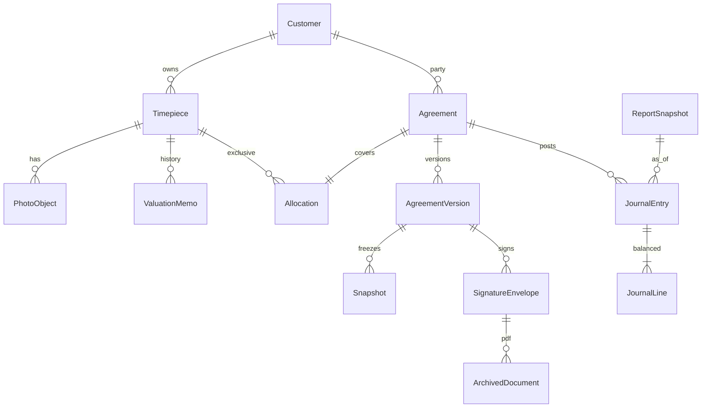

# Production persistence

**Status:** active · Stage 1 Drizzle probe on Neon `development` only · browser store still live · no production migration

Keep Next.js, React, TypeScript, Tailwind, and shadcn. Do not rewrite the framework. Do not run production migrations or deploy from this plan.

## Summary

MAC must hold customer, timepiece, contract, photo, and ledger records on servers it controls. Today those records live in one browser `localStorage` blob. Neon **MAC App** and Doppler are connected for development. The app still reads and writes the browser store. Browser data stays until an explicit, tested migration path exists.

## Capability status

| Area | Status | Notes |
|---|---|---|
| Collector/desk UI | Implemented | Next.js App Router |
| Browser store `mac-app-state-v3` | Implemented | Live source of truth |
| Preview JPEGs (900px, q 0.82) | Implemented | Originals discarded on upload |
| HTML “sign” flag | Implemented | Not a signed PDF |
| Prototype money helpers | Implemented | Not accounting policy |
| Splash “not a loan” e2e | Verified on a fresh `next dev` | `reuseExistingServer: !process.env.CI`; 23/23 passed 2026-09-15 |
| Neon project MAC App | Verified | `withered-lake-05570428` — do not create another |
| Branch `development` | Verified | Schema-only `br-summer-truth-a52brhnv` |
| Branch `production` | Verified | Default; local must not target it |
| Doppler `dev` / `prd` | Verified | Plus `APP_ENV`; see env-separation plan |
| `npm run db:ping` | Verified | `neondb` / Postgres 18.6 |
| Drizzle Stage 1 | Verified | `mac_schema_probe` on `development` only; production and staging have no tables |
| Neon Auth | Disabled | Keep off |
| WorkOS, R2, ledger, signing | Proposed | R2 bucket `mac-app` exists; app does not read it yet |
| Drizzle `customers` / `timepieces` | Verified | `development` only; UI still uses `localStorage` |
| Drizzle applications / agreements / archives / reports | Verified | `development` only; mock signing adapter; no ledger |
| Desk-credential security PR | Proposed | Separate approval boundary |
| Browser → server migration | Incomplete | No path yet; preserve local data |

## Problem frame

A repo desk that may buy and later sell back watches worth millions cannot treat the customer’s phone as the archive. Staff on another machine cannot see the vault. High-resolution originals do not survive. A one-click “signed” flag is not a retained contract. There is no ledger.

## Assumptions

*Planning assumptions until the owner or accountant confirms them. Not contractual formulas.*

- A deal is operationally complete only when required signatures are in **and** the signed PDF is retained. Cash posting is a later step and can fail on its own.
- Desk “Mark signed” is prototype-only and must not exist in production.
- A contact inquiry is not an application.
- Originals are unmodified upload bytes. Thumbnails are separate objects.
- Amendments create a new version; prior PDFs and events stay.
- A timepiece belongs to at most one non-terminal contract.
- Valuations are memos. Book and cash are append-only events. Corrections are reverse + new event.
- Inquiry, mail, and webhooks are idempotent on a stable external id.
- Joint restore of database + originals + signed PDFs + ledger is required; a partial restore is a failed restore.

## Requirements

- R1. Durable customer and timepiece records, with history used in agreements.
- R2. Collectors access only their records; staff access by role; enforced on the server.
- R3. Original uploads in private MAC storage; thumbnails separate; integrity before “saved.”
- R4. Versioned contracts, electronic signatures, retained signed PDF, no customer delete/replace.
- R5. Per-contract and company accounting with balanced postings and exact money.
- R6. Snapshot reports that never rewrite archived signed PDFs.
- R7. Preserve `localStorage` until a tested import exists.
- R8. Local development uses Neon `development` via Doppler `dev`, never `production`.

## Scope boundaries

- No second Neon project.
- No Neon Auth.
- No QuickBooks, Xero, or other accounting vendor selection.
- No production migration, Doppler→Railway sync, or deploy from this plan.
- No desk password / cookie-secret change (separate security plan).
- Do not invent buyback or book-value formulas.
- Do not treat current e2e “Executed & Verified” as production evidence.

### Deferred to follow-up

- WorkOS production activation and MFA.
- Signing-provider purchase.
- R2 bucket provisioning.
- Railway worker service and pg-boss evaluation.
- Sentry, CodeQL, review-bot CI expansion.
- Playwright `reuseExistingServer: !process.env.CI` — applied; verify on a fresh server.

## Proposed data relationships

Directional, not a schema file.

- **Customer** — party record + WorkOS subject (later). Synthetic emails in development only.
- **Timepiece** — identity, serial/reference, provenance, condition, custody, owner.
- **PhotoObject** — original key, checksum, uploader, received-at, kind; derivative keys for thumbs.
- **Agreement / AgreementVersion** — template id + frozen snapshot of parties, pieces, photos, amounts as typed (formulas later).
- **ArchivedDocument** — immutable signed PDF object + hash.
- **ValuationMemo** — not a journal line.
- **JournalEntry / JournalLine** — integer **cents**, balanced, reversible only by new entries.
- **Allocation** — one live non-terminal agreement per piece.
- **Hold** — blocks funding, close, and purge.
- **AccountingExportPort** — later vendor adapter; not selected now.

Existing `lib/types.ts` shapes the UI. Server tables should cover those fields and add the missing evidence columns. Do not shrink the UI contract to match an empty database.

## Permission rules (proposed)

| Verb | Collector | Staff | Admin |
|---|---|---|---|
| Read own collection, photos, agreements, PDFs | yes | assigned / all (decide) | yes |
| Read other collectors | no | role-limited | yes |
| Upload originals | own pieces | desk intake | yes |
| Prepare / send contract | no | yes | yes |
| Sign as collector | own | no | no |
| Sign as MAC | no | if designated | yes |
| Post or reverse ledger | no | no without dual control | yes with policy |
| Lift dispute hold | no | no | yes |
| Delete signed PDF or posted event | no | no | no (reverse / supersede only) |
| Restore backup | no | no | yes |

Collector `/admin` and mail outbox must be **403 on the server**, not only a client redirect.

## Migration approach

1. Keep `lib/store.tsx` writing `mac-app-state-v3` until a dual-write or cutover flag is approved.
2. Development database uses **synthetic** fixtures only. No production customer information in seeds.
3. Existing data URLs may be imported later as `legacy_preview`, labeled as previews, never as recovered originals.
4. No automatic promotion of a browser blob to production.
5. Production Drizzle migrations run only after explicit approval, against Doppler `prd`, never as a side effect of local `dev`.

## First end-to-end milestone

The smallest **complete** business slice that can be implemented and verified:

**customer → timepiece → original photo → prepared contract → electronic signatures → retained signed PDF → recorded financial events → reconciled contract and company report.**

Thinning allowed inside that path: one synthetic collector, one watch, one original + one thumbnail, one template version, collector + MAC via a **signing adapter** (sandbox or recorded mock — provider purchase later), one retained PDF, one balanced posting pair whose **accounts the accountant names**, one contract statement + one company trial balance that match.

That is Milestone A. It is not “database user exists.”

## Stages in plain language

0. **Foundation (this pass, verified)** — one Neon project, `development` vs `production`, Doppler `dev`/`prd`, local commands through Doppler, Neon Auth off, browser store untouched.
1. **Compatibility spike (verified 2026-09-15)** — Drizzle against `development` only; `mac_schema_probe` + `npm run db:migrate` / `db:drizzle-ping`; no product tables in `production` or `staging`.
2. **Identity + customer + timepiece (verified 2026-09-15)** — `customers` and `timepieces` on `development` only; actor stub in `lib/db/isolation.mjs`; WorkOS subject column stays null; `npm run test:db` proves collector A cannot read B.
3. **Original photos (verified 2026-09-15)** — `photo_objects` on `development`; checksum must match before save; retry of the same digest is a no-op; collector isolation covers photos. Object store is an adapter (in-memory in tests). Preview data URLs stay in the UI. No server file proxy.
4. **Prepare contract + snapshots (verified 2026-09-15; hardened)** — collector application stays `submitted` until desk prepare; prepare is one transaction; a torn row is resumed; live allocations are unique per timepiece.
5. **Sign + archive PDF (verified 2026-09-15)** — mock adapter; sign-complete and archive-success are different states; duplicate webhook is a no-op; archive retry does not duplicate the PDF; nobody may replace an archived PDF.
6. **Ledger + snapshots (blocked)** — integer cents; owner/accountant must name the first accounts before any journal is posted. Do not invent buyback or book-value formulas.
7. **Reports (verified 2026-09-15 for contract statements)** — desk can freeze a contract statement from the prepared snapshot + archive checksum; regenerating a report does not mutate the archived PDF. Company trial balance waits on Stage 6.
8. **Recovery drill** — restore database + files + PDFs + ledger together on `development`. Ledger restore waits on Stage 6.

Stage 1 is the smallest **technical** increment after this pass. Milestone A is the smallest **complete** increment that satisfies the owner brief.

## Local commands

| Command | Config | Branch |
|---|---|---|
| `npm run dev` | Doppler `dev` | `development` |
| `npm run db:ping` | Doppler `dev` | `development` |
| `npm run db:migrate` | Doppler `dev` | `development` only; refuses staging/production |
| `npm run db:drizzle-ping` | Doppler `dev` | `development` |
| `npm run test:db` | Doppler `dev` | Stage 2 isolation against `development` |
| `npm run dev:plain` | none | no Neon env |
| `npm run start` | Railway (later) | must not use `dev` secrets |

`.neon` is pinned to `development` (gitignored). `neon.ts` does not expire `development` or `production`. `auth` stays `false`.

## Package review

| Package | Role | Verdict |
|---|---|---|
| `@neon/config` | `neon.ts` | Keep |
| `@neon/env` | dependency of `@neon/config`; unused by app | Keep installed; do not import in app code |
| `@neondatabase/serverless` | HTTP driver used by `tools/harness/neon-ping.mjs` | Keep; planned Drizzle driver |
| Neon Auth libraries | none | Do not add |
| Drizzle | installed | Stage 1 probe on `development`; migrate via `DATABASE_URL_UNPOOLED` |

Conflict: `neon checkout` can pull `DATABASE_URL` into `.env.local` and fight Doppler. Use `--no-env-pull`. Do not put Neon URLs back in `.env.local`.

## Acceptance tests (Milestone A)

- Collector A cannot read B via UI or API.
- Desk routes and outbox are 403 without a staff session.
- Photo is not “saved” until checksum verifies; retry does not duplicate the original.
- Application is not executable until desk prepare freezes a version.
- Sign-complete + archive-fail posts no purchase; retry archives once; duplicate webhook is a no-op.
- Customer cannot delete or replace a signed PDF.
- Appraisal change does not change book or cash.
- Company report for date D matches the stored snapshot.
- `NEON_BRANCH` under Doppler `dev` is `development`.
- Splash suite still asserts the product is not a loan.

## Unresolved business decisions

1. When does title/reporting flip: signatures, retained PDF, or cash posted?
2. Staff vs admin verb split (defaults in Assumptions).
3. Required signers and whether MAC must always counter-sign.
4. First ledger accounts and whether prototype `buybackPrice` / LTV become policy.
5. Signing provider (design adapter only).
6. Doppler workplace: CLI is Norfolk AI; product org is KIT-Capital.
7. Whether desk “all collectors” is staff or admin-only.
8. Retention window after decline, repurchase, or hold.

## Verification of this pass

- Branches: `production` (default, empty public), `development` (`mac_schema_probe` + Drizzle log only), `staging` (empty public).
- `.neon` branch: `development`.
- Doppler `dev` injects `NEON_BRANCH=development`; `prd` injects `production`.
- `npm run db:ping` and `npm run db:drizzle-ping` connected to `neondb` / development without printing URLs.
- `npm run db:migrate` refused staging/production in unit tests and applied the probe only on `development`.
- Playwright e2e strips `RESEND_API_KEY` so inquiries stay in the preview outbox.
- No production migration. Browser store unchanged.
