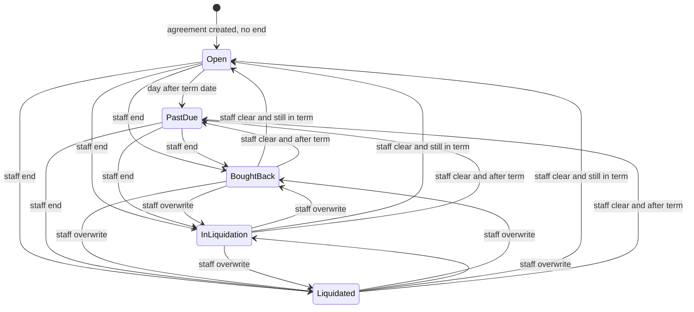
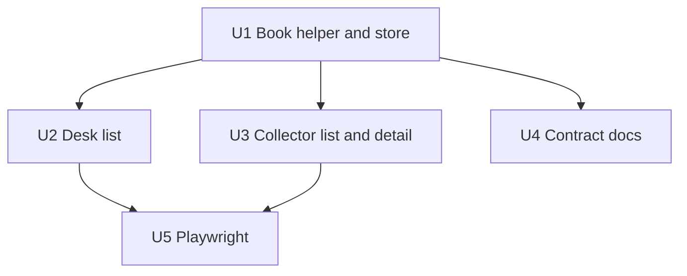

# feat: Add the repo operations book

## Summary

Ship a user-facing repo book on the live browser store. Desk and collector share five labels: **open**, **past due**, **bought back**, **in liquidation**, **liquidated**. Staff record an end with date and amount. Past due is derived when the term date has passed and no end is recorded. Official books stay in QuickBooks and third-party inventory. Signature flags, Scenario 60 pricing, and the downloadable contract PDF stay as they are.

---

## Problem Frame

Staff cannot see where a repo stands after the sale. Today an agreement is only `draft`, `pending_signature`, or `signed`. There is no shared word for past the term, bought back, or in liquidation. The owner does not want this app to be the ledger. The missing piece is an operations book: every repo, the pieces in it, and a staff-toggled end — not journals, not inventory, not QuickBooks.

| Axis | Words today | This plan |
|---|---|---|
| Signature | draft / pending signature / signed | Unchanged |
| Shell template | open / assigned / closed | Unchanged |
| Operations book | None | open / past due / bought back / in liquidation / liquidated |

---

## Requirements

- R1. Every live agreement can be read on desk and collector with the same five book labels. Pieces on the agreement stay listed via `watchIds` and do not get their own book labels.
- R2. Desk staff and admin can record one current end (bought back, in liquidation, or liquidated) with a calendar date and a dollar amount. Staff may overwrite or clear that end.
- R3. If the term date has passed and no end is recorded, both surfaces read **past due**. Staff do not toggle past due.
- R4. A recorded end always wins over open and past due. Clearing the end returns the derived label.
- R5. Signing (collector HTML Sign or desk Mark signed) does not change the book label. The book label does not change the signature flag.
- R6. Copy stays sale-and-repurchase. Forbidden: loan, lender, interest, debt, vesting, paid off.
- R7. Official accounting and inventory stay outside this app. No journal, no chart of accounts, no QuickBooks link.
- R8. The live store remains `mac-app-state-v3`. No Neon write, dual-write, or cutover.
- R9. CONTRACT docs name this app as the repo book / analytics, and name QuickBooks / third-party inventory as the official books. Stage 6 stays deferred, not deleted as a future persistence track.
- R10. Collector splash e2e still asserts the product is not a loan.

---

## Scope Boundaries

- Do not change Scenario 60 math, the PDF renderer, or `/api/contracts/pdf`.
- Do not land or unstick [PR #7](https://github.com/KIT-Capital/mac-app/pull/7).
- Do not add e-sign, a vendor file URL, or a sample-layout rewrite.
- Do not add a desk agreement detail route.
- Do not post ledgers, invent accounts, or integrate QuickBooks.
- Do not write Neon, flip `MAC_DATA_STORE`, or auto-migrate browser data.
- Do not reuse `Agreement.status` or `AgreementShell.status` for book labels.
- Do not auto-set **in liquidation** from modeled liquidation dollars.
- Do not add piece-level custody or title status. Pieces stay on `watchIds`.
- Do not create `STRATEGY.md`.
- Do not treat emptied working-tree files as the intended surface.

### Deferred to Follow-Up Work

- Land PR #7 (Scenario 60 PDF quality fix) as its own loop.
- E-sign and retained vendor PDF location once a sample and vendor exist.
- Neon cutover and a tested browser import (`docs/plans/2026-09-15-production-persistence.md`).
- Stage 6 official ledger, if ever, only after named accounts — not this product’s books.
- Restore any locally emptied CONTRACT / Scenario 60 files before implementation starts (working-tree hygiene, not a product unit).

---

## Context & Research

### Relevant Code and Patterns

- Browser store and mutations: `lib/store.tsx` (`createAgreement` always `pending_signature`; `signAgreement` sets `signed` + `signedAt`).
- Types: `lib/types.ts` (`Agreement`, `AgreementStatus`, `AgreementShell`).
- Calendar month helper on the committed Scenario 60 module: `addCalendarMonths` in `lib/contract/repo-scale.mjs` (same helper the PDF schedule uses).
- Desk live table: `app/admin/agreements/page.tsx` (list only; Mark signed; no detail route).
- Collector list: `app/agreements/page.tsx` (chip today is signature status).
- Collector detail: `app/agreements/[id]/page.tsx` (restore from the last commit if the working copy is empty; Sign / Download PDF stay).
- Demo fixture: `lib/seed.ts` Hale repo `createdAt: 2021-03-14`, 12 months, `pending_signature` — already past due under this plan.
- Collector phone plane: `components/collector-shell.tsx` / `components/screen-header.tsx`.
- Desk 16:9 console: `components/desk-shell.tsx` / `components/admin-chrome.tsx`.
- Language gate: `lib/contract/repo-contract.mjs` and `e2e/collector.spec.ts` splash `/loan/i` count 0.
- Docs to reframe: `docs/business-logic.md` (Production records §4 still requires ledgers), `docs/architecture.md`, `docs/plans/2026-09-15-production-persistence.md`, `docs/api.md` (record the UI-only book exception).

### Institutional Learnings

- `docs/solutions/` is empty. Binding constraints live in CONTRACT docs and `AGENTS.md`.
- `docs/decisions/0001-preserve-mac-stack.md` — keep Next.js and the browser store.
- `docs/decisions/0002-neon-mac-app-project.md` — do not treat `localStorage` as migrated.
- Owner brief 2026-09-16: this app is operations/analytics; QuickBooks and a third party hold official books and inventory.

### External References

Skipped. Local store and desk/collector patterns are enough. External loan-servicing language would fight the product contract.

---

## Key Technical Decisions

- **Two axes.** Keep `Agreement.status` as the signature flag. Add a separate staff end record. Derive **open** and **past due** at read time. Never persist those two words.
- **Term clock.** Term date is `addCalendarMonths(createdAt, termMonths)` — the last PDF schedule date. Clock does not start at `signedAt`.
- **Inclusive last day.** On the term date the label is still **open**. **Past due** begins the next calendar day.
- **Today.** UTC `YYYY-MM-DD`, same convention as `createAgreement`. The label helper takes an explicit `today` so unit tests do not depend on the machine clock. One Hale case may use real 2026 today.
- **End record.** Persist kind (`bought_back` | `in_liquidation` | `liquidated`), date, and amount only. Display words are bought back / in liquidation / liquidated.
- **Staff may overwrite or clear** an end. Clear returns derived open / past due. No history log (this is not QuickBooks).
- **Validation.** Date required, `>= createdAt`, `<= today`. Amount required, finite, `>= 0`. Staff type the dollars; do not auto-write the schedule price. Helper text may show the month’s repurchase dollars.
- **Any of the three kinds** may be set from open or past due. No required `in liquidation → liquidated` ladder.
- **Desk UX stays on the list.** Modal or expand-row on `/admin/agreements`. Two columns: signature (Mark signed) and book (label + Record end). No `/admin/agreements/[id]`.
- **Collector list chip is the book label only.** Detail shows the book label plus the existing Sign / Executed control.
- **Unsigned repos are in the book.** Hale stays `pending_signature` and reads **past due**.
- **Signature after an end is allowed.** Axes stay independent (prototype HTML sign remains a flag).
- **Same piece on two repos stays allowed.** The book is per agreement, not per piece.
- **Staff and admin both record ends.** Collectors never do.
- **Modeled liquidation dollars never auto-toggle** in liquidation.

---

## Open Questions

### Resolved During Planning

- Is this the official ledger?: No. QuickBooks / third party own official books and inventory. This app is the repo book.
- Does PR #7 belong here?: No. Separate loop.
- Mix book words into `Agreement.status`?: No. That breaks Sign, Mark signed, and scale lock.
- New desk detail route?: No. List + modal / expand-row.
- Wait for the sample PDF?: No. Current downloadable PDF stays.

### Deferred to Implementation

- Modal vs expand-row chrome on the desk list: pick the one that fits `AdminTable` without a new route.
- Exact store field name: any name that is not `status` and is not a shell field. Do not bikeshed in the plan.
- Whether desk overview “pipeline” should exclude ended sale amounts: leave the card as-is unless the list work makes the lie obvious; do not turn it into a trial balance.

---

## High-Level Technical Design

> *This illustrates the intended approach and is directional guidance for review, not implementation specification. The implementing agent should treat it as context, not code to reproduce.*

Read path: if an end exists, that label wins; else compare `today` to the term date; else **open**. Signature state is a parallel flag, not a transition on this diagram.

---

## Implementation Units

### U1. Book helper and store

**Goal:** Persist a staff end on the browser agreement and derive the five labels without touching signature status.

**Requirements:** R1, R3, R4, R5, R6, R8

**Dependencies:** Restore emptied `lib/contract/repo-scale.mjs` from the last commit before using `addCalendarMonths`.

**Files:**
- Create: `lib/contract/repo-book.mjs`
- Modify: `lib/types.ts`, `lib/store.tsx`, `package.json` (`test:unit` is an explicit file list — add `lib/contract/repo-book.test.mjs`)
- Test: `lib/contract/repo-book.test.mjs`

**Approach:**
- Add an optional end record on `Agreement`. Do not extend `AgreementStatus`.
- Derive the book label with `addCalendarMonths(createdAt, termMonths)` and an injected `today`.
- Store mutations: record end, overwrite end, clear end. `signAgreement` and `createAgreement` stay signature-only.
- `resetDemo` must leave Hale with no end so the derived label is past due.

**Execution note:** Implement the new domain helper test-first.

**Patterns to follow:**
- `lib/contract/repo-scale.mjs` / `lib/contract/repo-scale.test.mjs` for calendar months and unit style.
- `lib/store.tsx` `updateAgreement` for persistence.

**Test scenarios:**
- Happy path: Hale seed, no end, today 2026-09-16 → **past due**; signature still pending.
- Happy path: new agreement created today, 12 months, no end → **open**.
- Happy path: Hale + end bought back 2022-03-14 / 245000 → **bought back**.
- Happy path: Hale + end in liquidation → **in liquidation**; Hale + end liquidated → **liquidated**.
- Happy path: end present, then `signAgreement` → book label unchanged; signature `signed`.
- Edge case: createdAt 2025-09-16, 12 months, today 2026-09-16 → **open** (term date inclusive).
- Edge case: same fixture, today 2026-09-17 → **past due**.
- Edge case: March 31 + 12 months uses `addCalendarMonths`, not `Date.setMonth`.
- Edge case: staff clears Hale’s end → **past due** again.
- Edge case: modeled liquidation dollars present, no end → still **past due**, never in liquidation.
- Error path: missing date, date before `createdAt`, date after today, or non-finite amount → reject; store unchanged.
- Error path: collector-equivalent call (no desk session in this client store) is not required here; enforce “collector cannot record end” in U2/U3. Helper may accept a well-formed end from any caller of the store method — the UI must not expose it to collectors.

**Verification:**
- Unit file is on `test:unit`. Hale without an end is past due. Sign does not write an end. Invalid ends do not persist.

---

### U2. Desk live-agreements book

**Goal:** Desk staff can see the book label and record, overwrite, or clear an end on the existing list.

**Requirements:** R1, R2, R4, R6

**Dependencies:** U1

**Files:**
- Modify: `app/admin/agreements/page.tsx`
- Modify: `components/admin-chrome.tsx` only if a second column needs a shared table primitive
- Test: covered by U1 units plus U5; no separate desk unit-test file unless a tiny presentational helper is extracted

**Approach:**
- Keep the shells table’s Open / Assigned / Closed vocabulary untouched.
- On Live agreements, keep Mark signed. Add the book label and a Record end control (modal or expand-row).
- Show date and amount after an end exists. Allow overwrite and clear.
- Both `staff` and `admin` may record ends.

**Patterns to follow:**
- Existing Mark signed button and `AdminTable` on `app/admin/agreements/page.tsx`.
- Desk form controls in `components/field.tsx`.

**Test scenarios:**
- Happy path: Hale row reads **past due** and still offers Mark signed.
- Happy path: record bought back with date and amount → row reads **bought back**; collector will see the same after U3 (assert in U5).
- Happy path: overwrite in liquidation → liquidated.
- Happy path: clear end on Hale → **past due**.
- Error path: submit without date or amount → no persist; inline error; no loan words.
- Integration: Mark signed on Hale → signature signed, book still **past due**.

**Verification:**
- Desk list shows both axes. Shell status widgets are unchanged. No new desk route.

---

### U3. Collector list and detail book labels

**Goal:** Collector list and detail show the shared book words. Sign and PDF download stay on the signature / document axis.

**Requirements:** R1, R5, R6

**Dependencies:** U1. Restore `app/agreements/[id]/page.tsx` from the last commit if it is empty.

**Files:**
- Modify: `app/agreements/page.tsx`
- Modify: `app/agreements/[id]/page.tsx`
- Test: U5 e2e; optional shared label helper already tested in U1

**Approach:**
- List chip uses the book label only (Hale reads **past due**, not pending signature).
- Detail shows the book label and keeps Review Terms / Sign / Executed & Verified and Download contract PDF.
- Phone layout stays the existing collector plane. Do not add desk chrome.

**Patterns to follow:**
- Current card layout on `app/agreements/page.tsx`.
- Existing sign / PDF flow on the committed detail page.

**Test scenarios:**
- Happy path: Hale list chip is **past due**.
- Happy path: Hale detail shows **past due** and still offers Sign.
- Happy path: after Sign, chip stays **past due**; page shows Executed & Verified.
- Integration: after a desk end, list and detail show that end word (assert in U5).
- Edge case: empty list copy stays “No sale-and-repurchase agreements on file yet.”

**Verification:**
- Collector never sees a Record end control. PDF download still works. No loan words on the chips.

---

### U4. Contract docs: book, not ledger

**Goal:** CONTRACT and living plans match the owner brief: this app is the repo book / analytics; official books are external.

**Requirements:** R7, R9

**Dependencies:** U1 (so the written status vocabulary matches the helper)

**Files:**
- Modify: `docs/business-logic.md`
- Modify: `docs/architecture.md` (restore from the last committed revision if the working copy is empty, then reframe)
- Modify: `docs/plans/2026-09-15-production-persistence.md`
- Modify: `docs/api.md`
- Modify: `docs/README.md` only if the router line for Neon/ledger needs a pointer to this plan
- Do not rewrite `docs/plans/2026-09-15-neon-railway-env-separation.md` in this unit; if it is empty on disk, restore the committed file as hygiene before any commit that includes docs

**Approach:**
- Replace Production records §4 “Accounting” as a live app requirement with: official cash and inventory live in QuickBooks and third-party inventory; this app keeps the repo book (end kind, date, and amount) and Scenario 60 prices.
- Keep Stage 6 in the persistence plan as **deferred / not this product’s books**, not as the next implementation stage for the UI.
- Record a UI-only exception in `docs/api.md`: book labels and ends exist only on the client store.
- Do not invent ledger account names. Do not delete the persistence plan.

**Test scenarios:**
- Test expectation: none -- documentation-only unit. Completeness is the rewritten sections plus U5’s not-a-loan assertion.

**Verification:**
- A later agent reading `docs/business-logic.md` will not add a journal to satisfy “production records.”
- Persistence plan still says browser store stays until an explicit cutover.

---

### U5. Playwright: Hale book and splash

**Goal:** Prove shared labels, desk end, and the not-a-loan invariant on the real UI.

**Requirements:** R1, R2, R3, R5, R6, R10

**Dependencies:** U2, U3

**Files:**
- Modify: `e2e/collector.spec.ts`
- Modify: `e2e/desk.spec.ts`
- Modify: `e2e/helpers.ts` only if a shared Hale or desk-end helper is needed

**Approach:**
- Keep the splash `/loan/i` count 0 case.
- Add Hale (or resetDemo) collector list/detail: **past due**.
- Add desk record end → collector chip matches.
- Add Sign / Mark signed does not change the book chip.
- Collector viewport stays phone-default; desk stays the wide console.

**Patterns to follow:**
- Existing repurchase Sign → Executed & Verified in `e2e/collector.spec.ts`.
- Desk cookie setup in `e2e/desk.spec.ts` / `e2e/helpers.ts`.

**Test scenarios:**
- Happy path: after resetDemo, collector agreements list shows **past due** for Hale and does not show loan / paid off / vesting.
- Happy path: desk records bought back with date and amount; collector list/detail show **bought back**.
- Integration: collector Sign on Hale → Executed & Verified and book chip still **past due** (or the recorded end if one was set).
- Integration: splash still has zero `/loan/i` matches.
- Edge case: shells table still shows template Open for the open shell, not Hale’s book label.

**Verification:**
- `npm test` includes the new cases. Quality gate still has the splash assertion.

---

## System-Wide Impact

- **Interaction graph:** Collector apply → store → list/detail. Desk Mark signed → `signAgreement`. Desk Record end → new store mutation → both UIs read the helper. PDF route is unchanged and does not read the book.
- **Error propagation:** Invalid ends fail in the store/helper and stay on the desk form. Do not toast a server error; there is no server.
- **State lifecycle risks:** `resetDemo` must drop ends. Removing all `watchIds` still deletes the agreement (existing behavior) and its end. Same-browser collector and desk share the blob — accepted until cutover.
- **API surface parity:** No HTTP/tRPC procedure. Record the exception in `docs/api.md` (R9).
- **Integration coverage:** U5 is the only proof that desk write and collector read share a label.
- **Unchanged invariants:** Scenario 60 schedule, PDF language gate, desk 403, splash not-a-loan, Neon development tables unused by UI, shell Open/Assigned/Closed.

---

## Risks & Dependencies

| Risk | Mitigation |
|---|---|
| Implementer overwrites `Agreement.status` | U1 forbids it; tests keep Sign and Mark signed on the old enum |
| Working tree has emptied Scenario 60 / architecture files | Prerequisite: restore from the last commit before U1–U3 |
| `open` collides with shell status | Separate helper and desk columns; U5 shells case |
| Term-date off-by-one or DST drift | Reuse `addCalendarMonths`; inclusive last day; inject `today` |
| Docs still demand a ledger | U4 reframes CONTRACT language in the same loop |
| PR #7 quality failure / dirty branch | Out of scope; do not mix PDF fixes into this work |
| Money-adjacent review | Full review required by `AGENTS.md` (money-adjacent status) |

### Prerequisites

- Restore emptied committed files (`lib/contract/repo-scale.mjs`, `app/agreements/[id]/page.tsx`, `docs/architecture.md`, and any other zero-byte tracked files) from the last commit before implementation.
- Do not start this work by “fixing” PR #7 in the same change set.

---

## Documentation / Operational Notes

- Update CONTRACT docs in U4 in the same loop as the UI. Docs govern; do not ship the book against a ledger requirement.
- After landing, `/ce-compound` can capture the first `docs/solutions/` entry (two axes; not a ledger). That is follow-up, not a unit.
- No production deploy, Doppler sync, or Neon migration from this plan.
- Device-local store remains the support story: desk and collector must share a browser to see the same book.

---

## Alternative Approaches Considered

- **Write the five labels into `Agreement.status`:** Rejected. Breaks Sign, Mark signed, scale lock, and existing e2e.
- **Dual-write Neon:** Rejected. Owner wants user-facing first; cutover is a separate approved flag.
- **New `/admin/agreements/[id]`:** Rejected. Owner asked for desk toggles; the list already exists.
- **Auto in liquidation from modeled dollars:** Rejected. Owner said staff toggles the end.

---

## Sources & References

- Owner brief 2026-09-16 (operations book; QuickBooks and third-party inventory official; user-facing first)
- `docs/business-logic.md`
- `docs/plans/2026-09-15-production-persistence.md`
- `docs/decisions/0001-preserve-mac-stack.md`
- `docs/decisions/0002-neon-mac-app-project.md`
- Related PR (out of scope): [KIT-Capital/mac-app#7](https://github.com/KIT-Capital/mac-app/pull/7)
- Prior session: [Scenario 60 PDF](d377d666-8332-44bb-8f6e-364adfcafd56)
