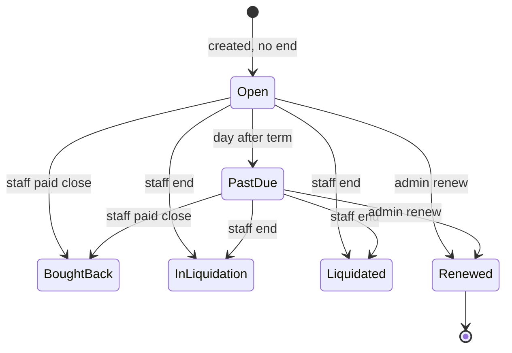
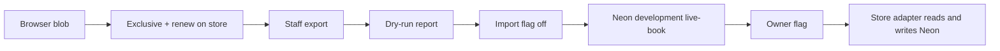
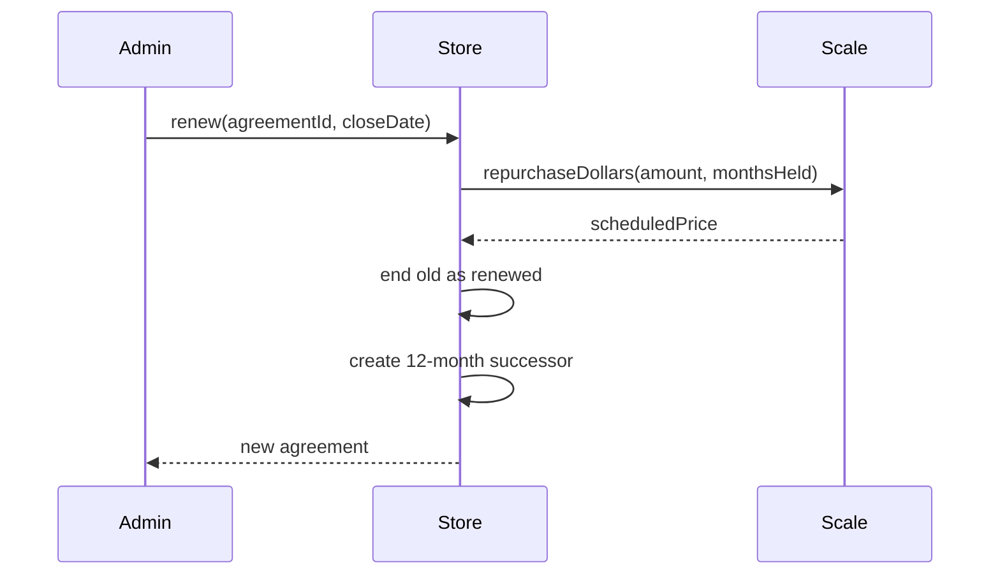

# Live book cutover - Plan

## Goal Capsule

Move the live collector and desk book onto MAC computers on Neon `development`, after the operations book can lock a piece to one live repo and renew a term.

Authority: `AGENTS.md`, `docs/business-logic.md`, `docs/design-system.md`, `docs/design-reference.md`, this file. The living status file `docs/plans/2026-09-15-production-persistence.md` stays the persistence roadmap. Do not rewrite it in place.

Stop if any of these would be required: production or staging migrate, Neon Auth, WorkOS, a journal, QuickBooks, dual-write, auto-migrate of `localStorage`, or a second Neon project.

Execution: one GitHub PR per unit on `KIT-Capital/mac-app`. Merge on green. Quality CI is `lint` + `test` + `build`. Money-adjacent units need the full review `AGENTS.md` requires.

Tail: after each merge, the next unit starts from `main`. Do not flip the owner switch in this loop.

---

## Product Contract

### Summary

The desk is the operations book: every customer, collection, repo, and where the business stands in this app. Official cash, inventory, and filed agreement copies stay outside. Collectors see only their own rows, the on-screen repo, and the downloadable PDF. A live piece sits on one repo. Paid close is **bought back**. Admin renewal closes the old repo as **renewed** and opens a new 12-month repo at that month’s Scenario 60 price.

### Problem Frame

Staff on another machine cannot see the vault because the live book is one browser blob. The same piece can sit on two live repos. There is no renewal path. Official books must not be invented here.

### Requirements

#### Operations book

- R1. Desk staff and admin see every collector, every piece, every repo, and the shared book label.
- R2. A collector sees only their own profile, pieces, repos, on-screen agreement, and PDF.
- R3. Book labels are **open**, **past due**, **bought back**, **in liquidation**, **liquidated**, **renewed**. Open and past due stay derived. A recorded end wins.
- R4. Paid close is staff **bought back** with date and amount. Cash stays at the bank / QuickBooks.
- R5. Copy stays sale-and-repurchase. Forbidden: loan, lender, interest, debt, financing, vesting, paid off.

#### Exclusive piece and renewal

- R6. A timepiece on an **open**, **past due**, or **in liquidation** repo cannot join another live repo. `(session-settled: user-directed — chosen over allowing the same piece on two live repos: owner said one live agreement unless the first is over or renewed)`
- R7. After **bought back**, **liquidated**, or **renewed**, those pieces are free unless the renewal moved them to the successor.
- R8. Admin may renew a live repo: close it as **renewed** on the close date, amount = that month’s Scenario 60 repurchase dollars (`repurchaseDollars` for months held, last term month if past due). `(session-settled: user-directed — chosen over bought-back or original sale amount: old word is renewed; new repo starts at the scheduled price)`
- R9. The successor is a new 12-month repo. It starts with the same pieces and that scheduled amount. The collector may add free pieces so desk LTV still covers the sale amount. They may raise the sale amount only up to that LTV cap.
- R10. Renewal is admin-only. It does not post cash or inventory.

#### Agreement surfaces

- R11. Collector and desk keep an on-screen repo and a stored, checksummed unsigned PDF in live mode. Executed or signed official copies stay outside until a signing design.
- R12. Visual chrome follows the 14 November 2022 Limus deck (`docs/design-reference.md`): dark/light pair, Logo-FF, two-column collection, application fields, account tiles. Do not use the MB&F mark.
- R13. Product detail the 2022 deck omits comes from the 2021 App Screenshots folder: multi-piece repo, on-screen agreement pages, and Sign or download PDF. Keep those behaviors. Do not copy 2021 “financing” words.

#### Persistence cutover

- R14. Staff import the current browser book (people, pieces, preview photos, agreements, ends) into Neon `development` by a desk action. Never on boot, deploy, or first paint.
- R15. An owner switch flips live reads and writes together after a tested import. Default remains the browser store. Development only.
- R16. Preview JPEGs import as labeled previews, never as recovered originals. No server file proxy.
- R17. Catalog, shells, and desk settings stay in the browser this loop.
- R18. New book HTTP follows existing App Router + `mac_desk` 403. Do not add tRPC or MCP. Update `docs/api.md` for each new path or remaining UI-only exception.

### Actors

- A1. Collector — own rows only; cannot record an end or renew.
- A2. Staff — desk book, generic ends, and import (with admin).
- A3. Admin — staff verbs plus owner switch is not a desk toy; the switch is a Doppler flag the owner sets.

### Key Flows

- F1. Collector apply → exclusive check → pending signature → on-screen repo + PDF.
- F2. Staff record bought back → pieces free.
- F3. Admin renew → old **renewed** → new 12-month repo at scheduled price → collector may add pieces.
- F4. Staff export current blob → dry-run report → import with flag off → owner flips flag on development.

### Acceptance Examples

- AE1. Hale’s two pieces on one past-due repo. A second live repo that lists `rm-011` is rejected. Covers R6.
- AE2. Staff buy back Hale. Both pieces may enter a new repo. Covers R4, R7.
- AE3. Admin renews a 12-month repo on the term date. Old label is **renewed**. New sale amount equals `repurchaseDollars(old.amount, 12, old.scale)`. Same `watchIds` move. Covers R8, R9.
- AE4. Flag off after a successful import: desk and collector still read the browser blob. Covers R15.
- AE5. Splash still has zero `/loan/i` matches. Covers R5.

### Scope Boundaries

- Official QuickBooks cash, third-party inventory, and filed paper/PDF archives stay outside.
- No e-sign vendor, no retained object-store signed PDF, no Stage 6 ledger.
- No production or staging cutover. No Neon Auth. No WorkOS. No desk-password change.
- No dual-write. No auto-migrate.
- Do not import into existing one-piece `agreements` / `photo_objects` originals tables.
- Social login, Google/Facebook/Amazon buttons from the 2021 shots, and MB&F marks stay out.

#### Deferred to Follow-Up Work

- Staging and production cutover after a later owner yes.
- Catalog, shells, and settings on the server.
- Reviewed tRPC/MCP adapters.
- R2 originals for new uploads.
- First `docs/solutions/` entry via `/ce-compound`.

### Success Criteria

Desk on a second machine can, after import and flag, see the same book the collector sees. Exclusive and renewal hold on both stores. Official books were not added.

---

## Planning Contract

### Key Technical Decisions

- KTD1. New focused plan file. `(session-settled: user-directed — chosen over replacing docs/plans/2026-09-15-production-persistence.md: that living roadmap retains Milestone A while this plan governs the live-book cutover)`
- KTD2. Sixth end kind `renewed` on `AgreementEnd`. Persist kind, date, amount only. Derive open / past due in `lib/contract/repo-book.mjs`. Governs R3, R8.
- KTD3. Exclusive live set = agreements whose `bookLabel` is open, past due, or in liquidation. Check on `createAgreement` and on renewal piece move. Governs R6.
- KTD4. Renewal amount is `repurchaseDollars` for months from `createdAt` to the close date, clamped to `1..termMonths`. After term, use `termMonths`. New repo `termMonths` is 12. New `scale` from `agreementScaleFromDesk`. Governs R8, R9.
- KTD5. Limus 2022 is the chrome. 2021 shots supply agreement/PDF/multi-piece detail only. Governs R12, R13.
- KTD6. New live-book tables (or additive columns that do not reshape Stage 4 `agreements`). Keep client string IDs. Multi-`watchIds`. Preview URL column, not `photo_objects`. Reuse `customers` / `timepieces` only with fail-closed ID and email collisions. Governs R14, R16.
- KTD7. Import is a desk-gated App Router POST outside the `/admin` matcher. Validate, dry-run report, then one transaction. Flag off. Same export shape as `persistableState`. Governs R14, R18.
- KTD8. Owner switch is a server-read flag, not `NEXT_PUBLIC_*`. Unset = browser store. It switches reads and writes together. Client asks the server which store is live. Governs R15.
- KTD9. After the flag, collector APIs use session email → customer. Desk cookie is not row ownership. `resetDemo` must not wipe Neon. Hale re-seed on sign-in is gated off when the flag is on.
- KTD10. Ship user-facing exclusive + renewal on the browser store first. Then schema + import. Then the dead adapter. Then the flag. Do not combine first migrate, first import, and flag-on.

### High-Level Technical Design

### Sequencing

1. U1 exclusive + **renewed** helper on the live store.
2. U2 desk renewal + collector successor.
3. U3 live-book schema on `development`.
4. U4 staff import.
5. U5 store adapter + owner flag, default off.
6. U6 CONTRACT docs in the same PRs that change the behavior.

### Assumptions

- “Scheduled” month for a past-due renew is the last term month. KTD4.
- Raising the successor sale amount is allowed only after free pieces are added and LTV covers it. R9.
- Development Neon may hold Stage 2 test rows. Import fails closed on collision rather than upsert-over. KTD6.

### Library constraints (Context7, 2026-09-17)

Confirmed against Next.js 16 (closest pin 16.2.9) and Drizzle ORM 0.45 / kit 0.31. Stay on the pinned pair; do not jump to `@rc`.

- U3: `drizzle-kit generate` then review SQL then `migrate`. Additive `CREATE TABLE` only. Keep `text` primary keys so client IDs survive. Do not `push`. Do not store JPEGs in `jsonb`.
- U4: App Router Route Handlers, not Server Actions (1 MB default). Do not POST several preview data URLs in one body; send keys or one preview per request. Path stays outside `/admin` so `proxy.ts` does not silently truncate at 10 MB.
- U5: Flag stays server-runtime (`process.env` after a request). `NEXT_PUBLIC_*` is baked at `next build` and would need a Railway rebuild to flip. Mark `lib/db/client.ts` `server-only`. User GET handlers stay uncached: `Cache-Control: private, no-store`; client `cache: 'no-store'` and `credentials: 'include'`. Never `force-static` or `'use cache'` on live-book CRUD.

---

## Implementation Units

### U1. Exclusive live piece and renewed label

**Goal:** A live piece cannot join a second repo. **Renewed** is a first-class end word.

**Requirements:** R3, R5, R6, R7

**Dependencies:** none

**Files:**
- Modify: `lib/types.ts`, `lib/contract/repo-book.mjs`, `lib/store.tsx`
- Test: `lib/contract/repo-book.test.mjs`, add `lib/contract/repo-allocation.test.mjs` to `test:unit`

**Approach:**
- Add `renewed` to end kinds and labels. Cite KTD2.
- Add a live-allocation helper. Cite KTD3.
- `createAgreement` rejects a `watchId` already live. Do not extend `Agreement.status`.

**Execution note:** Implement the helper test-first.

**Patterns to follow:** `lib/contract/repo-book.mjs` / `lib/contract/repo-book.test.mjs`

**Test scenarios:**
- Happy path: Hale no end, today 2026-09-17 → past due; second repo with `rm-011` rejected.
- Happy path: end `renewed` → label **renewed**.
- Edge case: term date inclusive still **open**.
- Edge case: after bought back, `rm-011` may join a new repo.
- Error path: invalid renewed end (missing date or amount) does not persist.
- Integration: `signAgreement` does not write an end.

**Verification:** Hale stays past due without an end. Exclusive rejects the second live use.

---

### U2. Desk renewal and successor repo

**Goal:** Admin closes a live repo as **renewed** and opens a 12-month successor at the scheduled price.

**Requirements:** R1, R8, R9, R10, R11

**Dependencies:** U1

**Files:**
- Modify: `lib/store.tsx`, `app/admin/agreements/page.tsx`, `app/agreements/page.tsx`, `app/agreements/[id]/page.tsx`
- Test: `lib/contract/repo-renewal.test.mjs` on `test:unit`; `e2e/desk.spec.ts`, `e2e/collector.spec.ts`

**Approach:**
- Desk list keeps Mark signed and Record end. Add Renew. Cite KTD4.
- Successor starts with moved `watchIds` and scheduled amount. Collector may add free pieces on the new repo. LTV cap from desk settings / open shell.
- On-screen agreement + PDF stay on the successor. Cite KTD5. No new desk detail route.

**Execution note:** Money helper test-first. Full review required (money-adjacent).

**Patterns to follow:** Record end modal on `app/admin/agreements/page.tsx`. `repurchaseSchedule` / `repurchaseDollars` in `lib/contract/repo-scale.mjs`.

**Test scenarios:**
- Happy path: 12-month repo, close on term date, new amount equals month-12 `repurchaseDollars`.
- Happy path: collector list shows old **renewed** and new **open**.
- Edge case: renew past due uses month `termMonths`.
- Edge case: adding a still-live piece to the successor is rejected.
- Error path: collector UI has no Renew control.
- Integration: PDF download on the successor still lists the moved pieces. Splash `/loan/i` count 0.

**Verification:** Desk renew writes both rows. Collector sees both labels. No loan words.

---

### U3. Live-book schema on development

**Goal:** Neon `development` can hold the live book without using Stage 4 one-piece agreements.

**Requirements:** R14, R16

**Dependencies:** U1

**Files:**
- Modify: `lib/db/schema.ts`
- Create: next `drizzle/*.sql`
- Test: `lib/db/live-book.test.ts` on `test:db`

**Approach:**
- Additive tables or columns for live agreements, `watchIds` membership, book end, preview URLs. Cite KTD6.
- `npm run db:migrate` remains development-only.
- Do not call `prepareAgreement` or `saveOriginal`.

**Execution note:** Confirm tables on Neon `development` after migrate. Exit 0 is not enough.

**Patterns to follow:** `lib/db/schema.ts`, `lib/env/development-migration.mjs`

**Test scenarios:**
- Happy path: insert Hale-shaped row with two `watchIds` and no application.
- Happy path: preview URL stored; no original key required.
- Error path: migrate refuses staging/production.
- Edge case: unique live membership per timepiece.

**Verification:** `development` has live-book tables. Production and staging public stay untouched.

---

### U4. Staff import of the browser book

**Goal:** Desk can dry-run and import a `mac-app-state-v3` export into Neon `development` while the flag stays off.

**Requirements:** R14, R16, R18

**Dependencies:** U3

**Files:**
- Create: `lib/db/live-book-import.mjs`, `app/api/desk/live-book-import/route.ts`
- Modify: a desk admin page that already exists (agreements or a small panel on it)
- Test: `lib/db/live-book-import.test.mjs` on `test:unit` (no DB) and a `test:db` file for the commit path

**Approach:**
- POST JSON = `persistableState`. Desk cookie 403 inside the handler. Cite KTD7.
- Dry-run returns counts, IDs, rejects. Commit is one transaction. Preserve client IDs. Join people on normalized email. Reserved desk emails are not customers.
- Reject missing `watchIds`. Map dollars to cents on reused timepiece columns. Previews as `legacy_preview`.
- Re-import before flag: idempotent upsert on live-book PK. After flag: refuse.

**Execution note:** Mapper unit tests with no database. Do not put the route under `/admin`.

**Patterns to follow:** `app/api/mail/route.ts`, `lib/desk-guard.mjs`

**Test scenarios:**
- Happy path: Hale export, dry-run then commit, two pieces one repo, no end, label past due.
- Happy path: same export twice before flag = same IDs.
- Edge case: empty localStorage that is only in-memory demo Hale — import UI must not silently upload demo as live without staff confirm.
- Error path: no desk cookie → 403. Store unchanged.
- Error path: email or ID collision with existing `customers` → fail closed + report.
- Integration: flag still off; live UI still reads the blob.

**Verification:** Report counts match Neon. UI unchanged until U5.

---

### U5. Owner flag and store adapter

**Goal:** After import, an owner flag makes desk and collector read and write the live-book server.

**Requirements:** R1, R2, R15, R17, R18

**Dependencies:** U2, U4

**Files:**
- Modify: `lib/store.tsx`, `.env.example`, `docs/config-and-env-map.md`
- Create: `app/api/live-book/route.ts` (or split read/write handlers), `lib/env/live-book-flag.mjs`
- Test: unit flag matrix; e2e helper that stays on the blob unless an explicit flag test is added

**Approach:**
- Server-only flag. Client learns it from a server read. Cite KTD8, KTD9.
- Flag on + empty DB → empty/error, not the blob.
- Flag off + Neon rows → blob.
- Catalog, shells, settings stay in `localStorage`. `createAgreement` still reads desk scale from the client settings blob.
- `resetDemo` and Hale sign-in re-seed do not write Neon.

**Execution note:** Do not set the flag on Railway staging or production in this loop.

**Patterns to follow:** `lib/env/database-mapping.mjs`, `instrumentation.ts` mapping guard

**Test scenarios:**
- Happy path: flag off, Neon has rows, UI shows blob Hale.
- Happy path: flag on, imported Hale, desk and collector show the same **past due**.
- Error path: flag on, empty DB, no silent blob fallback.
- Integration: collector A cannot read B via the new handlers.
- Integration: splash `/loan/i` count 0. Shells table still uses Open/Assigned/Closed.

**Verification:** Default path is still the browser. Development-only flag documented. No `NEXT_PUBLIC_` bake-in.

---

### U6. Contract docs for the six-word book and cutover

**Goal:** CONTRACT docs match exclusive pieces, **renewed**, and “import then flag.”

**Requirements:** R5, R12, R18

**Dependencies:** U1 (vocabulary)

**Files:**
- Modify: `docs/business-logic.md`, `docs/architecture.md`, `docs/api.md`, `docs/design-reference.md` (pointer to 2021 agreement/PDF detail only)
- Modify: `docs/plans/2026-09-15-production-persistence.md` to remove dual-write as an allowed holding pattern, point at this plan, and align its status, capability, milestone, acceptance, and verification sections
- Modify: `docs/README.md` router line for this plan

**Approach:**
- Production records stay: official books outside; this app is the repo book.
- Record UI-only exceptions that remain after U5.
- Do not mint `STRATEGY.md`.

**Test scenarios:**
- Test expectation: none -- documentation-only unit. Completeness is the rewritten sections plus U2/U5 not-a-loan assertions.

**Verification:** A later agent will not add a journal or allow two live repos for one piece.

---

## Verification Contract

- `npm run lint`, `npm test`, `npm run build` green on each PR.
- `npm run test:unit` includes book, allocation, renewal, and import mapper files.
- `npm run test:db` on Doppler `dev` after U3/U4. Skip in CI without `DATABASE_URL`.
- `npm run db:migrate` still refuses staging/production.
- Playwright keeps splash `/loan/i` count 0 and Hale book labels.
- Money-adjacent PRs (U2, U4, U5) get the full review `AGENTS.md` requires.

## Definition of Done

- U1–U6 merged on green as separate PRs, or a later PR only when a unit cannot stand alone.
- Exclusive + renewal work on the browser store before any flag flip.
- Import tested with flag off.
- Flag unset in every Railway environment.
- Official books were not added.
- Abandoned spike code is not left in the diff.

---

## System-Wide Impact

- Collector apply, desk Mark signed, Record end, and Renew all go through the store, then through handlers after the flag.
- Isolation moves from email-filter-in-the-browser to server actors after the flag.
- PDF route stays payload-in / PDF-out.
- Agent-native: no tRPC/MCP. New handlers are the human path. Record exceptions in `docs/api.md`.

## Risks & Dependencies

| Risk | Mitigation |
|---|---|
| Import into Stage 4 drops `watchIds` and ends | KTD6; tests use Hale two-piece shape |
| `NEXT_PUBLIC_` flag disagrees with server | KTD8 |
| Dual-write leftover in the 15 September file | U6 strikes it; do not implement it |
| Blob quota / 10 MB body | Import on `/api`, measure a real export, split previews if needed |
| `resetDemo` wipes Neon | KTD9 |
| 2021 “financing” copy leaks | R5, AE5, language gate |

## Documentation / Operational Notes

- Living persistence plan stays. This file is the HOW for exclusive, renewal, import, and the development flag.
- Owner flips the flag in Doppler `dev` only, then restarts the development app. Not part of merge-on-green.
- Rollback is flag off. Post-flip Neon edits do not reappear in the blob.

## Alternative Approaches Considered

- Dual-write then flip reads: rejected. Owner and later contract forbade inventing dual-write.
- Import into existing Stage 4 agreements: rejected. One `timepieceId` and required `applicationId` cannot hold Hale.
- Rewriting the 15 September persistence file: rejected this session.
- `NEXT_PUBLIC_` store switch: rejected. Build-time bake can disagree with the server.

## Sources & Research

- Owner briefs 2026-09-16 and 2026-09-17
- Limus deck 14 November 2022 (visual chrome). Dropbox: `Cidale Interests/Companies/Mechanical Art Capital/Vladimir/MechanicalArt_MB&F_Presentation_11-14-22.pdf`
- 2021 App Screenshots folder (agreement/PDF/multi-piece detail). Dropbox: `Cidale Interests/Companies/Mechanical Art Capital/App/App Screenshots`
- `docs/plans/2026-09-16-001-feat-repo-operations-book-plan.md` (completed five-label book; dual-write rejected)
- `docs/plans/2026-09-15-production-persistence.md` (living status; development cutover ready and default off)
- `lib/store.tsx`, `lib/contract/repo-book.mjs`, `lib/contract/repo-scale.mjs`, `lib/db/schema.ts`
