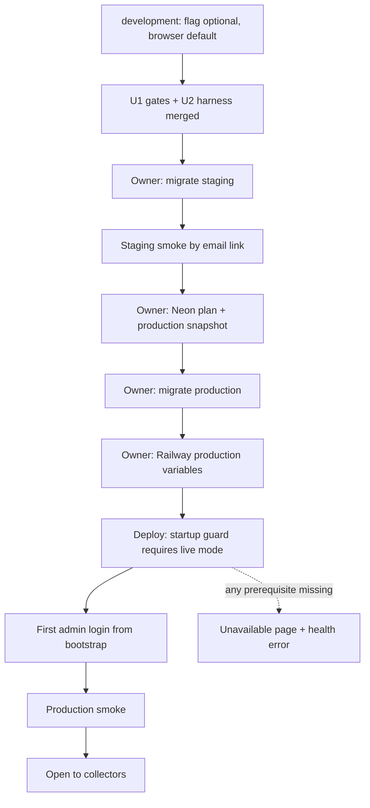
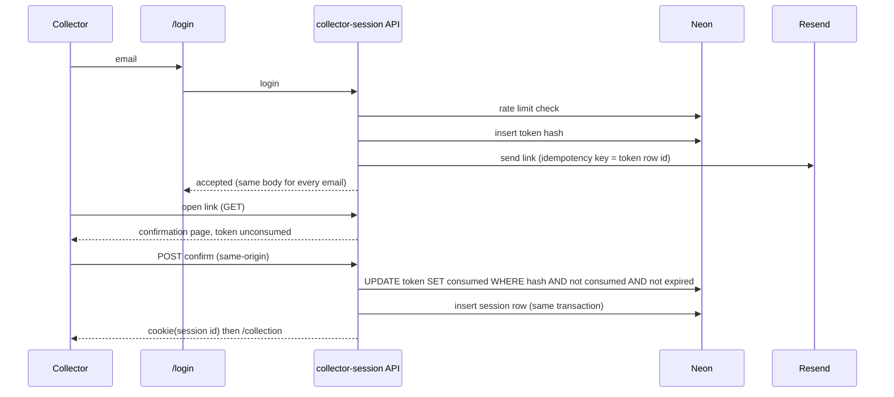
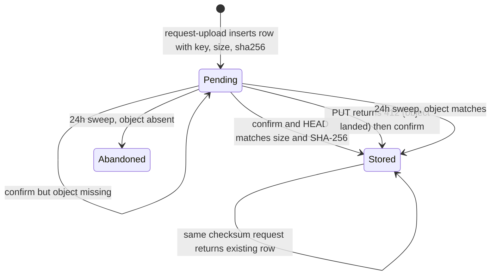
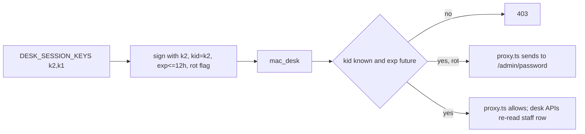

# Production go-live - Plan

## Goal Capsule

Take Mechanical Art Capital from a development-only repo desk to a live app on `mechart.app` that real collectors and MAC staff use. Records live on MAC servers (Neon `production`, private R2 bucket `mac-app`). Collectors sign in with a verified email link. Desk logins leave the source code. Desk pricing, catalog, and shells live on the server. New photos keep the original privately. Stored agreement PDFs and email already work in live mode. Production starts empty.

Authority: `AGENTS.md`, `docs/business-logic.md`, `docs/security.md`, `docs/architecture.md`, `docs/api.md`, `docs/design-system.md`, this file. `docs/plans/2026-09-15-production-persistence.md` stays the living roadmap; U12 aligns its status lines. Prior plans `2026-09-17-001` (cutover) and `2026-09-17-002` (immutable agreements) are shipped inputs, not rewritten.

Stop if any of these would be required: e-signatures, counsel approval of a template, a ledger or QuickBooks link, membership billing, Neon Auth, WorkOS, dual-write, auto-migrate of `localStorage`, a server file proxy, a framework rewrite, or a change to Scenario 60 pricing.

Owner-approved gates inside this plan (never automatic in a merge-on-green loop): staging migrate, production migrate, attaching Railway production variables, setting `MAC_LIVE_BOOK` on in staging or production, applying the R2 bucket lock and CORS, Neon plan upgrade, Sentry project creation.

Execution: one GitHub PR per unit on `KIT-Capital/mac-app`. Merge on green after Greptile comments are addressed. Quality CI is `lint` + `test:unit` + `build`; Playwright and `test:db` run locally. Units that touch auth, money, migrations, storage, or mail get the full review `AGENTS.md` requires.

Tail: after each merge the next unit starts from `main`. U10 is run by the owner and the agent together, step by step, not by the loop.

---

## Product Contract

### Summary

Ship the production path in dependency order: environment gates and the migrate harness, then collector email-link sign-in, then staff accounts, then desk data on the server, then private photos, then the legacy-scale fix and monitoring, then the staged go-live and a restore drill. Browser mode remains the development and test default. Production never runs browser mode.

### Problem Frame

The app on Railway has no database. Collectors would keep their vault in one phone. Any email plus any password signs a collector in. Two desk logins and one shared password sit in source with a default cookie secret. Desk pricing lives in each staff member's browser, so two desk machines can disagree on the Scenario 60 scale. Photos are resized previews only; originals are discarded. The live-book flag and the migrate harness refuse everything except `development`. Nothing watches production errors. No restore has been rehearsed.

### Requirements

#### Environments and go-live

- R1. In production the app runs only in live mode. If `MAC_LIVE_BOOK` is off or any live prerequisite is missing, the server refuses to start or serves a "temporarily unavailable" page; it never serves the browser or demo store.
- R2. Staging and production migrations run only by an explicit, target-named command over `DATABASE_URL_UNPOOLED`, and production also requires a confirmation flag. Development stays the default target.
- R3. Rollback in production is the unavailable page or a Neon restore. Flag-off browser mode is a development rollback only.
- R4. Production starts empty. No demo collector, demo pieces, demo desk users, demo catalog, or demo shells appear in production. The desk import route refuses in production. `(session-settled: user-directed — chosen over a collector hand-off path: owner confirmed no real collector data exists in browsers today)`
- R5. `/api/health` reports app and database reachability without secrets and is the Railway health check.

#### Collector identity

- R6. Collectors sign in and sign up with an email link only. The login page shows no password box and no social buttons for collectors. `(session-settled: user-approved — chosen over real social login: only the email link is a verified identity)`
- R7. A verification link works once. Tokens are stored hashed with an expiry and a consumed time. The link opens a confirmation page; redemption happens on a same-origin POST so mail scanners cannot consume the token. Sessions are rows with an opaque id in the cookie so a session can be revoked.
- R8. Login-link requests and desk password attempts are rate limited per email and per client address in Postgres, not process memory.
- R9. Unknown, suspended, and known emails receive the same response and similar timing.
- R10. In browser mode (development and Playwright) a collector enters with email only. The Hale demo stays available there.

#### Desk identity

- R11. Each staff member has a row with a scrypt password hash and a role (`staff` or `admin`). Roles come from the row. `(session-settled: user-directed — chosen over Doppler-only hashes: add, disable, or reset staff without a deploy, with an audit trail)`
- R12. The desk token carries an expiry of at most 12 hours and a key id. The server signs with the first configured key and verifies against all. A missing or malformed desk key set fails closed outside development. Desk mutating handlers re-read the staff row, so a disabled or demoted member is refused at once.
- R13. Desk actions that change money, agreements, staff, imports, settings, shells, or scale are written to an audit table in the same transaction. No application code path updates or deletes audit rows, and a database trigger raises on any attempt.
- R14. The first admin is created from Doppler-held bootstrap values only while the staff table is empty. Password reset is admin-only: a temporary password shown once on screen, then forced rotation. The two demo desk accounts are consulted only when `APP_ENV=development`; staging and production refuse them.
- R27. Every cookie-authenticated handler that changes state checks the request origin before reading the body; a cross-site request is refused.

#### Desk data on the server

- R15. In live mode, desk settings, catalog references, and agreement shells live in Neon and change only through desk-gated live-book operations. Browser mode keeps `localStorage`. In live mode the store never falls back to demo values.
- R16. The server floor-checks any saved scale against the Scenario 60 constants and refuses lower values. In live mode the server derives a new repo's scale from server-held settings and the open shell; a client-sent scale is not trusted. Existing per-repo frozen scales are not recomputed.

#### Photos

- R17. A new timepiece photo's original bytes go straight from the browser to R2 under a server-chosen key, bound to the declared size and SHA-256, on a presigned PUT that expires within ten minutes. The server records the photo as stored only after it confirms the object exists with the declared size and checksum.
- R18. The resized preview is also an R2 object. The app loads previews through short-lived presigned GET URLs minted by a handler.
- R19. No server file proxy. The Next.js server never receives or streams photo bytes.
- R20. Existing browser data-URL previews stay labeled previews. Nothing recovers a discarded original.

#### Agreements

- R21. An admin may freeze the scale of a live repo whose scale is null. The action writes only the scale, works on signed rows, is audited, and cannot run twice.
- R22. Copy stays sale-and-repurchase. The pending-counsel label stays on every agreement surface. Scenario 60 dollar values are unchanged.

#### Monitoring and recovery

- R23. Uncaught server errors and failed mail, R2, and checksum operations reach Sentry with tokens, presigned URLs, recipient addresses, and keys scrubbed. Alerts go to one owner mailbox.
- R24. A restore drill on Neon `development` restores a timestamp into a preview branch and verifies every stored PDF and photo row against R2 by checksum and size.
- R25. A go-live runbook and a restore runbook exist in `docs/` and were followed once.

#### Contract docs

- R26. Each PR that changes behavior updates the CONTRACT docs it affects in the same PR.

### Actors

- A1. Collector — signs in by email link; owns pieces, photos, repos, and stored agreements; cannot delete or replace any of them.
- A2. Staff — desk book, appraisals, ends, imports in development, photo intake; password login.
- A3. Admin — staff verbs plus staff management, freeze scale, renewals.
- A4. Owner — approves gates: migrations, Railway variables, flag, R2 lock and CORS, Neon plan, Sentry project.

### Key Flows

- F1. Collector sign-in (live): email → same "check your email" for every address → link → confirmation page → same-origin POST → one-time token consumed → session row → cookie → `/collection` (or `/collection/setup` after registration).
- F2. Desk sign-in: "MAC desk staff" control reveals the password box → scrypt verify against the staff row → desk token with expiry and key id → `/admin`.
- F3. Photo intake (live): browser resizes preview and hashes both files → requests two presigned PUTs → uploads to R2 → confirms → server HEAD-verifies → piece saved with photo ids → previews shown through presigned GET.
- F4. Go-live: gates and harness merged → staging migrate → staging smoke with synthetic accounts → Neon plan and snapshot → production migrate → Railway variables → deploy → first admin login and rotation → admin sets desk settings, catalog, and an open shell and confirms them on a second machine → smoke → open to collectors.
- F5. Restore drill: choose a timestamp on `development` → restore into a preview branch → run the manifest check → record results → drop the preview branch.

### Acceptance Examples

- AE1. `APP_ENV=production` with `MAC_LIVE_BOOK` unset: the process exits before serving, with a named error code. Covers R1.
- AE2. `APP_ENV=production`, flag on, `COLLECTOR_MAGIC_LINK_ORIGIN` missing: every page renders the unavailable notice; `/api/health` reports the failing prerequisite by name only. Covers R1, R5.
- AE3. `npm run db:migrate` with no target still applies to development only; `--target staging` refuses without the unpooled URL; `--target production` refuses without `--confirm-production`. Covers R2.
- AE4. A verification link opened twice: first opens the collection, second returns the same error as an expired link. Covers R7.
- AE5. Four login-link requests for one email within an hour: the fourth receives the same accepted response and no mail is sent. Covers R8, R9.
- AE6. A staff row marked disabled cannot sign in; an existing desk token with a past expiry is refused by both `proxy.ts` and the desk APIs; a live token for a member disabled a minute ago is refused by the next desk mutation. Covers R11, R12.
- AE12. A verification link fetched by a mail scanner (GET only) leaves the token unconsumed; the collector's later click and confirm redeems it. Covers R7.
- AE13. A cross-site POST to `/api/live-book` with a valid cookie is refused before the body is read. Covers R27.
- AE7. Desk machine A saves a Scenario 60 scale; desk machine B sees it on next load; a scale below the Scenario 60 floors is refused with a named error. Covers R15, R16.
- AE8. A presigned PUT with a different byte length than declared is refused by R2 and the photo row stays pending; confirming a pending photo whose object is missing leaves it pending. Covers R17.
- AE9. Freezing the Hale demo repo on a fresh development import sets scale once; a second freeze returns a named conflict; the collector page then shows the nineteen frozen clauses and the monthly table. Covers R21.
- AE10. A checksum mismatch on a stored PDF during the drill appears in the manifest report as `mismatch: 1`; the drill passes only at zero missing and zero mismatch. Covers R24.
- AE11. Splash and generated copy still have zero `/loan/i` matches. Covers R22.

### Scope Boundaries

- No electronic signatures, no counsel-approved template status, no signed-PDF archive flow.
- No ledger, journal, QuickBooks, or inventory-system link.
- No membership billing or payment processor.
- No WorkOS, MFA, or Neon Auth. Staff accounts are an interim design.
- No framework rewrite, tRPC, or MCP product surface. Parity exceptions stay recorded in `docs/api.md`.
- No collector browser-data hand-off path (R4).
- No re-upload prompt for existing data-URL previews.
- Collector hide of unbound pieces stays a separate follow-up.

#### Deferred to Follow-Up Work

- WorkOS AuthKit for staff MFA once more than five desk users exist.
- Moving the `/api/contracts/pdf` in-memory limiter to the Postgres limiter (browser-mode path only).
- Off-platform monthly `pg_dump` copy to a second R2 bucket.
- `Content-Disposition` on presigned agreement downloads.
- Content validation of uploaded images (magic-byte check by ranged GET on confirm, malware scanning); today only the signed content-type allow-list applies.
- Least-privilege Postgres application role that does not own `desk_audit_log`.
- Rehearsing a production restore on staging under the same plan window before collectors are admitted.
- Per-environment R2 credentials or a separate staging bucket.
- R2 lifecycle rule for abandoned `originals/` objects.
- Scheduled production run of the object manifest check.

### Success Criteria

A collector on their phone and the desk on two machines see the same book from Neon `production`. No password field exists for collectors. No credential exists in source. A login link sent to a Gmail address and an iCloud address lands in the inbox, not spam, during the staging smoke. A photo added today has its original in R2. The owner receives a Sentry alert for a forced test error. A restore drill passed on `development` before the production migrate.

---

## Planning Contract

### Key Technical Decisions

- KTD1. **Production fails closed to live mode.** `tools/harness/start-mac-app.mjs` and `instrumentation.ts` call a new `evaluateProductionReadiness(env)` next to `assertDatabaseMapping`. The process exits before serving only when `APP_ENV=production` and `MAC_LIVE_BOOK` is off, or the database mapping fails; every other missing live prerequisite (origin, session secret, Resend key, desk keys, R2) is a runtime `unavailable` state, so Railway keeps the process up and the app, not Railway's failure page, tells people it is unavailable. The evaluator imports no database client at module top so it is safe in both runtimes. The `unavailable` state makes `storeMode` a distinct value: `parseLiveBookResponse` maps a `503 { mode: "unavailable" }` body to it, the store does not retry in a loop, `operationDisposition` refuses writes without a fetch, and `components/app-frame.tsx` renders one unavailable page in place of every route, so no page-level fetch fires. The page shows the MAC lockup, one sentence ("Mechanical Art Capital is temporarily unavailable. Your collection and agreements are safe."), a contact line for `info@mechartcap.com`, and one "Try again" button that performs a single full reload; no sign-in, no navigation chrome, no automatic re-check. One `unavailableResponse()` helper is used by every live route, including `/api/desk-session`, `/api/mail`, and `/api/desk/*`; the agreement page treats it as unavailable, not browser mode. `/api/contracts/pdf` and the import route refuse when `APP_ENV=production` regardless of the flag. Governs R1, R3, R4. Chosen over "flag off means browser mode in production": the browser store would show each visitor their own empty or demo book.
- KTD2. **Widen, do not fork, the two development-only guards.** `lib/env/live-book-flag.mjs` accepts `staging` and `production` when `MAC_LIVE_BOOK` is on; `COLLECTOR_MAGIC_LINK_ORIGIN` must be HTTPS outside development. `lib/env/development-migration.mjs` becomes a target evaluator: default `development`; `--target staging` and `--target production --confirm-production` set `allowProductionMigrations` on `evaluateDatabaseMapping`. Governs R2. Chosen over a second harness: one guard, one test file, same error-code shape.
- KTD3. **`drizzle-kit migrate` is the only apply path.** It selects the WebSocket pool and runs all pending migrations plus journal rows in one transaction. The `neon-http` migrator is never used: it applies statements one HTTP call at a time and writes the journal after, so a failure leaves partial DDL with no record. The migrator applies only journal entries whose `when` exceeds the last applied timestamp, and `drizzle/meta/_journal.json` entry 0007 carries a hand-typed `when` of 2026-09-18T12:20Z with no `0007_snapshot.json`; a 0008 generated before that instant would be skipped on development and applied on staging, with exit 0. U2 therefore regenerates the snapshot chain first, refuses to generate a migration whose `when` is not greater than every earlier entry, and the harness fails when journal order and `drizzle.__drizzle_migrations` order disagree; no journal or ledger value is hand-edited. Migrations merge in timestamp order; a PR rebased behind another's migration regenerates. Governs R2.
- KTD4. **Login page shape.** One email box for everyone, empty in every mode (the Hale demo prefill goes; Playwright supplies the demo email). The submit reads "Send sign-in link"; a "MAC desk staff" text control reveals the password box and changes the submit to "Sign in". After a collector submit the form is replaced by a sent state: the link arrives by email, lasts 15 minutes, works once, and the "Don't have an account? Sign up" link stays visible; the sent state carries no "send again" action. No domain rule and no probe endpoint decides desk versus collector, so staff emails are not enumerable and the Hale demo keeps `@mechartcap.com`. In browser mode the collector path calls the existing local sign-in with email only. `/signup` keeps its fields, drops anything password-like, and shares the sent state. Governs R4, R6, R10. Chosen over an `@mechartcap.com` domain rule: `docs/hosting.md` keeps demo identities on that domain.
- KTD5. **One-time tokens and session rows in Neon.** New tables `collector_access_tokens` (unique token hash, customer id or signed registration payload, purpose, expires, consumed, `send_status` of `pending`, `sent`, or `send_failed`) and `collector_sessions` (id, customer id, expires, revoked). Token insert and the Resend call run after the response with `after()` from `next/server`, so unknown, suspended, and known emails answer after the same rate-limit and lookup work. The verify link is a GET that renders a confirmation page (MAC lockup, one "Confirm sign-in" button, `Referrer-Policy: no-referrer`, no cross-origin resources, a hint to open the link in the browser you use for MAC, and one identical message with a "Request a new link" path for expired, consumed, or missing tokens; never a JSON body); a same-origin POST carrying the token in the body redeems with one conditional `UPDATE … RETURNING`, inserts the session row, and for `register` inserts the customer, all in one transaction; a `register` token whose email now exists is treated as `login`. Redemption ignores any incoming cookie and mints a new session id; verify accepts no redirect parameter. Sessions expire 30 days after issue; suspension revokes every row for the customer; desk sign-in and both cookie DELETE paths revoke the row, not only the cookie. The cookie carries only the signed session id, `SameSite=Lax`, `HttpOnly`, `Secure`. Success lands on `/collection` for login and `/collection/setup` for registration. Consumed rows null the registration payload; `tools/harness/collector-access-sweep.mjs` deletes tokens 24 hours past expiry, dead sessions after 30 days, and rate-limit windows after two hours. Foreign keys to `customers` cascade so `customer.remove` stays possible. Governs R7, R9. Chosen over the current signed 15-minute payload: that token replays for its lifetime and cannot be revoked.
- KTD6. **Postgres rate limiter.** Table `access_rate_limits` with primary key (scope, hashed key, window start). It runs in live mode only; browser-mode development sign-in is not limited. Scopes and defaults: link sends three per email and ten per client address per hour; desk password attempts count failures only, ten per email and thirty per client address per hour, and a successful sign-in clears the email window; registration links have a hard global cap of 100 per hour, while login links over 100 per hour raise one Sentry event per window and are still sent. Over the limit returns the same response as the normal path: the accepted body for per-email and per-address link scopes, the same 401 as a wrong password for desk attempts, and a generic "try again shortly" notice for the global registration cap, which reveals nothing about any address. One `clientAddress(headers)` helper uses the last `X-Forwarded-For` hop only and ignores `X-Real-IP` unless the U10 smoke proves Railway overwrites it; the per-email limit is the hard control and the per-address limit is log-and-allow until U10 confirms the apex is not proxied. `/api/mail` inquiry sends move to this limiter in U3. Governs R8. Chosen over the in-memory `Map`: Railway restarts and replicas reset it.
- KTD7. **Staff accounts with scrypt.** Table `staff_accounts` (email unique on the lower-cased value, scrypt hash, salt, params, role, `must_rotate`, `password_set_at`, `disabled_at`) and `desk_audit_log` (actor email, role, action, target id, at, client address). Hashing uses `node:crypto` `scrypt` with N=2^17, r=8, p=1, a per-row salt, and `maxmem` of 256 MiB, because 128·N·r is 128 MiB and Node's default cap is 32 MiB; each concurrent verification, including dummy-hash verifications, holds about 128 MiB, so the per-address desk attempt limit bounds Railway memory and the U4 benchmark records both time and memory. No native dependency. Unknown or disabled emails verify against a fixed dummy hash so timing matches. Migration 0009 adds a trigger that raises on `UPDATE` or `DELETE` of audit rows; the application still owns the table, so the guarantee is "no code path and a raise on accident", not a permission boundary (least-privilege role deferred). `lib/auth.ts` splits: a client-safe helper for reserved emails and roles, and a `server-only` module for verification, the scrypt helper, and the development fixture; the fixture is consulted only when `APP_ENV=development`, refused elsewhere with a named error, and never ships to the browser. `npm run desk:hash-password` reads a password from an interactive prompt (never argv or env) and prints only the serialized hash for the Doppler bootstrap value. In live mode `lib/store.tsx` takes the desk role from the `/api/live-book` viewer, not from the fixture. Governs R11, R13, R14. `(session-settled: user-directed — chosen over Doppler-only hashes: staff changes without a deploy, with an audit trail)`
- KTD8. **Desk token with `exp` and `kid`; dual-key rotation.** `DESK_SESSION_KEYS` is an ordered list `kid:secret,…`; sign with the first, verify against all. The parser fails closed on zero keys, a duplicate `kid`, a secret under 32 bytes, or a `kid` containing `:` or `,`; an unknown `kid` is refused. `DESK_SESSION_SECRET` is honored as a single-key alias only when `APP_ENV=development`. The token is `{ email, role, kid, iat, exp, rot }`, where `rot` is true while `must_rotate` is set and the rotation handler re-issues the token with `rot` false. One verifier is the only producer of a desk session object and is shared by `proxy.ts`, `lib/desk-guard.mjs`, and every desk API. `proxy.ts` keeps matching `/admin` HTML only and needs no database: it refuses on expiry or unknown `kid` and sends `rot` tokens to `/admin/password`. The desk branch of the shared request actor re-reads `staff_accounts` for `disabled_at` and role on every desk request, reads and writes alike. Governs R12. Chosen over a bare secret rotation: staff would be locked out during rotation.
- KTD9. **Bootstrap admin from Doppler while the table is empty.** `DESK_BOOTSTRAP_ADMIN_EMAIL` and `DESK_BOOTSTRAP_ADMIN_PASSWORD_HASH` are read only when `staff_accounts` has zero rows; the insert runs inside the sign-in transaction with a conflict-ignoring insert so two first sign-ins cannot both bootstrap; the row carries `must_rotate` and the runbook removes the two keys after first login. While `must_rotate` is set, `proxy.ts` routes the member to `/admin/password` and every other desk API returns `PASSWORD_ROTATION_REQUIRED`; the store maps that code to a redirect to the password page, not to the failure state, and the password page does not mount the live-book load. The page collects the temporary password, the new password, and its confirmation; a new password is at least 12 characters, differs from the temporary one and the email, and is refused otherwise with `PASSWORD_TOO_WEAK`; success clears `must_rotate`, re-issues the token, and lands on `/admin`. Add and reset are admin-only: the server generates the temporary password and `/admin/access` shows it exactly once in a dismissable panel with a copy button and the instruction to hand it over out of band; the invite email carries no credential; staff management also offers enable for a disabled member. Collector invites stay on `/admin/access` as they are; desk staff get a separate section on the same page backed by `staff_accounts`. There is no self-service email reset for staff. If every admin is disabled, recovery is a runbook SQL step, never re-bootstrap. Governs R14. Chosen over a seed migration: seeds refuse outside development (R4).
- KTD10. **Desk data tables and operations.** `desk_settings` is a singleton row (constant id with a CHECK), `catalog_references`, `agreement_shells`. New live-book actions `settings.update`, `catalog.upsert`, `catalog.remove`, `shell.upsert`, `shell.remove`, all `requireDesk`; `settings.update` is admin-only. Only desk money and custody fields move to Neon (LTV, fees, term, vault copy, membership price); `appearance` and other per-user preferences stay client and profile state. `readLiveBookState` returns settings, catalog, and shells with the book; when the settings row is absent the adapter returns the Scenario 60 constants and never writes defaults. The store passes `operation` on the existing `updateSettings`, `upsertCatalog`, `upsertShell` paths; `mergeBook` takes these slices from the server; `persistLiveSafeState` stops writing them; `withDeskDefaults` does not seed in live mode. `agreement.create` and `agreement.renew` derive the scale on the server from `desk_settings` and the open shell inside the transaction and ignore a client-sent scale in live mode. Server validation reuses `assertScenario60Floors`. Governs R15, R16.
- KTD11. **Direct-to-R2 photo upload with a pending row.** `presignPut(key, {contentLength, contentType, sha256, expiresSeconds})` is added beside `presignGet` in both object stores with its own cap of 600 seconds and `allHeaders: true` so `content-length`, `content-type`, `x-amz-checksum-sha256`, and `if-none-match: *` are signed. Keys are `{app_env}/originals/{customer_id}/{photo_id}` and `{app_env}/previews/{customer_id}/{photo_id}` with random UUID photo ids; legacy rows keep their old key format and no key backfill runs. `photo_objects` gains `status` (`pending`, `stored`, `abandoned`; default `stored` so existing rows are correct), `preview_key`, `preview_checksum`, and nullable `content_type`. Migration 0011 replaces `photo_objects_timepiece_checksum_uidx` with a partial unique index that excludes `abandoned`, so an abandoned row never blocks a re-upload. `request-upload` for a checksum that already has a pending row returns that row with fresh URLs; a PUT that returns 412 means the object already landed, so the client proceeds to confirm instead of retrying; confirm HEADs with `x-amz-checksum-mode: ENABLED`, converts R2's base64 checksum to the hex the rows store, compares size and SHA-256, and treats a missing checksum header as not stored; the sweep HEADs before marking a row abandoned, stores a matching object, and never deletes objects. Idempotency scope is (timepiece, checksum), never global. Orphan objects under `originals/` are an accepted cost until an owner-applied R2 lifecycle rule exists. Governs R17, R18, R19. Chosen over the existing `saveOriginal` byte path: it is a server file proxy.
- KTD12. **Previews load through presigned GET.** A photo handler mints a preview URL per photo id for the owning collector or desk with the existing 300-second cap; the client caches URLs in memory until expiry. `WatchPhoto` shows a neutral placeholder with no caption while fetching, the illustration fallback with its caption on `PHOTO_NOT_FOUND`, and refetches once on an image error after expiry before falling back; a data-URL source shows a "Preview" caption in the same position and style as the existing "Illustration" caption, and stored R2 photos carry no caption. Migration 0011 adds nullable `live_previews.photo_object_id` referencing `photo_objects`; `kind` distinguishes a legacy URL from a stored photo. A request for a foreign, pending, or unknown id returns one identical `PHOTO_NOT_FOUND`. Governs R18. Chosen over storing previews in `jsonb` or the browser: the desk on another machine must see the vault.
- KTD13. **Freeze scale is a distinct operation.** `agreement.freezeScale` is admin-only, bypasses `requireMutableAgreement`, and in one transaction updates only `live_agreements.scale` with `WHERE scale IS NULL` and writes the audit row; a second call affects zero rows and returns `AGREEMENT_SCALE_FROZEN`. Rows with a recorded end may be frozen so ended repos also show frozen text. The browser store applies the same null check. Governs R21. Chosen over reusing `agreement.updateScale`: it refuses signed and ended rows and permits repeated edits.
- KTD14. **Sentry on Next.js 16 with Turbopack.** `@sentry/nextjs` with `instrumentation.ts` `register` and `onRequestError`, `instrumentation-client.ts`, and `app/global-error.tsx`; explicit capture in mail, R2, and checksum failure branches; `beforeSend` strips `token`, `X-Amz-*`, `Idempotency-Key`, `Cookie`, and recipient fields from `request.url`, headers, and breadcrumbs; `sendDefaultPii` off; `beforeSendTransaction` drops `/api/health`. Source maps upload with a Doppler-held token. Governs R23. Chosen over Railway logs alone: no alerting.
- KTD15. **Restore drill is a script plus a runbook.** `tools/harness/object-manifest-check.mjs` reads `agreement_documents` and `photo_objects` from a given database URL, HEADs each R2 key, and reports missing and mismatched counts. The drill restores a `development` timestamp into a preview branch through the Neon API and runs the check against that branch. Governs R24, R25.
- KTD16. **Staging rehearsal is a synthetic smoke, not an import.** Production starts empty, so the staging rehearsal registers a synthetic collector by email link, adds a piece with photos, applies, freezes scale, builds a stored PDF, and emails it. No browser book is imported. Governs R4, F4.
- KTD17. **One request verifier and one origin check.** A `server-only` module resolves the request actor (desk token or collector session row) and is the only such resolver; `app/api/live-book`, `app/api/agreement-documents`, `app/api/photos`, `app/api/mail`, `app/api/desk-session`, and `app/api/desk/*` consume it. Every cookie-authenticated mutating handler reuses the origin rule from `lib/contract/pdf-request-policy.mjs` (`Sec-Fetch-Site: same-origin` or `Origin` equal to `COLLECTOR_MAGIC_LINK_ORIGIN`) before reading the body. Governs R27. Chosen over the current copy of `requestActor` in two routes: U3 and U4 would otherwise edit the same code in parallel, and a third copy was about to appear.

### High-Level Technical Design

Environment gates and go-live order:

Collector sign-in in live mode:

Photo lifecycle:

Desk token verification:

### Sequencing

1. U1 production gates, unavailable page, health.
2. U2 target-aware migrate harness and journal repair.
3. U13 shared request verifier and origin check.
4. U3 collector email-link sign-in (migration 0008).
5. U4 staff accounts, audit log, desk token (migration 0009).
6. U5 desk settings, catalog, shells on the server (migration 0010).
7. U6 photo storage primitives and handler (migration 0011).
8. U7 photo intake and preview rendering in the UI.
9. U9 error monitoring.
10. U11 restore drill.
11. U10 staged go-live (owner gates).
12. U8 freeze scale on legacy repos (non-gating; development and demo repos).
13. U12 docs alignment and issue closure.

After U13, U3 ships before U4 because U4 reuses U3's `access_rate_limits` table and limiter module, and both modify `app/login/page.tsx`, `lib/auth.ts`, `lib/collector-access.mjs`, and `lib/db/schema.ts`. U6 depends on U2 and U13, U9 depends on nothing, and both may run alongside U3 and U4. U11 runs before U10 so the restore runbook has been followed once before the production migrate. U8 is not on the go-live path; it may merge any time after U4. A later PR that generates a migration behind another's regenerates its migration and snapshot after rebasing on `main`. Migrations 0008–0011 keep strictly increasing journal timestamps in merge order.

### Assumptions

- No real collector has data in a browser at `mechart.app` today (R4, owner-confirmed).
- `mechartcap.com` is verified in Resend for `info@mechartcap.com`; U10 checks and stops if not.
- Railway's Node version supports `node:crypto` scrypt (any Node 20+); no argon2 dependency.
- The `mechart.app` apex stays DNS-only (grey cloud) at Cloudflare so the trailing `X-Forwarded-For` hop is the client address. U10 confirms this on production before `MAC_LIVE_BOOK` is turned on; the staging smoke cannot stand in because staging has no Cloudflare hop. Until confirmed, the per-address limit is log-and-allow.
- The two sweeps (KTD5 tokens, sessions, rate windows; KTD11 pending photos) run daily from one Railway cron service defined in U10 against staging and production; on development they run by hand.
- The client Sentry DSN is public by design and may be baked as `NEXT_PUBLIC_SENTRY_DSN` per Railway environment; the server DSN is read at runtime.
- The Neon plan will be upgraded so `production` has at least a 7-day history window before the production migrate; the `development` drill runs inside the current window.
- Doppler `stg` and Railway staging already carry the Neon staging URLs; staging gets its own `COLLECTOR_MAGIC_LINK_ORIGIN` (`https://mac-app-staging.up.railway.app`).
- The R2 bucket CORS and bucket lock are owner actions in Cloudflare; code documents the required values and does not apply them.
- One bucket `mac-app` serves every environment under `{app_env}/` prefixes with one credential set. Staging credentials can therefore read production keys. Accepted for this loop; per-environment API tokens or a `mac-app-staging` bucket are recorded under Deferred to Follow-Up Work. CORS is a browser gate, not an authorization control.

### Library constraints (Context7, 2026-09-17)

- Next.js 16.3.5: `proxy.ts` is Node-only and buffers matched request bodies up to 10 MB; photo and PDF routes stay outside its matcher. `cookies()` is awaited. Route Handlers keep `Cache-Control: private, no-store`. `instrumentation.ts` `onRequestError` receives server errors; `NEXT_PUBLIC_*` is baked at build and never carries a flag.
- Drizzle 0.45.2 / drizzle-kit 0.31.10: apply with `drizzle-kit migrate` over the unpooled URL (KTD3). `drizzle/meta/0007_snapshot.json` is missing; U2 regenerates the snapshot chain before U3 generates 0008.
- Resend 6.28: `emails.send(payload, { idempotencyKey })` is the second argument; keys expire after 24 hours; 10 requests per second per team; a From on an unverified domain returns 403.
- aws4fetch 1.0.20 with R2: presigned PUT requires an explicit `X-Amz-Expires` (default is one day); R2 honors `If-None-Match` and `Content-MD5` on PUT; SHA-256 checksum headers are enforced when signed; bucket CORS must list every signed header and expose `ETag`; R2 has no S3 Object Lock, only bucket locks.
- @sentry/nextjs 10.x: supports Next.js 16 and Turbopack; `excludeServerRoutes` is a no-op under Turbopack; verify one real server event arrives on Railway before relying on it.
- Neon: point-in-time restore works on root branches inside the plan's history window (Free: 6 hours); snapshots persist beyond it.

---

## Implementation Units

| U-ID | Title | Key files | Depends on |
|---|---|---|---|
| U1 | Production gates, unavailable page, health | `lib/env/live-book-flag.mjs`, `lib/env/production-readiness.mjs`, `lib/store.tsx`, `components/app-frame.tsx`, `app/api/health/route.ts` | none |
| U2 | Target-aware migrate harness and journal repair | `lib/env/development-migration.mjs`, `tools/harness/drizzle-migrate.mjs`, `drizzle/meta/*` | none |
| U13 | Shared request verifier and origin check | `lib/server/request-actor.ts`, `lib/request-origin.mjs`, six API route files | U1 |
| U3 | Collector email-link sign-in | `app/login/page.tsx`, `lib/collector-access*.{mjs,ts}`, `drizzle/0008_*.sql` | U2, U13 |
| U4 | Staff accounts, audit log, desk token | `lib/auth.ts`, `lib/auth.server.ts`, `lib/desk-session.ts`, `proxy.ts`, `drizzle/0009_*.sql` | U2, U13, U3 |
| U5 | Desk settings, catalog, shells on server | `lib/store.tsx`, `lib/live-book-operation.mjs`, `lib/db/live-book-mutations.ts`, `drizzle/0010_*.sql` | U4 |
| U6 | Photo storage primitives and handler | `lib/storage/*.mjs`, `lib/db/photos.ts`, `app/api/photos/route.ts`, `drizzle/0011_*.sql` | U2, U13 |
| U7 | Photo intake and preview rendering | `app/collection/add/page.tsx`, `components/watch-photo.tsx`, `lib/store.tsx` | U6 |
| U8 | Freeze scale on legacy repos | `lib/db/live-book-mutations.ts`, `app/admin/agreements/page.tsx` | U4 |
| U9 | Error monitoring | `instrumentation.ts`, `instrumentation-client.ts`, `app/global-error.tsx` | none |
| U10 | Staged go-live | `docs/runbooks/go-live.md`, Doppler/Railway (owner) | U1–U7, U9, U11, U13 |
| U11 | Restore drill | `tools/harness/object-manifest-check.mjs`, `docs/runbooks/restore-drill.md` | U2, U6 |
| U12 | Docs alignment and issue closure | `docs/*.md` | U10 |

### U1. Production gates, unavailable page, health

**Goal:** Production can only run in live mode, and a misconfigured server tells people it is unavailable instead of showing an empty vault.

**Requirements:** R1, R3, R4, R5

**Dependencies:** none

**Files:**
- Modify: `lib/env/live-book-flag.mjs`, `instrumentation.ts`, `tools/harness/start-mac-app.mjs`, `lib/store.tsx` (`unavailable` store mode, `parseLiveBookResponse`, `operationDisposition`), `lib/live-book-mode.mjs`, `components/app-frame.tsx`, `app/agreements/[id]/page.tsx` (unavailable is not browser mode), `app/api/live-book/route.ts`, `app/api/collector-session/route.ts`, `app/api/agreement-documents/route.ts`, `app/api/desk-session/route.ts`, `app/api/mail/route.ts`, `app/api/desk/live-book-import/route.ts`, `app/api/desk/live-book-preview/route.ts`, `app/api/contracts/pdf/route.ts`, `lib/contract/pdf-request-policy.mjs`, `lib/desk-session.ts` (fail closed outside development), `railway.json`, `.env.example`, `docs/config-and-env-map.md`, `docs/security.md`, `docs/architecture.md`
- Create: `lib/env/production-readiness.mjs`, `lib/unavailable-response.mjs`, `app/api/health/route.ts`
- Test: `lib/env/production-readiness.test.mjs`, extend `lib/collector-access.test.mjs`, `lib/live-book-mode.test.mjs`, `lib/contract/pdf-request-policy.test.mjs`; add new files to `test:unit`

**Approach:**
1. Widen `evaluateLiveBookConfig` per KTD2; keep the HTTP-localhost allowance for development only.
2. Add `evaluateProductionReadiness` per KTD1 and call it from the startup guard and `instrumentation.ts`; only flag-off in production and a failed database mapping exit the process; the rest report as unavailable. U1 checks only that `DESK_SESSION_SECRET` is non-empty (that is what desk tokens consume today); `DESK_SESSION_KEYS` parsing, `kid` verification, and the development alias arrive in U4 (KTD8). No database import at module top.
3. Add `unavailableResponse()` and use it in every live route listed above when the live evaluator fails in staging or production.
4. Store: add the distinct `unavailable` mode per KTD1; `components/app-frame.tsx` renders the unavailable page (content per KTD1) for every route and suppresses page fetches; the agreement page treats a non-live body as unavailable when the server says so.
5. Import route and `evaluatePdfMintPolicy` refuse when `APP_ENV=production` with a named error before body parsing.
6. `/api/health` is `force-dynamic`, returns `{ ok, appEnv, checks: { database, liveBook } }` with error codes only (driver errors map to `DATABASE_UNREACHABLE`), `Cache-Control: no-store`; `railway.json` health check moves to it.

**Execution note:** Guard evaluators test-first; mirror the `evaluateX` / `assertX` shape in `lib/env/database-mapping.mjs`.

**Patterns to follow:** `lib/env/database-mapping.mjs`, `lib/env/development-migration.mjs`, `liveBookFailureState` in `lib/store.tsx`

**Test scenarios:**
- Covers AE1. Production with flag unset → evaluator returns `PRODUCTION_REQUIRES_LIVE_BOOK`; startup guard exits before serving.
- Covers AE2. Production, flag on, missing origin → process stays up; live-book API 503 `mode: unavailable`; store mode is `unavailable`, not `unknown`; the page shows the lockup, the one sentence, the contact line, and "Try again"; no login form renders; no retry loop fires on focus; health names `COLLECTOR_MAGIC_LINK_ORIGIN_REQUIRED` only.
- Happy path: staging with flag on, HTTPS origin, all prerequisites → evaluator ok, `appEnv: staging`.
- Edge case: development with flag off → browser mode unchanged; Playwright suite still passes.
- Edge case: agreement page receives the unavailable body → shows the unavailable notice, not the browser-mode preview buttons.
- Error path: import POST and PDF mint in production → refused with named error and no body read.
- Integration: health endpoint never includes a URL, secret, hostname, or driver message.

**Verification:** Production cannot serve browser mode. The unavailable page shows no sign-in. Health check is green on Railway Development.

---

### U2. Target-aware migrate harness and journal repair

**Goal:** Staging and production migrations become possible, explicit, and refused by default, and the migration journal is trustworthy before any new migration is generated.

**Requirements:** R2

**Dependencies:** none

**Files:**
- Modify: `lib/env/development-migration.mjs` (becomes target evaluation), `tools/harness/drizzle-migrate.mjs`, `lib/env/database-mapping.mjs` (only if `allowProductionMigrations` needs a staging analogue), `package.json` (`db:migrate:staging`, `db:migrate:production` scripts through Doppler `stg` / `prd`), `.github/workflows/quality.yml`, `docs/config-and-env-map.md`
- Create: `drizzle/meta/0007_snapshot.json`
- Test: `lib/env/development-migration.test.mjs`, `tools/harness/drizzle-migrate.test.mjs`

**Approach:**
1. Snapshot repair per KTD3: run `drizzle-kit generate`, confirm the emitted SQL matches `drizzle/0007_agreement_documents.sql` in constraint and index names, keep only the snapshot as `0007_snapshot.json`, and discard the SQL. The journal and the development ledger are not edited by hand.
2. Harness checks: journal `when` values strictly increasing and all in the past at apply time; applied-order agreement with the target's `__drizzle_migrations`; refuse with a named error otherwise. A `db:generate` wrapper refuses to write a migration whose `when` is not greater than every earlier journal entry.
3. Parse `--target` (default `development`) and `--confirm-production` per KTD2; the evaluator returns a named error for each refusal.
4. The command still requires `DATABASE_URL_UNPOOLED` matching the target endpoint; the mapping guard already refuses a mismatch.
5. Apply through `drizzle-kit migrate` only (KTD3); print applied migration names and the resulting row count, never URLs.
6. Add a CI step that runs `drizzle-kit check` and `drizzle-kit generate` and fails on drift or a new file.

**Execution note:** Full review required (migrations, CI). Test the evaluator and the CLI refusal paths before touching the apply path. Exit 0 is not proof; the runbook confirms tables and the journal row count on the target.

**Patterns to follow:** `tools/harness/drizzle-migrate.mjs`, `tools/harness/drizzle-migrate.test.mjs`

**Test scenarios:**
- Covers AE3. No target → development only; `--target staging` without unpooled URL → refused; `--target production` without `--confirm-production` → refused.
- Happy path: `--target staging` with staging unpooled URL and `APP_ENV=staging` → allowed.
- Happy path: after repair, `drizzle-kit check` is clean and a second `generate` reports no changes; development `__drizzle_migrations` still has eight rows.
- Error path: journal with a future `when` or a non-increasing entry → harness refuses with `MIGRATION_JOURNAL_INVALID`; `db:generate` refuses a new entry whose `when` is not the largest.
- Error path: `--target production` with a development URL → mapping guard refuses.
- Error path: unknown target → refused with `MIGRATION_TARGET_INVALID`.
- Integration: CI drift step fails when `lib/db/schema.ts` differs from the last snapshot.

**Verification:** Development migrate behaves as before with a repaired journal. Staging and production apply only with explicit flags through the unpooled URL.

---

### U13. Shared request verifier and origin check

**Goal:** One server module resolves who is calling, and one origin rule protects every cookie-authenticated mutation, so U3 and U4 can change their halves without touching the same code.

**Requirements:** R27

**Dependencies:** U1

**Files:**
- Create: `lib/server/request-actor.ts`, `lib/request-origin.mjs`
- Modify: `app/api/live-book/route.ts`, `app/api/agreement-documents/route.ts`, `app/api/mail/route.ts`, `app/api/desk-session/route.ts`, `app/api/desk/live-book-import/route.ts`, `app/api/desk/live-book-preview/route.ts`, `lib/contract/pdf-request-policy.mjs` (export the origin rule), `docs/api.md`, `docs/security.md`
- Test: `lib/request-origin.test.mjs` on `test:unit`; existing route tests and Playwright

**Approach:**
1. Extract the duplicated `requestActor` into `lib/server/request-actor.ts` per KTD17 with no behavior change; the desk and collector branches become two small adapters that U4 and U3 replace.
2. Extract the origin rule from `evaluatePdfMintPolicy` into `lib/request-origin.mjs`; apply it to every mutating handler above before body parsing; GET handlers are untouched.
3. Mark the verifier `server-only`.

**Execution note:** Full review required (auth). Refactor with the existing test suites green before and after; no new behavior except the origin refusal.

**Patterns to follow:** `requestActor` in `app/api/live-book/route.ts`, `evaluatePdfMintPolicy` in `lib/contract/pdf-request-policy.mjs`

**Test scenarios:**
- Covers AE13. Cross-site POST with a valid cookie → 403 before body read; same-origin POST → unchanged behavior.
- Happy path: desk and collector cookies still resolve to the same actors as before; both cookies present → still rejected.
- Edge case: missing both `Sec-Fetch-Site` and `Origin` on a mutation → refused; on a GET → allowed.
- Integration: Playwright suites pass unchanged; `/api/contracts/pdf` behavior unchanged.

**Verification:** `requestActor` exists once. Every mutating handler lists the origin check first.

---

### U3. Collector email-link sign-in

**Goal:** Collectors sign in and sign up with a one-time email link. No password box, no social buttons.

**Requirements:** R6, R7, R8, R9, R10

**Dependencies:** U2, U13

**Files:**
- Modify: `app/login/page.tsx`, `app/signup/page.tsx`, `lib/auth.ts` (collector path drops password), `lib/collector-access.mjs`, `lib/collector-access.server.ts`, `app/api/collector-session/route.ts`, `app/api/collector-session/verify/route.ts`, `app/api/mail/route.ts` (Postgres limiter), `lib/server/request-actor.ts` (collector branch), `lib/session-client.ts`, `lib/db/schema.ts`, `lib/mail.ts` (idempotency key on access mail), `e2e/helpers.ts`, `e2e/collector.spec.ts`, `docs/security.md`, `docs/api.md`
- Delete: `components/social-login.tsx`
- Create: `drizzle/0008_collector_access.sql`, `lib/db/collector-sessions.ts`, `lib/access-rate-limit.mjs`, `app/verify/page.tsx` (confirmation page), `tools/harness/collector-access-sweep.mjs`
- Test: `lib/collector-access.test.mjs`, `lib/access-rate-limit.test.mjs` on `test:unit`; `lib/db/collector-sessions.test.ts` on `test:db`; Playwright collector suite

**Approach:**
1. Login and signup pages per KTD4: empty email box, "Send sign-in link" submit, desk control reveals the password box, sent state replaces the form; collectors never see a password box. Browser mode: local sign-in with email only.
2. Generate 0008 on the repaired chain with the three tables and constraints in KTD5 and KTD6.
3. Token issue: random 32 bytes, store the SHA-256, purpose `login` or `register`, 15-minute expiry; registration details stay signed inside the row payload; insert and send run in `after()` so every branch answers after the same work.
4. Verify GET renders the confirmation page per KTD5; POST redeems, inserts the session, and registers when needed in one transaction; success routes by purpose.
5. The collector branch of the shared verifier resolves the session row; `customers.status` is still checked on every request; sign-out, desk sign-in, and both cookie DELETE paths revoke the row.
6. Rate limiter per KTD6 in front of token issue and in front of `/api/mail` inquiry sends; over-limit returns the normal-path response for that scope.
7. Access mail passes `idempotencyKey` `collector-access/<token-row-id>`; provider failure sets the token row `send_status` to `send_failed` and the response has already returned accepted.
8. Sweep script per KTD5, run like `photo-pending-sweep.mjs`.
9. Playwright: `signInHale` fills email only; desk helpers use the staff control; the collector suite's password-dependent lines change in the same PR.

**Execution note:** Full review required (auth). Redeem and rate-limit logic test-first on `test:db`.

**Patterns to follow:** `lib/collector-access.mjs` non-enumeration flow, `lib/db/agreement-documents.ts` conditional update with `RETURNING`, `lib/mail-rate.mjs` window shape

**Test scenarios:**
- Covers AE4. Redeem twice → first ok, second `ACCESS_TOKEN_INVALID`, same body as expired.
- Covers AE5. Fourth send for one email in an hour → accepted body, no mail, no new token row.
- Covers AE12. GET of the verify link → token unconsumed; POST → consumed and session issued.
- Happy path: unknown email → accepted body, no row; known active email → row and mail; suspended → accepted, no row.
- Happy path: browser mode Hale enters with email only; `/collection` shows demo pieces.
- Edge case: `register` token whose email now exists → treated as login for that customer.
- Edge case: session row revoked → next `/api/live-book` read is 401 and the cookie is cleared.
- Edge case: token expired by one second → invalid; sweep removes it after the retention window.
- Error path: Resend error → row `send_status` is `send_failed`, accepted body already sent, no token echoed anywhere.
- Error path: redeem transaction fails after consume → token not consumed (rolled back), no session.
- Error path: expired, consumed, or missing token on the confirmation page → one identical message with a "Request a new link" path; no JSON body reaches a browser.
- Integration: response time for unknown, suspended, and known emails completes before the deferred send callback runs in all three cases.
- Integration: login page has no password input or social button for a collector and no prefilled email; desk control reveals the password box; the sent state keeps the sign-up link; splash `/loan/i` count 0.

**Verification:** A collector can only enter through a link that works once. Playwright green in browser mode.

---

### U4. Staff accounts, audit log, desk token

**Goal:** Desk logins leave the source code. Tokens expire and keys rotate. Desk actions are audited.

**Requirements:** R8, R11, R12, R13, R14

**Dependencies:** U2, U13, U3 (limiter table and module)

**Files:**
- Modify: `lib/auth.ts` (client-safe reserved-email and role helper only), `lib/desk-session.ts`, `lib/desk-guard.mjs`, `proxy.ts`, `app/api/desk-session/route.ts`, `lib/server/request-actor.ts` (desk branch), `lib/store.tsx` (live-mode role from the server viewer), `app/login/page.tsx` (desk branch no longer calls the client fixture), `app/admin/access/page.tsx` (staff management, admin-only), `lib/db/schema.ts`, `lib/db/live-book-mutations.ts` (audit rows on money, agreement, import, scale actions; staff re-read on desk mutations), `lib/collector-access.mjs` and `lib/live-book-operation.mjs` (reserved desk emails read from one helper), `.env.example`, `docs/config-and-env-map.md`, `docs/security.md`
- Create: `drizzle/0009_staff_accounts.sql`, `lib/auth.server.ts` (verification, development fixture), `lib/db/staff-accounts.ts`, `lib/staff-password.mjs` (hash, verify, and the `desk:hash-password` prompt CLI), `app/admin/password/page.tsx`
- Test: `lib/staff-password.test.mjs`, `lib/desk-guard.test.mjs`, `lib/desk-session.test.mjs` on `test:unit`; `lib/db/staff-accounts.test.ts` on `test:db`; `e2e/desk.spec.ts`

**Approach:**
1. Tables and audit trigger per KTD7; scrypt helper with `maxmem`, constant-time compare, and a benchmark test that hashing stays under one second and records memory; dummy-hash verification for unknown emails; the `desk:hash-password` CLI and a test that its output verifies.
2. Desk sign-in: in live mode verify against `staff_accounts`; the fixture is consulted only when `APP_ENV=development`; staging and production refuse it with a named error. Failed desk attempts go through the KTD6 limiter in live mode.
3. Token per KTD8 with `rot`; the key-set parser fails closed; one verifier used by `proxy.ts`, `deskApiStatus`, and the shared request actor; the desk branch re-reads the staff row on every desk request.
4. Bootstrap per KTD9 on first desk sign-in attempt when the table is empty; `/admin/password` per KTD9; the store maps `PASSWORD_ROTATION_REQUIRED` to that page.
5. Staff management on `/admin/access` per KTD9: a desk-staff section beside the existing collector invites; add, disable, enable, reset with a temporary password shown once (admin-only); each writes an audit row; a staff email that exists in `customers` is refused.
6. Audit rows in the same transaction for `agreement.*`, `end.*`, `renew`, import commit, staff changes, `settings.update` and `shell.*` (U5), and `freezeScale` (U8).

**Execution note:** Full review required (auth). Token verifier and key-set parser test-first; confirm `proxy.ts` and API agree on every refusal case.

**Patterns to follow:** `lib/desk-session.ts` HMAC shape, `lib/desk-guard.mjs`, `lib/db/records.ts` actor helpers

**Test scenarios:**
- Covers AE6. Disabled row → sign-in refused; expired token → `proxy.ts` 403 and desk API 403; disabled after issue → next desk request 403.
- Happy path: sign with `k2`, verify a token signed by `k1` → allowed; drop `k1` → `k1` tokens refused.
- Happy path: hashing with N=2^17, r=8, p=1 and `maxmem` 256 MiB completes without error under one second; the CLI's printed hash verifies.
- Happy path: empty table + bootstrap keys → admin row created with `must_rotate`; concurrent second sign-in does not create a second row; later sign-ins ignore bootstrap keys.
- Happy path: `must_rotate` member → routed to `/admin/password` without the failure overlay; other desk APIs return `PASSWORD_ROTATION_REQUIRED`; a new password shorter than 12 characters → `PASSWORD_TOO_WEAK`; after rotation, normal access with a re-issued token.
- Happy path: admin resets a member → temporary password shown once, `must_rotate` set, audit row written, invite email carries no credential; admin re-enables a disabled member.
- Edge case: staging or production with fixture accounts → refused before hashing; the fixture is absent from any client bundle.
- Edge case: malformed `DESK_SESSION_KEYS` (duplicate `kid`, short secret) → startup guard refuses outside development.
- Edge case: Playwright desk suite signs in a dozen times in browser mode → never throttled; a successful live sign-in clears the email window.
- Error path: wrong password → same timing class as unknown email; no audit row; eleventh failed attempt in an hour → same 401, no hash computed.
- Error path: `UPDATE` on an audit row → trigger raises.
- Integration: admin adds a member on `/admin/access` → row and audit row exist; member signs in with role `staff` and the store shows the desk, not the collector, view; Renew stays hidden.

**Verification:** No credential string in source. Token expiry and rotation proven. Desk e2e green with the development fixture.

---

### U5. Desk settings, catalog, shells on the server

**Goal:** Every desk machine sees the same pricing, catalog, and shells in live mode.

**Requirements:** R4, R13, R15, R16

**Dependencies:** U4

**Files:**
- Modify: `lib/store.tsx` (`updateSettings`, `upsertCatalog`, `removeCatalog`, `upsertShell`, `removeShell` pass `operation`; `withDeskDefaults` skips seeding in live mode; `persistLiveSafeState` stops writing them), `lib/live-book-operation.mjs`, `lib/db/live-book-mutations.ts`, `lib/db/live-book-adapter.ts`, `lib/db/schema.ts`, `app/admin/config/page.tsx` (saved copy no longer says "to this device" in live mode), `docs/architecture.md`, `docs/api.md`, `docs/business-logic.md`
- Create: `drizzle/0010_desk_data.sql`
- Test: `lib/live-book-operation.test.mjs`, `lib/live-book-mode.test.mjs`; `lib/db/live-book.test.ts` on `test:db`; `e2e/desk.spec.ts`

**Approach:**
1. Tables and actions per KTD10; `settings.update` admin-only, catalog and shells desk; only the listed money and custody fields move.
2. Server validates settings and shell terms with `assertScenario60Floors`; refuses with `AGREEMENT_SCALE_INVALID`.
3. Adapter returns `settings`, `catalog`, `shells` with the book, or Scenario 60 constants when the row is absent; `mergeBook` uses them; `persistLiveSafeState` and `withDeskDefaults` stop touching them in live mode; browser mode unchanged.
4. `agreement.create` and `agreement.renew` derive the scale server-side per KTD10; the client-sent scale is ignored in live mode.
5. `settings.update`, `shell.upsert`, and `shell.remove` write a `desk_audit_log` row in the same transaction (R13).

**Execution note:** Full review required (money). Operation parsers test-first.

**Patterns to follow:** `agreement.updateScale` path across `lib/live-book-operation.mjs` → `lib/db/live-book-mutations.ts`; `lib/db/live-book-adapter.ts` `readLiveBookState`

**Test scenarios:**
- Covers AE7. Two desk sessions: A saves, B reloads and sees it; a scale under the floors → refused.
- Happy path: collector in live mode reads the same LTV cap on the repo page as the desk saved.
- Happy path: a stale tab posts an old scale on `agreement.create` → the stored repo carries the server-derived scale.
- Edge case: empty catalog in live mode stays empty; demo catalog is not re-seeded; no settings row → constants returned, nothing written.
- Edge case: `appearance` toggled by a collector does not reach Neon.
- Error path: staff (not admin) calls `settings.update` → `ADMIN_REQUIRED`.
- Integration: a settings save and a shell change each leave one audit row.
- Integration: existing frozen `live_agreements.scale` values unchanged after a settings save.

**Verification:** Desk on two machines agrees. Browser mode still saves "to this device".

---

### U6. Photo storage primitives and handler

**Goal:** The server can hand out direct upload and view URLs and confirm what landed, without touching bytes.

**Requirements:** R17, R18, R19

**Dependencies:** U2, U13

**Files:**
- Modify: `lib/storage/object-store.mjs`, `lib/storage/r2-object-store.mjs`, `lib/db/photos.ts` (remove `saveOriginal`), `lib/db/schema.ts` (`photo_objects` columns, partial unique index, `live_previews.photo_object_id`), `lib/live-book-errors.mjs`, `docs/api.md`, `docs/hosting.md` (CORS values), `docs/config-and-env-map.md`
- Create: `lib/storage/photo-object-key.mjs`, `drizzle/0011_photo_objects_direct.sql`, `app/api/photos/route.ts`, `tools/harness/photo-pending-sweep.mjs`
- Test: `lib/storage/object-store.test.mjs`, `lib/storage/r2-object-store.test.mjs`, `lib/storage/photo-object-key.test.mjs` on `test:unit`; `lib/db/photos.test.ts` on `test:db`

**Approach:**
1. `presignPut` per KTD11 in memory and R2 stores; R2 signs `content-length`, `content-type`, `x-amz-checksum-sha256`, `if-none-match: *`.
2. Migration 0011 per KTD11 and KTD12: status with default `stored`, nullable `content_type`, preview columns, partial unique index excluding `abandoned`, nullable `live_previews.photo_object_id`.
3. Handler actions through the shared verifier: `request-upload` (collector for own piece or desk; body: piece id, kind, size, type, sha256 for original and preview) → two pending rows and two URLs, or the existing pending row with fresh URLs; `confirm` → HEAD each key with checksum mode, compare size and SHA-256, mark stored; `preview-url` → presigned GET for a stored preview the actor may read.
4. Size cap 25 MB; content-type allow-list `image/jpeg`, `image/png`, `image/heic`.
5. Sweep script HEADs pending rows older than 24 hours: stores them if the object matches, else marks them abandoned; it never deletes objects.
6. Route stays outside the `proxy.ts` matcher.

**Execution note:** Full review required (storage). Key helper and presign tests first; the `saveOriginal` byte path is removed, not kept beside the new one.

**Patterns to follow:** `lib/db/agreement-documents.ts` build/reconcile shape, `app/api/agreement-documents/route.ts` body validation, `agreementObjectKey`

**Test scenarios:**
- Covers AE8. Confirm with object missing → still pending; confirm after HEAD size mismatch → `PHOTO_SIZE_MISMATCH`, still pending; HEAD without a checksum header → still pending.
- Happy path: request-upload → two pending rows with server keys and URLs expiring within 600 seconds; confirm → stored.
- Happy path: after 0011 on development, every existing row reads `stored`.
- Edge case: same checksum requested again while pending → same row, fresh URLs, no new key; after abandoned → a new row is allowed.
- Edge case: same checksum on another customer's piece → independent row (scope is timepiece).
- Error path: collector requests upload for another collector's piece → `TIMEPIECE_NOT_FOUND`; `preview-url` for a foreign or pending id → `PHOTO_NOT_FOUND`.
- Error path: size over cap or disallowed type → 422 before any row.
- Integration: presigned URL contains no credentials beyond the signature; response never includes the bucket name.

**Verification:** No route receives image bytes. Rows move pending → stored only after HEAD matches size and checksum.

---

### U7. Photo intake and preview rendering

**Goal:** Adding a timepiece in live mode stores the original and preview in R2, and every screen shows previews from R2.

**Requirements:** R17, R18, R20

**Dependencies:** U6

**Files:**
- Modify: `app/collection/add/page.tsx`, `app/collection/[id]/page.tsx`, `components/watch-photo.tsx`, `lib/image.ts` (return both blobs and SHA-256), `lib/timepiece-shots.mjs`, `lib/store.tsx` (`persistLiveDataPreviews` unchanged for legacy previews; new photo ids on `Timepiece.images`), `app/admin/assets/page.tsx`, `app/admin/photos/page.tsx`, `docs/business-logic.md`
- Test: `lib/timepiece-shots.test.mjs`, `lib/image.test.mjs` on `test:unit`; `e2e/collector.spec.ts` (browser mode keeps data URLs)

**Approach:**
1. Browser computes SHA-256 with Web Crypto for original and preview, calls `request-upload`, PUTs both, calls `confirm`; a 412 on PUT proceeds to confirm.
2. Each slot shows uploading (progress over the thumbnail), stored, or failed with retry. Save and Appraise stay enabled; on submit, unstored required shots are reported through the existing `intakePhotoErrors` list. The required set follows `isShotRequired(shot, settings.requireFourPhotos)`, not a fixed five.
3. `WatchPhoto` accepts a photo id or a data URL and renders the states in KTD12.
4. Browser mode keeps the data-URL path untouched; legacy previews render as before with the "Preview" caption (KTD12).

**Execution note:** Verify in the browser on Railway Development with the flag on: add a piece, refresh on a second machine, see the photo.

**Patterns to follow:** `lib/timepiece-shots.mjs` slot model, `components/watch-photo.tsx`

**Test scenarios:**
- Happy path (unit): `readImageFile` returns preview bytes, original bytes, and both hashes.
- Happy path (browser): required shots uploaded and confirmed → Save succeeds → desk sees the piece and previews on a second machine.
- Happy path: slot shows an uploading state during the PUT and a stored state after confirm.
- Edge case: PUT fails on one slot → that slot shows retry; submit reports the unstored required shot.
- Edge case: tab closed after PUT and before confirm → reopen, PUT returns 412 → confirm → stored; if never reopened, the sweep stores the matching object.
- Edge case: `WatchPhoto` with an id shows the neutral placeholder while fetching, the illustration fallback on `PHOTO_NOT_FOUND`, and refetches once after an expired URL; a data URL shows the "Preview" caption.
- Error path: presign expired → upload refused; UI requests a fresh URL.
- Integration: browser mode Playwright intake unchanged; no request to `/api/photos` when the flag is off.

**Verification:** Originals exist in R2 under server keys. No data URL is written to Neon.

---

### U8. Freeze scale on legacy repos

**Goal:** Every live repo can have a frozen scale, so the full agreement text and stored PDF are possible for imported and demo repos on development. Closes GitHub issue #9. Not on the go-live path: production starts empty and derives every new scale on the server, so no production row is ever null.

**Requirements:** R21, R22

**Dependencies:** U4 (audit row in the same transaction)

**Files:**
- Modify: `lib/live-book-operation.mjs`, `lib/db/live-book-mutations.ts`, `lib/store.tsx` (browser equivalent), `app/admin/agreements/page.tsx` (Freeze scale control, admin-only, shown only when scale is null), `lib/live-book-errors.mjs`, `docs/business-logic.md`, `docs/api.md`
- Test: `lib/live-book-operation.test.mjs`; `lib/db/live-book.test.ts` on `test:db`; `e2e/desk.spec.ts`, `e2e/collector.spec.ts`

**Approach:**
1. `agreement.freezeScale` per KTD13 with the current desk scale as input, floor-checked, `WHERE scale IS NULL`.
2. Desk control on the selected repo; success re-reads the book.
3. Collector page already renders the frozen snapshot when `scale` is present (shipped in PR #32).

**Execution note:** Full review required (money). Conditional update test-first.

**Patterns to follow:** `agreement.updateScale`, `requireDesk`, `assertScenario60Floors`

**Test scenarios:**
- Covers AE9. Freeze once → scale set; freeze again → `AGREEMENT_SCALE_FROZEN`; collector page shows nineteen clauses and the monthly table.
- Happy path: freeze on a signed row and on a row with a recorded end succeeds; one audit row per freeze.
- Error path: staff role → `ADMIN_REQUIRED`; scale under floors → `AGREEMENT_SCALE_INVALID`.
- Error path: two concurrent freezes → exactly one row updated and one audit row.
- Edge case: freeze does not change `amount`, `termMonths`, or the recorded end.
- Integration: Hale in browser mode → desk admin freezes → Hale's agreement shows frozen text and the temporary preview still says not stored.

**Verification:** Issue #9 closes with the merge. Amounts unchanged.

---

### U9. Error monitoring

**Goal:** The owner hears about production errors and failed mail or storage operations.

**Requirements:** R23

**Dependencies:** none (owner creates the Sentry project and puts `SENTRY_DSN` and `SENTRY_AUTH_TOKEN` in Doppler)

**Files:**
- Modify: `instrumentation.ts`, `next.config.ts`, `lib/mail.ts`, `lib/agreement-document-mail.mjs`, `lib/db/agreement-documents.ts`, `lib/db/photos.ts`, `lib/storage/r2-object-store.mjs`, `package.json`, `.env.example`, `docs/config-and-env-map.md`, `docs/architecture.md`
- Create: `instrumentation-client.ts`, `app/global-error.tsx`, `lib/observability.mjs` (capture helpers and scrubber)
- Test: `lib/observability.test.mjs` on `test:unit`

**Approach:**
1. Install `@sentry/nextjs` per KTD14; DSN read at runtime, no `NEXT_PUBLIC_` DSN for the server.
2. Scrubber removes `token`, `X-Amz-*`, `Idempotency-Key`, `to`, `recipientEmail`, presigned URLs; `sendDefaultPii` off.
3. Explicit capture in the failure branches named in KTD14 with error codes and row ids only.
4. Alert rule to the owner mailbox is an owner action; the runbook records it.

**Execution note:** Prefer a smoke check: throw one test error in a Node route on Railway Development and confirm it arrives.

**Patterns to follow:** `markMailFailed` in `lib/mail-delivery.mjs`, `console.error(JSON.stringify(...))` sites

**Test scenarios:**
- Happy path (unit): scrubber removes every listed field from a sample event and keeps error codes and ids.
- Happy path (smoke): forced server error on Railway Development appears in Sentry within a minute.
- Edge case: `SENTRY_DSN` unset → app runs, capture helpers are no-ops, no build failure.
- Integration: `/api/health` transactions are dropped; a mail send failure produces one event with the send row id.

**Verification:** One real event seen. No token or email in any event.

---

### U10. Staged go-live

**Goal:** Staging then production run live from Neon with the owner pressing each gate.

**Requirements:** R1, R2, R4, R25

**Dependencies:** U1–U7, U9, U11, U13

**Files:**
- Create: `docs/runbooks/go-live.md`
- Modify: `docs/hosting.md`, `docs/config-and-env-map.md`, `docs/plans/2026-09-15-production-persistence.md` (status lines only)

**Approach:**
1. Staging: owner runs `db:migrate:staging`; agent confirms the post-migrate checks (twelve journal rows in order, each new table present, zero non-stored photo rows, no demo emails); owner sets staging variables (`MAC_LIVE_BOOK`, `COLLECTOR_SESSION_SECRET`, `COLLECTOR_MAGIC_LINK_ORIGIN`, `DESK_SESSION_KEYS`, `DESK_BOOTSTRAP_*`, R2, `RESEND_API_KEY`, `SENTRY_DSN`); deploy; rehearse a Neon restore of staging into a preview branch; then the synthetic smoke per KTD16, which also proves whether Railway overwrites `X-Real-IP`.
2. Production prerequisites: Resend domain verified and a staging link landed in a Gmail and an iCloud inbox; R2 CORS for `https://mechart.app` and bucket lock on `production/agreements/`; `mechart.app` apex confirmed DNS-only at Cloudflare (or the address rule adjusted); Neon plan upgraded; production snapshot taken; the Railway cron service for the two sweeps created.
3. Production: owner runs `db:migrate:production --confirm-production`; same post-migrate checks; sets Railway production variables (pooled `DATABASE_URL`, never the unpooled one; bootstrap hash produced with `desk:hash-password`); deploy; startup guard passes; first admin logs in and rotates; bootstrap keys removed; admin sets desk settings, catalog, and an open shell and confirms them on a second machine; smoke with one synthetic collector that is then suspended; then collectors are invited.
4. Rollback per R3 written into the runbook: a Neon restore from the pre-migrate snapshot is a clean rollback only until the first collector is invited; after that, fix forward or serve the unavailable page, because a restore would delete rows while R2 objects remain.

**Execution note:** Each step is a checklist line with an "owner confirmed" box. The agent never runs a staging or production migrate without the owner's typed yes in the session.

**Patterns to follow:** `docs/hosting.md` step lists, `docs/plans/2026-09-15-neon-railway-env-separation.md` verification tables

**Test scenarios:**
- Test expectation: none -- operational unit. Proof is the completed checklist: staging smoke passed, production `/api/health` green, first admin rotated, `MAC_LIVE_BOOK` on in production and staging only where approved.

**Verification:** `mechart.app` serves the live book. Production has no demo rows. Development still runs the Playwright suite in browser mode.

---

### U11. Restore drill

**Goal:** A restore has been rehearsed and the stored objects verified against the database.

**Requirements:** R24, R25

**Dependencies:** U2, U6

**Files:**
- Create: `tools/harness/object-manifest-check.mjs`, `docs/runbooks/restore-drill.md`
- Modify: `package.json` (`db:manifest-check` through Doppler `dev`), `docs/config-and-env-map.md`
- Test: `tools/harness/object-manifest-check.test.mjs` on `test:unit` (memory store)

**Approach:**
1. Script per KTD15: reads rows with status `stored` only, derives the bucket prefix from each row key (not from the runner's `APP_ENV`), HEADs keys with checksum mode, compares size and SHA-256, falls back to GET-and-hash for legacy PDFs without a checksum header, and prints counts and row ids only. R2 is strongly consistent per key, so no wait is needed.
2. Drill on `development`: create a preview branch from a timestamp through the Neon API or CLI, run the check against the preview branch URL, record results, delete the preview branch.
3. Runbook fields: trigger, approver, timestamp, preview branch, result counts, audit row count, finalize decision.

**Execution note:** The script refuses when `APP_ENV=production` unless `--allow-production-read` is passed; it never writes.

**Patterns to follow:** `tools/harness/neon-ping.mjs`, `lib/storage/r2-ping.mjs`

**Test scenarios:**
- Covers AE10. Memory store with one mismatched PDF → report `mismatch: 1`, non-zero exit.
- Happy path: all rows match → zero counts, exit 0.
- Edge case: pending, abandoned, building, and failed rows are skipped, not counted missing.
- Edge case: a legacy PDF row without a checksum header → verified by GET-and-hash.
- Error path: production URL without the allow flag → refused before connecting.

**Verification:** Drill recorded once on `development` with zero missing and zero mismatch.

---

### U12. Docs alignment and issue closure

**Goal:** CONTRACT docs describe the production app, and the open GitHub issues are closed with references.

**Requirements:** R26

**Dependencies:** U10

**Files:**
- Modify: `docs/README.md` (router rows), `docs/architecture.md`, `docs/security.md`, `docs/api.md`, `docs/business-logic.md`, `docs/hosting.md`, `docs/config-and-env-map.md`, `docs/plans/2026-09-15-production-persistence.md` (status and capability table), `AGENTS.md` §3 and §4 exception text

**Approach:**
- Replace "development-only" and "browser is default" statements with the shipped behavior; keep official books outside; record remaining UI-only parity exceptions.
- Close issues #8 (shipped in PR #31) and #9 (U8) with PR links.

**Test scenarios:**
- Test expectation: none -- documentation-only unit. Completeness is a read of each modified doc against the running production app.

**Verification:** A later agent reading `docs/` does not reintroduce browser mode in production or a shared desk password.

---

## Verification Contract

| Gate | Command | Applies to |
|---|---|---|
| Lint | `npm run lint` (0 errors) | every PR |
| Unit | `npm run test:unit` (new files added to the script list) | every PR |
| Build | `npm run build` | every PR |
| Playwright | `npm test` locally in browser mode | U1, U13, U3, U4, U5, U7, U8 |
| Database | `npm run test:db` on Doppler `dev` | U3, U4, U5, U6, U8 |
| Migrate guard | `npm run db:migrate` refuses staging and production without flags; journal order check passes | U2 |
| Schema drift | `drizzle-kit check` and `generate` report no change in CI | U2 onward |
| Not a loan | Playwright splash `/loan/i` count 0 | every PR |
| Full review | `AGENTS.md` heavy review | U2, U13, U3, U4, U5, U6, U8 |
| Smoke | Railway Development with flag on: sign-in link, photo, Sentry event | U3, U7, U9 |

## Definition of Done

- U1–U13 merged on green as separate GitHub PRs from `main`, Greptile comments addressed.
- Snapshot chain repaired; `drizzle-kit check` clean; staging and production each hold twelve journal rows in order.
- Go-live (U10) did not wait on U8; U8 merged separately after U4.
- `mechart.app` serves the live book from Neon `production`; `/api/health` green; production has zero demo rows.
- No password box for collectors; no credential or default cookie secret in source; bootstrap keys removed after first admin login.
- Desk settings, catalog, and shells read from Neon in live mode on two machines.
- A photo added in production has original and preview objects in R2 under server keys.
- Issue #9 closed; Hale's development repo shows the frozen agreement.
- One Sentry event confirmed from Railway; alert rule set to the owner mailbox.
- Restore drill recorded on `development` with zero missing and zero mismatch.
- Staging and production migrations were run only by the owner-approved commands.
- Abandoned spike code removed from every diff.

---

## System-Wide Impact

- Auth boundary moves from client checks and source constants to Neon rows for both collectors and staff. One request verifier (KTD17) serves `/api/live-book`, `/api/agreement-documents`, `/api/photos`, `/api/mail`, `/api/desk-session`, and `/api/desk/*`; `proxy.ts` shares the desk token verifier. Cookie deletion and row revocation happen together in `lib/session-client.ts` DELETE paths, desk sign-in, and collector sign-out.
- `lib/auth.ts` is imported by client bundles today; after U4 only the client-safe helper remains there and verification lives in `server-only` modules.
- Store mode gains a distinct `unavailable` state rendered by `components/app-frame.tsx`; the store stops retrying and refuses writes in that state; pages that fetch on their own (agreement detail, admin mail) must honor it.
- In live mode the desk role comes from the server viewer, not the client fixture; a staff member added on `/admin/access` renders the desk view.
- `Timepiece.images` carries photo ids in live mode and data URLs in browser mode; every image consumer goes through `WatchPhoto`.
- Desk settings become server state; any code reading `settings` from the store in live mode now sees Neon values; `agreement.create` and `agreement.renew` no longer trust a client scale in live mode.
- Migrations 0008–0011 land on development first, staging in U10, production in U10, after the U2 journal repair.
- Every cookie-authenticated mutation now checks origin first (R27); a same-origin client is unaffected.
- Agent-native parity: the new handlers are the shared human path; no tRPC or MCP. Exceptions recorded in `docs/api.md`.

## Risks & Dependencies

| Risk | Mitigation |
|---|---|
| Widening the flag lets staging run live before its variables exist | KTD1 startup guard; staging gets its own origin and secrets before the flag |
| Removing the password box breaks ~25 Playwright sign-ins | U3 changes `e2e/helpers.ts` and both specs in the same PR |
| Journal entry 0007 has a future hand-typed `when` and no snapshot; a new 0008 is skipped on development and applied on staging with exit 0 | U2 repairs the journal and snapshot first; harness refuses a disordered journal |
| `neon-http` migrator used by mistake | KTD3; harness pins `drizzle-kit migrate` |
| Mail scanners prefetch the verify link and burn the one-time token | KTD5 confirmation page with POST redeem |
| Desk password login becomes a brute-force surface | KTD6 desk-login limiter scopes; scrypt cost |
| Abandoned photo rows block re-upload through the existing unique index | KTD11 partial unique index; conflict returns the pending row |
| U8 merges before U4 and freezes are unaudited | U8 depends on U4 |
| Neon restore after collector writes deletes rows and orphans objects | U10 rollback window statement; fix forward after invitation |
| Per-address rate limits keyed on a spoofable header | KTD6 single `clientAddress` helper, last hop only; per-email limit is the hard control |
| Staging credentials can read production objects in the shared bucket | Recorded assumption; per-environment tokens deferred |
| Disabled staff keep a valid token for up to 12 hours | KTD8 re-read of the staff row on every desk request |
| scrypt at N=2^17, r=8 exceeds Node's default 32 MiB memory cap | KTD7 sets `maxmem` 256 MiB; benchmark records memory |
| Cloudflare proxy in front of the apex makes every visitor share one address | Assumption: apex DNS-only; U10 check; per-address limit log-and-allow until confirmed |
| Global link cap becomes a collector lockout | KTD6 hard cap on registration only; login over cap alerts and still sends |
| Desk limiter throttles the Playwright suite | KTD6 live mode only; failures counted only; success clears |
| R2 rejects a PUT because a signed header is missing from CORS | `docs/hosting.md` lists exact CORS values; smoke on Development before staging |
| Turbopack drops Sentry server events | U9 smoke requires one real event |
| Neon history window too short for a meaningful drill | Assumption recorded; owner upgrades plan before production migrate |
| Resend domain not verified | U10 checks before the production migrate |
| `withDeskDefaults` re-seeds demo data | KTD10 gates seeding to browser mode |
| Legacy `saveOriginal` proxy left in place | U6 removes it |

## Open Questions

Deferred to implementation or owner action; none blocks planning.

- Owner: Neon plan tier and history window before production (U10 prerequisite).
- Owner: Sentry project and alert mailbox (U9 prerequisite).
- Owner: R2 CORS origins and bucket lock rules in Cloudflare (U7 and U10 prerequisites).
- Owner: confirm `mechartcap.com` is verified in Resend (U10 check).
- Owner: whether day-one production is open to any email or invite-only (see the handoff decision); the plan as written builds open registration behind the global registration cap.
- Owner: what real collectors see on the Membership page in live mode while there is no billing (see the handoff decision).
- Implementation: exact scrypt cost after benchmarking on the Railway container.
- Implementation: whether staging keeps the flag on permanently or only during rehearsals.
- Implementation: whether Railway overwrites inbound `X-Real-IP`; decided by the U10 staging smoke, which fixes the `clientAddress` rule.

## Documentation / Operational Notes

- Two runbooks: `docs/runbooks/go-live.md` and `docs/runbooks/restore-drill.md`.
- Rollback in production: unavailable page (flag stays on, fix the prerequisite) or Neon restore from the pre-migrate snapshot. Never browser mode.
- Rotation: add a new key to `DESK_SESSION_KEYS` first, deploy, wait 12 hours, remove the old key.
- After first admin login, remove `DESK_BOOTSTRAP_*` from Doppler and Railway.
- Doppler is authoritative; copy names to Railway with skip-deploys; `DATABASE_URL_UNPOOLED` never goes on the Railway app service.

## Alternative Approaches Considered

- Flag-off browser mode as production rollback: rejected; each visitor would see their own empty or demo book.
- `@mechartcap.com` domain rule for desk detection: rejected; demo identities stay on that domain and staff emails would be inferable.
- Doppler-only staff hashes: rejected by the owner in session; every staff change would need a deploy.
- Argon2id via native `node:crypto`: rejected for now; requires a Node 24.19 pin and the CI image is 24.13; scrypt is built in everywhere.
- Staging rehearsal by importing a browser book: rejected; production starts empty and `localStorage` is origin-scoped.
- Server-side photo upload through Next.js: rejected; server file proxy is forbidden.
- WorkOS now: rejected; adds a redirect flow and billing before the first production user.
- Shipping U3 and U4 in parallel against the duplicated `requestActor`: rejected; both would edit the same code in two routes, so U13 extracts one verifier first.
- Redeeming the verify link on GET: rejected; mail scanners would consume the one-time token before the collector clicks.

## Sources & Research

- Owner scope confirmation and two decisions in session (2026-09-17).
- Repo research: `lib/store.tsx` mode selection and `persistLiveSafeState`; `lib/env/live-book-flag.mjs`; `lib/env/development-migration.mjs`; `lib/auth.ts` `DESK_ACCOUNTS`; `lib/desk-session.ts` default secret; `lib/db/photos.ts` `saveOriginal`; `lib/storage/r2-object-store.mjs` (no `presignPut`); `lib/seed.ts` and `lib/admin-seed.ts` `withDeskDefaults`; `e2e/helpers.ts` `signIn`.
- Context7: `/vercel/next.js/v16.2.9`, `/drizzle-team/drizzle-orm-docs`, `/websites/resend`, `/mhart/aws4fetch`, `/websites/developers_cloudflare_r2`, `/websites/sentry_io_platforms_javascript_guides_nextjs`, `/neondatabase/website`.
- Installed sources: `node_modules/drizzle-orm/neon-http/migrator.js` (non-transactional), `node_modules/resend/dist/index.d.mts` (`idempotencyKey` second argument).
- OWASP Forgot Password and Password Storage cheat sheets (one-time hashed tokens; scrypt N=2^17, r=8, p=1).
- Prior plans: `docs/plans/2026-09-17-001-feat-live-book-cutover-plan.md`, `docs/plans/2026-09-17-002-feat-immutable-repo-agreements-plan.md`, `docs/plans/2026-09-15-production-persistence.md`.
- GitHub issues KIT-Capital/mac-app #8 (shipped) and #9 (U8).
- Deepening passes (architecture, security, data integrity) against `lib/store.tsx`, `app/api/*/route.ts`, `proxy.ts`, `lib/desk-session.ts`, `drizzle/meta/_journal.json` (entry 0007 `when` is hand-typed and in the future), and `lib/db/photos.ts` (`photo_objects_timepiece_checksum_uidx`).
