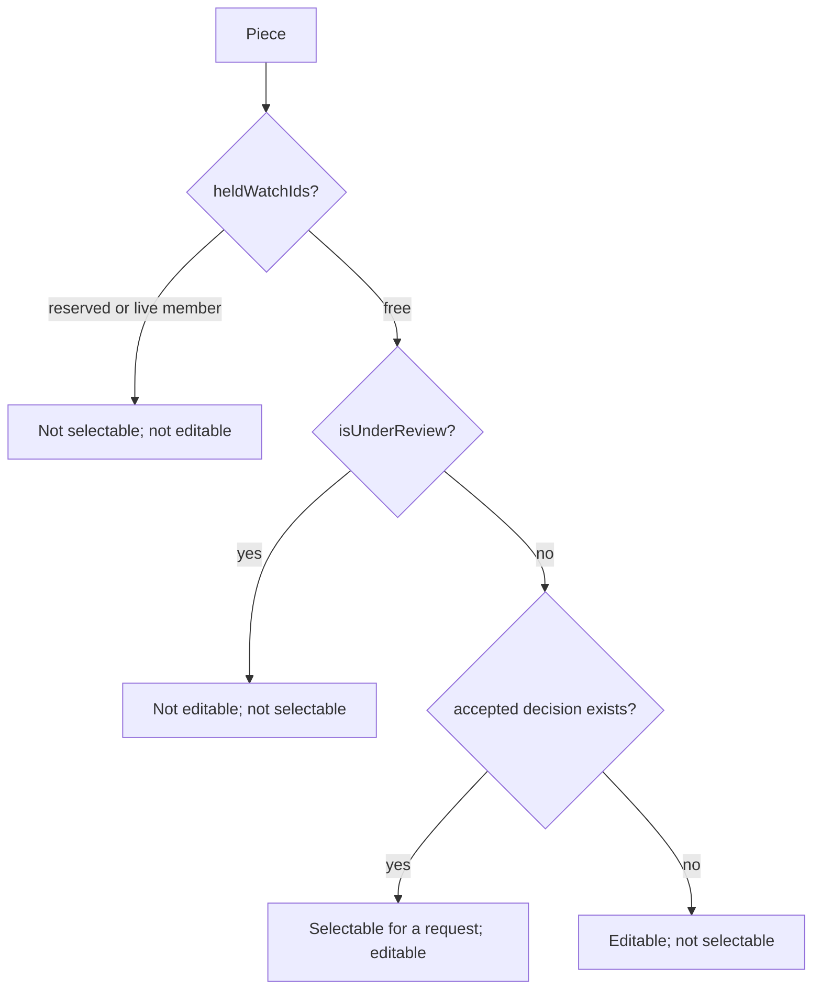
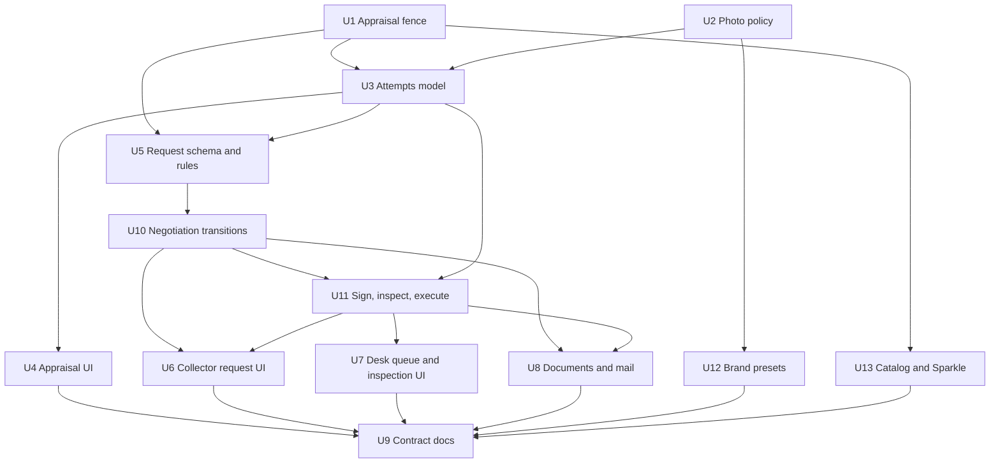

# Appraisal and Repo Request Flow - Plan

## Goal Capsule

- **Objective.** Replace the flag-based appraisal and the create-then-sign repo with two human-shaped workflows: an appraisal that one appraiser owns per decision, and a repo that moves request → proposal → collector signature → one inspection occasion where MAC executes, pays, and takes possession.
- **Authority.** `AGENTS.md` and `docs/` outrank this plan. This plan supersedes the "Appraisal attempts and physical inspection" section of `docs/plans/2026-09-19-desk-stores-whitelabel-analytics-plan.md` and the "Repo life" signature axis of `docs/workflows.md`; U9 rewrites those in place. Roles come from `docs/plans/2026-09-19-roles-identity-repo-parties-plan.md`; U1 here delivers that plan's U-appraise-acl and U11 delivers its U-mac-sign, and U9 marks both as delivered by reference. This plan still depends on that plan's U-passwords (live per-role desk logins) and U-party (dealer `Actor` and the `isRetailRole` sweep).
- **Stop conditions.** Stop and report if a unit would change which dollar drives the LTV cap, raise the 60% purchase share, post cash, enable Neon Auth or WorkOS, add a server file proxy, or auto-migrate `localStorage`.
- **Execution profile.** One PR per unit on `KIT-Capital/mac-app`, dependency order below, gates green before merge. Migrations apply to Neon `development` only through `npm run db:migrate`.
- **Tail.** Merge on green is standing authorization. Production migrate and `MAC_LIVE_BOOK` flip stay owner actions.

---

## Product Contract

### Summary

A collector or dealer photographs a piece with five required shots, submits it with a note, and an appraiser accepts it with a dollar value or marks it **Does not meet appraisal criteria**. That appraiser owns the decision. The piece may be resubmitted with added photos up to three decisions. With appraised pieces in hand, the person selects any number of free pieces and a term; the app instantly shows the maximum MAC would pay and the month-by-month buyback table. They choose an amount at or below the maximum, add a note, and apply. The Desk returns a proposal; the person accepts, declines, or asks for less; then signs. At one inspection occasion an appraiser or super admin verifies the pieces, may amend by hand, and MAC signs last, pays, and takes possession. A stored PDF records each stage. A second repo with other pieces can start any time.

### Problem Frame

Appraisal today is a three-value flag overwritten by any desk role with a one-click catalog copy. Photos are replaced in fixed slots, there is no attempt history, no note, no decision owner, and a piece marked appraised is frozen to its owner forever. The repo form sends one piece, asks the collector to type an amount, creates a live repo that locks the pieces on the spot, and lets either party set "signed" with the same write. A request that stalls sits in the book as an active repo and reads **past due** after its term. Nothing records who signed what, PDFs are never produced by the flow, and there is no Desk queue, no proposal, no decline, and no inspection.

### Requirements

#### Appraisal decisions

- R1. Each completed appraisal decision records the deciding appraiser's staff account id; only that appraiser or a super admin may reopen or change it. One exception: at a repo inspection, the inspecting appraiser may reverse a provisional Accept to a refusal because they hold the piece; the event names both the original decider and the inspector.
- R2. A piece receives at most three completed decisions; after the third, it is closed to further submissions and shows that state.
- R3. Accept requires one non-negative appraisal value; the catalog range is advisory and an out-of-range value warns without blocking.
- R4. A refusal is final when recorded; only an Accept is provisional until the inspection occasion of a repo that contains the piece.
- R5. Only appraisers and super admins may write appraisal values, catalog ranges, or decisions; the server refuses admins.

#### Photos

- R6. Five photo kinds are always required: front, back, left, right, clasp/band. A super admin may mark further kinds mandatory in Desk config, and that setting persists in both books.
- R7. A piece holds at most seven photos. Until its first appraisal submission the owner may retake any slot; from the first submission on, photos are only added, never replaced or deleted.
- R8. While a submission is under review, its piece accepts no data or photo changes from the retail owner; after review, the owner may edit data and add photos unless the piece is on a reserved or live repo.
- R9. A submission snapshot stores immutable object keys and checksums for every photo it references; those objects are never deleted or abandoned while referenced. Presigned photo URLs are minted only by photo id through the owner-scoped `preview-url` path; request bodies never carry object keys.

#### Repo request

- R10. The retail user selects any number of their free appraised pieces (accepted, not under review, and not on a reserved or live repo) and a term; the app computes the maximum sale amount and the month-by-month buyback table immediately, before any application is sent.
- R11. Apply freezes the scale, the per-piece caps, the pieces, the term, the chosen amount (≤ maximum), and a note; pieces become reserved.
- R12. The Desk may confirm the amount, lower it, decline with a reason, or flag the request for customer-success handling by phone; the Desk never raises the amount.
- R13. When the Desk returns a proposal the retail user may sign it, decline it, or ask for a lower amount, always with an optional note; a higher amount is never offered. There is no separate "accept" step — accepting is signing. When the Desk confirms the amount the retail user already chose, the request goes straight to "Your turn to sign".
- R14. Signing in-app stores signature evidence bound to the exact document the signer was shown, and refuses a signature whose shown document is no longer the current version.
- R15. The Desk records delivery when the pieces arrive. Inspection is one occasion: an appraiser or super admin confirms or refuses each piece, may amend (drop pieces, lower amount) into a new version the retail user re-accepts and re-signs, then MAC signs last and the repo executes.
- R16. Only an appraiser or super admin may sign for MAC, and only when every remaining piece has a final inspected acceptance and the checklist is complete. The checklist attests: seller identity verified against government ID, each piece's serial matches its record, condition matches the submitted photos, term and schedule agreed, seller signature present for the current version, sale amount paid with a payment reference recorded, pieces in MAC custody.
- R27. When a request closes after pieces were delivered (declined at inspection or withdrawn), the Desk records the return of the pieces as an event; until then the retail user sees "Awaiting return of your pieces".
- R28. A request's sale amount is whole dollars, at least the Desk-configured minimum sale amount, and at most the computed maximum.
- R17. Book labels (open, past due, and the staff ends) apply only to executed repos; the term clock starts at execution. Requests before execution show request states, not book labels.
- R18. Pieces on a closed request (declined, withdrawn, expired) are free at once; pieces on an executed repo lock until bought back, liquidated, or renewed.
- R19. A retail user may hold any number of concurrent requests and repos; one piece is on at most one reserved or live repo.
- R20. Every state change is recorded as an event with actor, action, amount, version, note, and time; the retail user sees only an allowlisted projection of the thread, the Desk sees all.

#### Retail simplicity

- R29. Every retail screen has one primary action. A request shows the retail user one of four words: **With MAC**, **Your turn**, **Active**, **Closed**. A piece's appraisal shows one of: **Not sent**, **With MAC**, **Accepted**, **Not accepted**, **Closed**; "attempt N of 3" appears only after the first decision. Internal states never appear in retail copy.
- R30. New repo opens pre-filled: every free accepted piece selected, the Desk's typical term, the amount at the maximum. Apply works with no edits; the retail user changes only what they want.
- R31. A closed request (declined, withdrawn, expired) offers one-tap **Start again** that opens New repo with the same pieces preselected when they are still free.
- R32. Notes are one optional field labeled "Anything MAC should know?" wherever they appear; the appraisal note and the request note are the same control.
- R33. The retail user re-signs an amended version on the same screen they signed the first time — "Accept changes and sign" — and may do so on their own device or the Desk's at the inspection occasion.

#### Brand presets

- R34. The Desk **Configure** page gains a **Branding** section, visible and editable only to a super admin, that selects one of two preset brands: **Mechanical Art Capital** (default) and **MB&F**. A preset sets the company name, the wordmark and logo mark, and the color palette together; presets are not edited field by field.
- R35. The selected preset applies to every collector and Desk screen, PDF header, and letter header, in both books. The MAC preset renders exactly today's contract (Logo-FF, navy/gold/champagne); the layout language from the November 2022 Limus design is shared by both presets.
- R36. The MB&F preset ships with a Geist text wordmark and sampled palette until MB&F supplies authorized logo files and official color values; the preset never claims MB&F endorsement in copy.

#### Catalog of brands and models

- R37. The catalog holds a **brand** row for every manufacturer MAC accepts and a **model** row for each brand's main models, each model with a reference, a typical range, and a financeable flag. A model may be marked retail-visible only once it has a photo MAC may use or a recorded photo link (R41); seeded rows start without either and unchecked. The seed is the 53 brands on mechanicalartcapital.com in their two tiers.
- R38. Only an appraiser or super admin writes the catalog, by hand or by accepting a Sparkle suggestion; admins read.
- R39. **Sparkle** researches on click, for the one brand or model the appraiser is editing, and returns a suggestion: candidate models with references, a market range with source URLs and retrieval date, and candidate photos with their source and license. The appraiser saves or ignores each suggestion. No bulk or scheduled run.
- R40. Every brand and every model carries a **retail-visible** checkmark set by the appraiser. Collectors browsing "brands we cover" and the models within a brand see only checked rows; unchecked rows still exist for the Desk.
- R41. A catalog photo is stored only when MAC may use it: MAC's own renders, or an openly licensed image with its attribution recorded on the row. Dealer and manufacturer photos are linked by source URL, never copied into MAC storage.

#### Documents and mail

- R21. Every change to amount or pieces creates a new agreement version with its own frozen snapshot; a stored, immutable PDF exists per version and stage (proposal, collector-signed, executed) in live mode. Browser mode records the snapshot and its hash but stores no PDF.
- R22. The executed PDF is emailed to the retail user as an attachment with a copy to the Desk; every other transition sends a plain notice to the party who must act next, plus a confirmation to the acting party for submit, sign, and expiry.
- R23. Every PDF and screen carries the pending-counsel label; documents that bear an in-app signature carry the software-attestation variant of that label.
- R24. Copy stays sale-and-repurchase. Forbidden anywhere: loan, lender, interest, debt, financing, vesting, paid off, originated, advance, principal, balance, collateral, borrower.

#### Parity and posture

- R25. Every rule above behaves identically in browser mode and live mode through one shared rules module, so the product can be exercised end to end in either book. Only the live book is a trust boundary: browser-mode roles, attempts, and signatures are demo data and are labeled as such.
- R26. Money math is unchanged: the per-piece cap uses `valueLow` at a 60% purchase share through the existing helpers.

### Actors

- A1. Collector / dealer — owns pieces; submits, resubmits, requests, accepts, asks lower, declines, withdraws, signs first.
- A2. Admin — reviews the queue, confirms or lowers, declines, flags customer success; cannot decide appraisals, inspect, amend, or sign for MAC.
- A3. Appraiser — everything an admin does, plus appraisal decisions, inspection, amendment, MAC signature, and catalog writes including Sparkle research and retail-visible checkmarks.
- A4. Super admin — everything an appraiser does, plus reopening any appraiser's decision, editing mandatory photo kinds, and selecting the brand preset.

### Key Flows

- F1. Submit for appraisal
  - **Trigger:** owner taps Request appraisal on a piece with all required photos.
  - **Steps:** note ≤ 256 chars → snapshot frozen (fields, photo keys + checksums, note) → piece locked → Desk queue.
  - **Outcome:** attempt `under_review`; owner sees "With MAC" and, after the first decision, "N of 3 decisions used".
- F2. Decide
  - **Trigger:** appraiser opens the attempt.
  - **Steps:** sees snapshot photos and fields → Save for later, Return, Accept + value, or Refuse → decision owner recorded.
  - **Outcome:** `accepted` (provisional) or `refused` (final); piece unlocked; owner may add photos and resubmit while decisions < 3.
- F3. Build a request
  - **Trigger:** owner opens New repo.
  - **Steps:** multi-select free pieces → term → maximum and schedule update live → amount ≤ maximum → note → Apply.
  - **Outcome:** `submitted`; pieces `reserved`; proposal PDF v1; Desk and owner mailed.
- F4. Negotiate
  - **Trigger:** Desk opens the queue item.
  - **Steps:** confirm | lower | decline | flag CS → `returned` ("Your turn") → owner signs | asks lower (back to `submitted`) | declines.
  - **Outcome:** `collector_signed` or closed.
- F5. Sign and inspect
  - **Trigger:** owner signs from `returned`.
  - **Steps:** collector-signed PDF → delivery method → Desk records delivery → per-piece inspection finalizes attempts → confirm | amend (new version, F4 again) | decline → checklist → MAC signs.
  - **Outcome:** `executed`; members `live`; executed PDF mailed; book label **open** from `executedOn`.
- F6. Second request
  - **Trigger:** owner opens New repo while another request or repo exists.
  - **Steps:** picker excludes reserved and live pieces.
  - **Outcome:** independent request; Desk queue shows both.

### Acceptance Examples

- AE1. Appraiser Dov accepts a piece; appraiser Rosario opens it and sees no Reopen control; super admin Ricardo does. Covers R1.
- AE2. A piece with three completed decisions (any mix) shows "Appraisal closed" and no Request appraisal button; the server refuses a fourth submission. Covers R2.
- AE3. A piece under review refuses a photo add and a field edit from its owner with `REVIEW_LOCKED`; after Return, both succeed; the seventh photo is accepted and the eighth refused. Covers R7, R8.
- AE4. A collector with four appraised pieces selects three and a 12-month term; the maximum equals the sum of the three per-piece caps and the table shows twelve rows before any Apply. Covers R10, R26.
- AE5. After Apply, the desk lowers the amount; the collector asks lower again; the desk confirms; the collector's screen reads "Your turn" with Sign as the only primary action; the amount never rose across the thread and every step is an event. Covers R12, R13, R20, R29.
- AE11. A collector with three free accepted pieces opens New repo and taps Apply without touching anything; a `submitted` request exists for all three pieces at the typical term and the maximum amount. Covers R30.
- AE12. A collector retakes the front photo twice before ever submitting; after the first submission, the front slot offers no retake and an "Add photo" control appears. Covers R7.
- AE6. A submitted request left untouched shows no book label, and its pieces do not appear in a second request's picker; once declined they do. Covers R17, R18, R19.
- AE7. An admin opens an inspecting request and sees MAC sign disabled with reason; an appraiser with one piece still provisional sees it disabled; after finalizing every piece and checking the list, it enables. Covers R15, R16.
- AE8. Execution produces an `executed` document for the current version, an `agreement_signatures` row for MAC bound to that version's snapshot hash, and one email with the attachment once the document is stored. Covers R14, R21, R22.
- AE9. Browser mode and live mode reject the same illegal transition with the same error code. Covers R25.
- AE10. Splash, request screens, Desk queue, and all letters have zero matches for the forbidden-word list. Covers R24.

### Scope Boundaries

- No change to which dollar drives the cap or to the 60% share (R26). The owner's "65% or so" is a separate money-math decision.
- No cash posting, ledger, or QuickBooks link. "Paid" is a checklist attestation with a timestamp.
- No e-signature vendor. In-app signing is software attestation pending counsel.
- No scheduler. Expiry is derived at read and enforced at the mutation boundary.
- No SMS or WhatsApp notices; email only (roles plan U-sms / U-whatsapp).
- No tenant scoping or analytics (other Desk-stores units). The brand overlay's first slice — two presets — ships here as U12, and the catalog with Sparkle ships as U13; per-tenant brand rows stay in the Desk-stores plan.
- Sparkle stays a suggestion the appraiser saves; no scheduled repricing, no retail Sparkle, no pricing shown on collector browse screens.
- No video upload; `allowVideo` stays a client-only picker.

### Deferred to Follow-Up Work

- Renewal successor through the new request path (today `agreement.renew` creates a `pending_signature` successor). Keep current behavior; convert in a follow-up once request states are live.
- Collector-initiated buyback: show today's buyback price on an executed repo, let the owner request buyback, Desk confirms payment and records **bought back**. Today only the Desk records ends.
- Term reminders: notices before month-end prices step up and before **past due**.
- Desk inspection photos: condition-on-receipt photos attached to the finalized attempt, separate from the retail seven, for dispute evidence.
- Dealer picker beyond 200 pieces per request (pagination and bulk select UX).
- Login by one-time code: retail signs in with a code sent to email or phone, no password and no third-party accounts; Desk staff keep a password plus the code. Owner decision 2026-09-19 after reviewing the 2021 app and 2020 RFQ, which used passwords and Google/Facebook/Amazon logins. Lands in the roles plan (U-passwords, U-sms), not here.
- Evidence retention period and deletion-request pseudonymization (KTD10) — pending counsel.
- Expiry windows as Desk settings (KTD12) — on the first owner request.
- Membership perk from the 2020 RFQ — periodic re-appraisal for members — only as an owner-requested resubmission with no attempt consumed, never automatic repricing (Sparkle rule).
- Retire the unused Stage 4 `applications` / `agreements` / `allocations` tables.

---

## Planning Contract

### Key Technical Decisions

- KTD1. **One `appraisal_attempts` aggregate, not a wider `WatchStatus`.** Each submission is a row with a frozen snapshot, `decided_by_staff_id`, and outcome. The timepiece row keeps `status`, `valueLow`, `valueHigh`, and `evaluatedAt` as stored columns written **only** by attempt transitions: Accept writes the catalog range into `valueLow`/`valueHigh` (today's behavior) alongside the new `value_cents` so the R26 cap keeps working and the request picker is never empty. `(session-settled: user-directed — chosen over letting any appraiser reverse any decision: one owner per decision, super admin as backstop)` Governs R1, R2, R4.
- KTD2. **Decision owner is `staff_accounts.id`, never email.** Desk actors must carry `staffId` for appraisal and MAC-sign writes; a desk token without it is refused with `SESSION_INVALID` on those actions, mirroring today's audited-action rule. Every new desk-callable `appraisal.*` and `request.*` action joins `AUDITED_DESK_ACTIONS`; `appraisal.return` requires `canEditAppraisal` like `decide` and `reopen`. Governs R1, R5, R16.
- KTD3. **One `requiredPhotoKinds` setting replaces `requireFourPhotos`.** Stored as a text array on `desk_settings` and in `AppSettings`, default `front, back, left, right, clasp`; the five defaults are not removable in the UI; super admin may add kinds. `TIMEPIECE_SHOTS` reads the setting. `(session-settled: user-directed — chosen over a second boolean flag: super admin picks mandatory extras)` Governs R6.
- KTD4. **Photos are add-only from the first submission; slot model becomes an ordered list capped at 7.** Before a piece has any `appraisal_attempts` row, today's replace-in-slot behavior stays (there is no evidence yet to protect). Once one exists, `requestPhotoUpload` checks the checksum first (an identical re-request of a stored photo returns the existing row, as today), then refuses a *different* photo for any kind — required or extra — that already has a non-abandoned row (`PHOTO_KIND_TAKEN`), and refuses an eighth photo (`PHOTO_LIMIT`); `setCurrentPreview` no longer deletes same-kind rows for such pieces. `(session-settled: user-directed — chosen over replace-in-slot: the appraiser can tell what a photo shows; 7 total including the five required)` Governs R7, R9.
- KTD5. **Book-and-hold predicates live in the existing `lib/contract/repo-book.mjs`;** the only new contract module is `request-transitions.mjs`. `repo-book.mjs` gains `heldWatchIds(agreements, today)` (renaming `liveWatchIds` in place: reserved + live, excluding derived-expired requests), `isRequestExpired(agreement, today)`, `isUnderReview(piece, attempts)`, `canRetailEditPiece(...)`, `nextAppraisalAttemptNo(...)`, and `deskToday()` (replacing `utcToday`). Layering: `repo-book.mjs` ← `request-transitions.mjs`; `appraisal-attempts.ts` imports only `repo-book.mjs`. Both `lib/store.tsx` and `lib/db/live-book-mutations.ts` / `lib/db/photos.ts` call these. Governs R8, R19, R25.
- KTD6. **Request states live on `live_agreements.status`; members gain `reserved`.** States: `submitted`, `returned`, `collector_signed`, `inspecting`, `executed`, `closed` with `close_reason` in `declined_by_desk | declined_by_collector | withdrawn | expired`. There is no `accepted` state: the retail user signs directly from `returned`. A status check constraint covers the new set plus legacy `draft | pending_signature | signed`. **`version` increments on every change to amount or pieces** — desk lower, collector ask-lower, inspection amend — and each version freezes its own snapshot, so `expectedVersion` guards the money. An amendment is a `returned` state at `version + 1`, not a separate status. The partial unique index on members widens to `status in ('reserved','live')`. `(session-settled: user-directed — chosen over create-then-sign: everything is settled before inspection; MAC signs last at inspection)` Governs R11, R15, R18, R19, R21.
- KTD21. **Legacy rows map once, in the migration.** `signed` → `executed` with `executed_on = coalesce(signed_on, created_on)`; `pending_signature` → `executed` with `executed_on = created_on`, because those rows were on the book from `createdAt` with `live` members and the Hale demo depends on it; every legacy row gets `version = 1`, `last_action_at = updated_at`, and one `legacy_backfill` event recording the prior status. Legacy `draft` rows, if any exist, close as `closed` / `withdrawn` with members released. `agreement.renew` successors are inserted `executed` with `executed_on = closeDate` and a `renewed_from` event, no signature rows, because the pieces are already in MAC custody; the request-path renewal stays deferred. No legacy row lands in a request state. The same mapping ships once as `legacyAgreementToRequest()` in `lib/contract/` and is used by the migration SQL fixture test, the browser persisted-state upgrade, and the desk import planner. Rollback is a Neon restore from the pre-migrate snapshot; there is no down migration.
- KTD22. **Retail reads receive an allowlisted projection.** The projection also maps internal status to the four retail words: `submitted` → With MAC; `returned` → Your turn; `collector_signed`, `inspecting` → With MAC (with a delivery sub-line); `executed` → Active; `closed` → Closed. Events with `internal = true`, staff ids and emails, client addresses, `customer_success`, `decided_by_staff_id`, and desk-side close detail never serialize to a retail actor; desk actors render as "MAC Desk", the owner as "You". The filter lives in the adapter, server-side. Governs R20.
- KTD23. **Two throttles, both through existing machinery.** `request.submit` and `request.withdraw` are limited to 5 per customer per day through `consumeAccessRateLimit` on the existing `access_rate_limits` table and refuse with `THROTTLED` — a transition never succeeds silently without its notice. The executed system send is unique per `(document_id, recipient_kind)` on `agreement_document_sends` so a retry never resends. Governs R22.
- KTD24. **Browser-mode evidence is labeled, not trusted.** Browser signature rows carry `book: "browser"`; browser screens and previews that would show a signature print "Demo — not evidence"; browser mode sends the same plain notices it sends today but never an attachment and never a claim that a document is stored. The "server fence" language in this plan applies to the live book only. Governs R23, R25.
- KTD28. **Catalog becomes two tables with provenance.** `catalog_brands` (id, name, tier `1 | 2`, slug, logo asset key nullable, retail_visible boolean, sort order) and the existing `catalog_references` gains `brand_id` FK, `retail_visible`, `photo_object_key` nullable, `photo_source_url`, `photo_license`, `photo_attribution`, a check `retail_visible = false or photo_object_key is not null or photo_source_url is not null`, `market_source_urls` jsonb, `market_retrieved_on`, `last_edited_by_staff_id`. `lib/catalog.ts` `TIER_ONE_BRANDS` and `MODELS_BY_BRAND` are replaced by the seeded tables in both books. Sparkle is a Desk-only server action (`catalog.sparkle`, `canEditAppraisal`, `staffId` required, rate-limited) that calls Exa search and a scraping API (Firecrawl first; Apify as a second adapter) against secondary-market dealer listings and manufacturer pages, and returns a suggestion payload the client renders for accept/ignore; it never writes rows itself. Provider keys live in Doppler. `(session-settled: user-directed — chosen over a hand-maintained list: appraiser edits by hand or asks Sparkle to research; retail sees only checked rows)` Governs R37–R41.
- KTD26. **Brand is one setting resolved to CSS variables at the root.** `desk_settings.brand_preset` (`mac | mbf`, default `mac`) and `AppSettings.brandPreset` drive `<html data-brand>`; `app/globals.css` defines `--brand-primary`, `--brand-accent`, `--brand-soft`, `--brand-name` per preset and remaps `--color-mac-navy` / `--color-mac-gold` / `--color-mac-champagne` to them, so existing token classes switch without edits. The 97 hardcoded `#FCB040`, 32 `#0E2A44`, and 20 `#E8D5C0` literals in `app/` and `components/` become token classes in the same unit — a preset cannot work while a single screen keeps a literal. Logo components take the preset from context and render the MAC Logo-FF assets or the MB&F assets. `(session-settled: user-directed — chosen over per-field brand editing: two preset brands for now)` Governs R34, R35, R36.
- KTD25. **Invariants live in the database where they can.** Check constraints: `live_agreements.status` in the six states plus legacy, `(status = 'executed') = (executed_on is not null)`, `(status = 'closed') = (close_reason is not null)`, `version >= 1`; members status in `reserved | live | released`; attempts status in the four states, `value_cents >= 0`, `decision_no between 1 and 3` with `UNIQUE (timepiece_id, decision_no)`; documents stage enum with the unique on (agreement, version, stage) partial `where stage <> 'legacy' and status <> 'failed'`; settings `required_photo_kinds @> '{front,back,left,right,clasp}'`. Attempt snapshots are immutable through a `BEFORE UPDATE` trigger that raises when `snapshot` or `submitted_at` changes. Triggers are hand-appended to the generated migration on the `0011` pattern and proven by SQL fixture tests, because `--schema-check` does not see them. Governs R2, R9, R17, R21.
- KTD7. **Book labels derive from `executed_on`, and the term clock starts there.** `bookLabel` returns `null` for unexecuted rows; `liveWatchIds` becomes `heldWatchIds`. The Hale demo fixture gets an `executedOn` so it still reads **past due**. This is a doc–code conflict with "Unsigned rows still appear in the book" in `docs/workflows.md`; U5 rewrites that sentence in the same PR as the code. Governs R17.
- KTD8. **Amount is monotonically non-increasing after Apply.** `validateSaleAmountRaise` is replaced by `validateSaleAmountLower`; collector `addWatches` and `setAmount` are removed from the request path (change pieces = withdraw and reapply). `(session-settled: user-directed — chosen over an in-app counter-offer: MAC will not consider higher amounts)` Governs R12, R13.
- KTD9. **Offer math runs client-side from server-disclosed terms, and is recomputed server-side at Apply.** The picker uses `applicationPurchaseShares` + `maxPurchaseAmount` per piece + `repurchaseSchedule`; `request.submit` recomputes the cap from the frozen scale and refuses an amount above it (`AMOUNT_ABOVE_CAP`). Per-piece caps are snapshotted into the request so later appraisal edits never reprice it. `(session-settled: user-directed — chosen over hiding the scale until an application is sent: calculations are immediate; the PDF is a record, not the source)` Governs R10, R11, R26.
- KTD10. **Two new evidence tables: `agreement_events` and `agreement_signatures`.** Events: actor kind (`retail | desk | system`) and id, action, from/to status, amount cents, version, note (≤ 1000 chars), `internal` boolean, created at. Signatures: agreement id, version, party `collector | mac`, signer id, typed name, `document_id`, `snapshot_hash`, client address, `book` (`live | browser`), signed at. **A signature binds to the document the signer was shown** — the `proposal` row of that version for the collector, the `collector_signed` row for MAC — through `document_id` plus that row's `snapshot_hash`; the client submits the hash it displayed and the server refuses a mismatch with `DOCUMENT_STALE`. Constraints: `document_id` NOT NULL with a composite FK `(document_id, agreement_id)` so a signature can never point at another agreement's document; `UNIQUE (agreement_id, version, party)`. Both tables are append-only through a `BEFORE UPDATE OR DELETE` trigger on the `0011` pattern. `agreement_documents` gains `UNIQUE (id, live_agreement_id)` so the composite FK is valid. `customer.remove` refuses when attempts or signatures exist (U3). Retention period and deletion-request pseudonymization are deferred follow-ups pending counsel. Governs R14, R20.
- KTD11. **`agreement_documents` gains only `stage`; the existing `version` column becomes the agreement version.** Unique per (agreement, version, stage), partial `where stage <> 'legacy' and status <> 'failed'`; legacy rows are backfilled `stage = 'legacy'` and keep their numbers; the `nextVersion` retry loop retires. The transition transaction inserts the document row as `building` with its snapshot and hash; render and R2 put run **after commit** (KTD27). **Render-on-read recovery:** `renderStageDocument(documentId)` is idempotent (conditional update where `status = 'building'`, `putIfAbsent`, compensating `failed`), and is invoked from the read paths (`listAgreementDocuments`, `mintAgreementDocumentUrl`) and from the `signCollector` / `executeMac` preconditions whenever the current version's row is `building` without an object or `failed` (a fresh row is inserted for the same key, which the partial unique allows). A single failed render therefore never blocks signing. No button-triggered build on the request path. Holding a row lock across PDF render and R2 I/O is exactly what the existing compensating design avoids; this plan keeps it. Governs R21.
- KTD27. **After-commit work has one mechanism.** `executeLiveBookOperationCore` returns `{ afterCommit: Array<() => Promise<void>> }`; `executeLiveBookOperation` returns it once the transaction resolves; `app/api/live-book/route.ts` schedules each job with `after()` from `next/server` (already used in `app/api/collector-session/route.ts`). The jobs of one transition run **in order as a single chained job** — render first, then any send that depends on the rendered document — so the executed email never runs before its PDF is `stored`; a send whose document is not `stored` when reached records a `failed` send row and is recovered by `request.resendExecuted` or reconcile-on-read. `npm run test:db` awaits the chain directly. Browser mode keeps the client-side `/api/mail` path for plain notices. Governs R21, R22.
- KTD12. **Expiry is derived and enforced at the mutation boundary and at read.** `REQUEST_RESPONSE_DAYS = 14` and `DELIVERY_DAYS = 30` ship as constants in `request-transitions.mjs`; they become Desk settings on the first owner request, not before. `isRequestExpired(agreement, today)` lives in `repo-book.mjs`; a transition on an expired request first closes it as `expired` (event actor `system`, members released) **in its own committed transaction**, and only then refuses the requested transition with `REQUEST_EXPIRED` — the refusal never rolls the close back; a `request.submit` that includes a piece held only by an expired request closes that request in the same transaction. `heldWatchIds` excludes derived-expired requests so an untouched request never keeps pieces out of a new one. Client-side expiry is display only; the server is the sole enforcer. Desk inaction never expires; the queue shows age. There is no "expiring soon" letter — that needs a scheduler this stack does not have. Governs R18, R19.
- KTD18. **Business dates are calendar dates in `America/New_York`.** `deskToday()` in `repo-book.mjs` replaces `utcToday()`; expiry, term clock, and schedule dates use the desk's calendar day, computed server-side in live mode and from the device clock in browser mode; the browser book labels its expiry as provisional until the next live read. Governs R17, R18.
- KTD19. **New code scopes retail actors with `isRetailRole`, never `role === "collector"`.** Every handler and store method this plan adds uses the helper. The sweep of the existing `=== "collector"` branches (`photos.ts`, `agreement-documents.ts`, `live-book-adapter.ts`, `pieceValues`, `app/api/live-book/route.ts`, `app/api/agreement-documents/route.ts`) belongs to the roles-plan U-party, which introduces the dealer `Actor`; until then `toCollectorActor` refuses non-collector retail rows, so no dealer can reach those branches. Governs A1, R19.
- KTD20. **Loan-adjacent identifiers leave the code with the copy.** `minAdvance` becomes `minSaleAmount`; `financingEmail` becomes `deskEmail`; the `financing` mail kind is removed. Internal names are not user-visible, but they leak into logs, exports, and future copy. Governs R24, R28.
- KTD13. **Every transition carries `expectedStatus` and `expectedVersion`.** Ownership resolves first, so a foreign id is `*_NOT_FOUND` and never a state error; then mismatch → `AGREEMENT_STATE_CONFLICT`. **Global lock order:** `timepieces` (ascending id, `for update`) → `live_agreements` (ascending id) → `appraisal_attempts` (ascending id); `appraisal.decide` locks its timepiece first, then the attempt; Postgres `40P01` maps to `AGREEMENT_STATE_CONFLICT`. Input bounds: `expectedVersion` a non-negative safe integer; amounts a single cents integer; `watchIds` deduplicated, ≤ 200, each ≤ 160 chars; delivery method a closed enum; `requiredPhotoKinds` a unique subset of `PHOTO_KINDS` containing the five defaults and ≤ 7; notes ≤ 1000 (request) / 256 (appraisal), control characters stripped, HTML-escaped in letters and PDFs. **Store rule:** every `request.*` and `appraisal.*` store method uses `deferLive: true` with a new `applyOnAck: false` option on `updateStore`, so in live mode the recipe runs only for browser mode and the live snapshot changes only through `reconcileLiveStore(true)`. Ids for `appraisal.submit` and `request.submit` stay client-minted through the existing `id()` parser and `ID_COLLISION` guard (as `createAgreement` does today) so the client can navigate to the new row after reconciliation; versions, dates, `decision_no`, and document ids are server-minted and never predicted. Governs R20, R25.
- KTD14. **Inspection finalizes attempts in the same transaction.** Confirming a piece sets `finalized_at`, `finalized_by_staff_id`, and `finalized_agreement_id` on its accepted attempt. Refusing a piece at inspection **reverses that attempt's Accept to `refused` in place** — it does not consume another decision (R1 exception). Dropping a piece for amount reasons leaves the attempt provisional and frees the piece. Governs R1, R4, R15, R16.
- KTD15. **Two counsel labels, chosen by stage.** `PENDING_COUNSEL_LABEL` on `proposal`; `ATTESTATION_LABEL` ("Draft — pending legal approval — software attestation, not counsel-approved") on `collector_signed` and `executed`. Governs R23.
- KTD16. **Admin may review; appraiser and super admin inspect and sign.** `canReviewRequest` = any desk role; `canInspect` = `canSignForMac`. Governs A2, A3, R16.
- KTD17. **The per-request piece limit rises from 24 to 200.** Roles plan R20 names dealers at ~100 pieces. Governs R19.

### High-Level Technical Design

#### Appraisal attempt lifecycle

```mermaid
stateDiagram-v2
  [*] --> Free: piece saved with required photos
  Free --> UnderReview: owner submits (attempt N)
  UnderReview --> Free: appraiser Returns (no decision consumed)
  UnderReview --> Accepted: Accept + value (decision N, provisional)
  UnderReview --> Refused: Does not meet criteria (decision N, final)
  Accepted --> Refused: repo inspection refuses (in place, same decision)
  Accepted --> FinalAccepted: repo inspection confirms
  Refused --> Free: owner adds photos, N < 3
  Accepted --> Free: owner edits or adds photos, N < 3 (attempt stays)
  Refused --> Closed: N = 3
  Accepted --> Closed: N = 3 (stays accepted; no further submissions)
  Accepted --> UnderReview: audited reopen by owner-appraiser or super admin
  Refused --> UnderReview: audited reopen by owner-appraiser or super admin
  FinalAccepted --> Locked: repo executes
```



#### Repo request lifecycle

```mermaid
stateDiagram-v2
  [*] --> submitted: Apply (pieces reserved, proposal v1)
  submitted --> returned: desk confirm (same v) or lower (v+1, new proposal)
  submitted --> closed: desk decline / owner withdraw
  returned --> collector_signed: owner signs current version\n(collector_signed doc for that v)
  returned --> submitted: owner asks lower (v+1, new proposal)
  returned --> closed: owner declines / expired
  collector_signed --> inspecting: desk records delivery
  collector_signed --> closed: owner withdraws / delivery expired
  inspecting --> returned: amend (v+1, new proposal; owner re-accepts, re-signs)
  inspecting --> closed: desk declines at inspection / owner withdraws
  inspecting --> executed: checklist + MAC signs (executed doc, members live)
  executed --> [*]: book axis takes over (open, past due, ends)
```

#### Piece exclusivity across both lifecycles



#### Unit dependency



### Assumptions

- Expiry defaults of 14 days per collector turn and 30 days from signature to delivery ship as Desk config; the owner changes them there, not in code.
- The collector may withdraw at any state before `executed`, including after signing; signed PDFs are retained.
- `financeable` remains a desk-controlled eligibility gate on top of an accepted decision.
- Terms 3, 6, and 8 keep today's fallback to the 12-month tenor for fee windows; the offer table shows what `repurchaseSchedule` computes.
- A piece dropped at inspection for amount reasons shows the owner "Released from request" and is free at once; its attempt stays provisional.
- Minimum sale amount defaults to **$10,000**, the floor the 2021 app enforced ("Minimum amount for financial agreement is $10,000"), not the $500 code default; the Desk may change it in config.
- Whether the in-app attestation constitutes an executed contract is counsel's call; the app records evidence and labels honestly.

### Open Questions

- Deferred (owner, money): "65% or so" purchase share versus the 60% enforced in three places — needs its own money-math approval before any code changes it.
- Deferred (counsel): wording of both labels and whether typed-name attestation is acceptable, before any real collector sees an executed PDF.
- Deferred (owner, compliance): whether an external stolen-watch registry check belongs on the inspection checklist; the checklist ships with a manual "ownership check done" line until then.

---

## Implementation Units

| U-ID | Title | Key files | Depends on |
|---|---|---|---|
| U1 | Appraisal authorization fence | `lib/db/live-book-mutations.ts`, `lib/roles.mjs` | — |
| U2 | Photo policy: required kinds setting, add-only photos | `lib/timepiece-shots.mjs`, `lib/db/photos.ts`, `app/collection/add/page.tsx` | — |
| U3 | Appraisal attempts model and shared locks | `lib/db/appraisal-attempts.ts`, `lib/contract/repo-book.mjs`, `lib/store.tsx` | U1, U2 |
| U4 | Appraisal UI: collector states and Desk review | `app/collection/[id]/page.tsx`, `app/admin/appraisals/[id]/page.tsx` | U3 |
| U5 | Repo request schema, rules module, book semantics | `lib/db/schema.ts`, `lib/contract/request-transitions.mjs`, `lib/contract/repo-book.mjs` | U1, U3 |
| U10 | Request transitions through negotiation and closure, after-commit hook, stage render | `lib/db/live-book-mutations.ts`, `lib/db/agreement-documents.ts`, `lib/store.tsx` | U5 |
| U11 | Signature, delivery, inspection, MAC execution | `lib/db/live-book-mutations.ts`, `lib/db/appraisal-attempts.ts` | U10, U3 |
| U6 | Collector request UI: picker, live offer, states | `components/application-form.tsx`, `app/agreements/[id]/page.tsx` | U10, U11 |
| U7 | Desk queue, review, inspection UI | `app/admin/agreements/page.tsx`, `app/admin/requests/[id]/page.tsx` | U11 |
| U8 | Labels, signature block, transition mail, executed send | `lib/contract/repo-agreement-snapshot.mjs`, `lib/mail.ts` | U10, U11 |
| U12 | Brand presets: MAC and MB&F | `app/globals.css`, `components/mac-logo.tsx`, `app/admin/config/page.tsx` | U2 (settings path) |
| U13 | Catalog: brands, models, photos, Sparkle research, retail checkmarks | `lib/db/schema.ts`, `lib/db/catalog.ts`, `app/admin/catalog/page.tsx`, `app/brands/page.tsx` | U1 |
| U9 | Contract documentation | `docs/workflows.md`, `docs/business-logic.md`, `docs/design-system.md`, `docs/decisions/` | U4, U6, U7, U8, U12 |

### U1. Appraisal authorization fence

- **Goal:** Make R5 true on the server before any appraisal screen ships.
- **Requirements:** R5, KTD2, KTD16.
- **Dependencies:** none.
- **Files:** `lib/db/live-book-mutations.ts`, `lib/roles.mjs`, `lib/db/records.ts`, `lib/server/request-actor.ts`, `lib/db/isolation.mjs`, `lib/live-book-errors.mjs`; tests `lib/db/live-book.test.ts`, `lib/roles.test.mjs`, `lib/db/isolation.test.mjs`.
- **Approach:**
  1. `timepiece.deskUpdate` with any of `valueLow`, `valueHigh`, `financeable`, `status: appraised`, `evaluatedAt` requires `canEditAppraisal(actor)`; otherwise `ROLE_FORBIDDEN`.
  2. `catalog.upsert` / `catalog.remove` require `canEditAppraisal`.
  3. Add `canReviewRequest`, `canInspect` (= `canSignForMac`) to `lib/roles.mjs`.
  4. Add `staffId` to the isolation `DeskActor` typedef; appraisal writes in live mode require `actor.staffId`.
  5. Add `ROLE_FORBIDDEN` to the FORBIDDEN error set if absent.
  6. `toCollectorActor` refuses non-collector retail rows until roles-plan U-party lands the dealer `Actor` and the `isRetailRole` sweep (KTD19).
  7. Enumerate the new `AUDITED_DESK_ACTIONS` set in one exported constant (KTD2).
- **Patterns to follow:** `requireDesk` and `AUDITED_DESK_ACTIONS` in `live-book-mutations.ts`; `canManageDeskAccount` fence in `lib/db/staff-accounts.ts`.
- **Test scenarios:**
  - Admin `timepiece.deskUpdate` with `valueLow` → `ROLE_FORBIDDEN`; the row is unchanged.
  - Admin `timepiece.deskUpdate` with only `assetCode` → succeeds.
  - Appraiser and super admin write `valueLow` / `status: appraised` → succeed and are audited.
  - Admin `catalog.upsert` → `ROLE_FORBIDDEN`; appraiser → succeeds.
  - Live-mode appraiser without `staffId` writing a value → `SESSION_INVALID`.
  - `canInspect` true for appraiser, super admin, master; false for admin, collector, dealer.
  - A retail row with role `dealer` is refused by `toCollectorActor` until U-party.
- **Verification:** `lib/db/live-book.test.ts` "keeps valuation and end controls on the desk" extended with the admin refusal; e2e `desk appraises a reviewing piece from the catalog range` signs in with a browser-mode appraiser fixture added to the desk e2e seed (live per-role desk passwords arrive with roles-plan U-passwords; this unit does not wait for it).

### U2. Photo policy: required kinds setting and add-only photos

- **Goal:** Five required kinds from one setting, super-admin extras, add-only up to seven.
- **Requirements:** R6, R7, KTD3, KTD4.
- **Dependencies:** none (lands before U3 so snapshots reference the final photo model).
- **Files:** `lib/types.ts`, `lib/theme.ts`, `lib/timepiece-shots.mjs`, `lib/db/schema.ts`, `drizzle/0021_*.sql` (generated), `lib/live-book-operation.mjs` (`SETTINGS_FIELDS`), `lib/db/live-book-mutations.ts` (`settings.update`, `settingsRowValues`), `lib/db/live-book-adapter.ts` (`settings()`), `lib/db/photos.ts`, `app/api/photos/route.ts`, `app/collection/add/page.tsx`, `app/admin/config/page.tsx`, `app/admin/photos/page.tsx`, `lib/store.tsx` (`addTimepiece` kind fallback); tests `lib/timepiece-shots.test.mjs`, `lib/db/photos.test.ts`, `lib/live-book-operation.test.mjs`, `e2e/collector.spec.ts`, `e2e/desk.spec.ts`.
- **Approach:**
  1. Replace `requireFourPhotos` with `requiredPhotoKinds: PhotoKind[]` in `AppSettings`, `DEFAULT_SETTINGS`, `desk_settings` (text array), `SETTINGS_FIELDS`, adapter, and config page; only super admin sees the editor; the five defaults render as fixed.
  2. Rename the `clasp` prompt to "Clasp / band"; kind value stays `clasp`.
  3. `TIMEPIECE_SHOTS` becomes a function of the setting; delete `STRICT_KINDS` / `CORE_KINDS`; collapse the duplicated `PHOTO_KINDS` lists to one export.
  4. Intake screen: required slots first, then an "Add photo" control for extra kinds up to seven total. Before the piece's first submission a slot offers Retake as today; after it, existing photos render without a change control (KTD4).
  5. `requestPhotoUpload` refuses an eighth photo (`PHOTO_LIMIT`) and, for a piece with any attempt, a second photo of a kind already stored (`PHOTO_KIND_TAKEN`); `setCurrentPreview` keeps replace semantics only for pieces with no attempt. U2 ships the count cap and the hook; U3 turns the hook on when attempts exist.
  6. `admin/photos` Remove is limited to `live_previews` rows with no `photo_object_id` (legacy data URLs).
- **Patterns to follow:** `validateSettingsPatch` bounds in `live-book-operation.mjs`; `intakePhotoErrors` in `timepiece-shots.mjs`.
- **Test scenarios:**
  - Default settings require exactly the five kinds; adding `box` makes Save refuse until a box photo exists.
  - Admin `settings.update` with `requiredPhotoKinds` → `ROLE_FORBIDDEN`; super admin → persisted; the setting round-trips through live GET.
  - A `requiredPhotoKinds` patch that omits any of the five defaults is rejected.
  - Eighth `request-upload` → `PHOTO_LIMIT`.
  - Piece with no attempt: second `front` upload replaces (today's behavior, test kept). Piece with an attempt: identical `front` photo re-requested → returns the stored row; a different `front` or a second `box` → `PHOTO_KIND_TAKEN` (tests added in U3).
  - Concurrent uploads of two different extra kinds both succeed.
  - Browser mode: intake form enforces the same limit and refusal copy without a network call.
- **Verification:** `lib/timepiece-shots.test.mjs` all green with the new signature; e2e "live intake uploads and confirms every required photo before saving" passes with clasp/band label.

### U3. Appraisal attempts model and shared locks

- **Goal:** Persist attempts in both books with owner, snapshot, cap, lock, and retention rules.
- **Requirements:** R1–R4, R8, R9, KTD1, KTD2, KTD5, KTD14 (attempt fields only).
- **Dependencies:** U1, U2.
- **Files:** `lib/db/schema.ts` (`appraisal_attempts`), `drizzle/0022_*.sql` (generated), `lib/types.ts` (`AppraisalAttempt`, `AppState.appraisalAttempts`), `lib/contract/repo-book.mjs` (predicates per KTD5), `lib/db/appraisal-attempts.ts` (new), `lib/live-book-operation.mjs` (`appraisal.submit`, `appraisal.return`, `appraisal.decide`, `appraisal.reopen`), `lib/db/live-book-mutations.ts`, `lib/db/photos.ts` (lock + retention check), `lib/db/live-book-adapter.ts`, `lib/live-book-mode.mjs` (`validBook`), `lib/store.tsx`, `lib/live-book-errors.mjs`, `scripts/photo-pending-sweep.mjs`; tests `lib/contract/repo-book.test.mjs`, `lib/db/appraisal-attempts.test.ts` (new), `lib/db/live-book.test.ts`, `lib/db/photos.test.ts`, `lib/live-book-operation.test.mjs`, `lib/live-book-mode.test.mjs`.
- **Approach:**
  1. Table columns: id, timepiece id, customer id, attempt no, `decision_no` (null until a decision), status (`under_review | returned | accepted | refused`), submitted at, snapshot jsonb (fields and note ≤ 256 — no photo list), decided by staff id (FK `staff_accounts`), decided at, value cents, range low/high cents at decision, finalized at, finalized by staff id (FK), finalized agreement id (FK `live_agreements`), reopened count. Unique on (timepiece id, attempt no); `UNIQUE (timepiece_id, decision_no)`; partial unique on timepiece id where status = `under_review`; constraints and trigger per KTD25. Photos live only in `appraisal_attempt_photos` (attempt id FK, photo object id FK `ON DELETE RESTRICT`, original key, checksum, kind), written in the same transaction and immutable by trigger; the review screen renders them by join (R9). One fact, one table.
  2. `appraisal.submit` (retail owner): refuses when under review, when completed decisions = 3, when a required photo kind is missing, when any referenced photo is not `stored`, or when the piece is held; inserts the attempt and its photo rows in one transaction.
  3. `appraisal.decide` (appraiser or super admin with `staffId`): a conditional `UPDATE … WHERE status = 'under_review' RETURNING` that assigns `decision_no = coalesce(decision_no, completed + 1)`, where `completed` counts this piece's other attempts with a `decision_no` — so a re-decision after reopen keeps its number and never consumes a second slot; the loser of a race hits either zero rows (`ATTEMPT_STATE_CONFLICT`) or the unique index (`APPRAISAL_ATTEMPTS_EXHAUSTED`). Accept needs the appraisal value **and** a range low/high, prefilled from the catalog match when one exists and editable by the appraiser (`RANGE_REQUIRED` otherwise), and writes `valueLow`/`valueHigh`/`status`/`evaluatedAt` on the timepiece per KTD1 so the R26 cap is never null; the range warning is a response flag, never a refusal; Refuse needs neither. "Save for later" is client-local draft state on the review screen, not a server action. `appraisal.return` carries the same role fence. Retail actor checks go through `isRetailRole` (KTD19).
  4. `appraisal.reopen` (owner-appraiser or super admin only, newest attempt only, no newer submission): sets `under_review`, increments reopened count, keeps `decided_by_staff_id`, audited with `detail`. A re-decision on a reopened attempt (one that already has a `decision_no`) is accepted only from the owning appraiser or a super admin; a super admin who re-decides becomes the new owner; any other appraiser gets `APPRAISAL_NOT_OWNER` (R1).
  5. `canRetailEditPiece` refuses edits, `timepiece.remove`, and photo adds while under review (`REVIEW_LOCKED`) or held (`PIECE_HELD`); `customer.remove` refuses with `CUSTOMER_REFERENCED` when attempts or signatures exist; a `BEFORE UPDATE OF status ON photo_objects` trigger raises on `abandoned` when an `appraisal_attempt_photos` row exists; `timepiece.remove` returns `TIMEPIECE_REFERENCED` when attempts exist; snapshot photos are shown through `preview-url` by photo id only (R9).
  6. Adapter loads attempts (collector scoped by customer id); `validBook` requires `appraisalAttempts` array; store mirrors every transition and persists attempts.
  7. Timepiece summary fields derived at read: `appraisalState`, `decisionsUsed`, `appraisalValue`.
- **Execution note:** Implement the shared predicates and the decide/reopen transaction test-first; the concurrency case (two appraisers spending the third decision) is the one that cannot be found by manual testing.
- **Patterns to follow:** `agreement_documents` snapshot + hash; `ownedAgreement` `for update`; `writeDeskAudit` with `detail`.
- **Test scenarios:**
  - Submit with the five required photos and a 200-char note → `under_review`, snapshot lists five object keys with checksums.
  - Submit with a 257-char note → `NOTE_TOO_LONG`; with a missing required kind → `PHOTOS_INCOMPLETE`.
  - Owner photo add or field edit while `under_review` → `REVIEW_LOCKED`; while held → `PIECE_HELD`.
  - Accept with no range on a piece with no catalog match → `RANGE_REQUIRED`; with an appraiser-entered range → `valueLow` set and the piece selectable.
  - Reopen then re-decide by the owner → the attempt keeps its `decision_no`; decisions used unchanged.
  - Super admin reopens appraiser A's decision; appraiser B tries to decide → `APPRAISAL_NOT_OWNER`; appraiser A or the super admin succeeds, and after a super-admin decision `decided_by_staff_id` is the super admin.
  - `customer.remove` on a customer with one attempt → `CUSTOMER_REFERENCED`.
  - Second submit while under review → `SUBMISSION_OPEN`.
  - Two appraisers decide the same third attempt concurrently → exactly one succeeds; the other gets `ATTEMPT_STATE_CONFLICT` or `APPRAISAL_ATTEMPTS_EXHAUSTED` from the constraint, not from an application lock.
  - Admin `appraisal.return` → `ROLE_FORBIDDEN`.
  - Piece with an attempt: identical `front` re-request returns the stored row; different `front` or second `box` → `PHOTO_KIND_TAKEN`.
  - Submit referencing a `pending` photo → `PHOTOS_NOT_STORED`.
  - Marking a referenced photo `abandoned` directly in SQL → the trigger raises.
  - Attempting to update a stored snapshot in SQL → the trigger raises.
  - Collector B calls `preview-url` with collector A's snapshot photo id → `PHOTO_NOT_FOUND`.
  - Retail read of a piece's attempts contains no staff id or email (KTD22).
  - Accept with value below range → success with `rangeWarning: "below"`; the value is stored unchanged.
  - Admin `appraisal.decide` → `ROLE_FORBIDDEN`.
  - Appraiser B reopens appraiser A's decision → `APPRAISAL_NOT_OWNER`; super admin succeeds and an audit row with `detail.reason` exists.
  - Reopen of an older attempt after a newer submission → `ATTEMPT_SUPERSEDED`.
  - After Refuse, the owner adds a sixth photo and edits condition → both succeed; the refused attempt's snapshot is byte-identical.
  - Collector B reads collector A's attempt → not found; desk reads all.
  - `timepiece.remove` on a piece with a referenced photo → `TIMEPIECE_REFERENCED`.
  - Browser mode: the same submit/decide/reopen sequence produces the same states and error codes through `lib/store.tsx`.
- **Verification:** `npm run test:db` includes the new attempt tests; live GET with attempts passes `validBook`; `lib/db/isolation.test.mjs` extended for attempts.

### U4. Appraisal UI: collector states and Desk review

- **Goal:** Show attempt states everywhere and replace one-click Appraise with a real review screen.
- **Requirements:** R1–R4, R8, F1, F2.
- **Dependencies:** U3.
- **Files:** `app/collection/[id]/page.tsx`, `app/collection/page.tsx`, `components/watch-card.tsx`, `app/appraisal/page.tsx`, `app/admin/assets/page.tsx`, `app/admin/appraisals/[id]/page.tsx` (new), `lib/catalog.ts` (remove `catalogAppraisalPatch` usage); tests `e2e/collector.spec.ts`, `e2e/desk.spec.ts`.
- **Approach:**
  1. Collector detail: one primary button, **Send for appraisal**, with the optional "Anything MAC should know?" field (R32); if a required photo is missing the button names the missing shot instead of failing. The status card uses the R29 appraisal words, shows the value when accepted with "Provisional — physical inspection required", the refusal icon and phrase when not accepted, and "attempt N of 3" only after the first decision.
  2. Grid card: one status chip using the same words; `N/3` only after a decision.
  2a. Keep the collector's appraisal export (`app/appraisal/page.tsx`): the 2021 app let collectors export an appraisal PDF "to file with their insurance company"; the export now lists accepted pieces with their appraisal value and the provisional or final label, never the desk-side liquidation word.
  3. Desk assets list: attempts queue with age and owner; row opens the review screen.
  4. Review screen: snapshot photos (presigned), all fields, note, catalog range as FYI, radio Accept / Does not meet appraisal criteria, value input with inline range warning, Save for later, Return with note, Decide. Reopen visible only to the owner-appraiser or super admin.
  5. Admin sees the review screen read-only.
- **Patterns to follow:** `ScreenHeader`, `LineField`, `WatchPhoto` id resolution; design tokens per `docs/design-system.md`.
- **Test scenarios:**
  - Collector submits with note → sees "With MAC" and disabled Edit and Add photo; no attempt count yet.
  - Appraiser refuses → collector sees "Not accepted" with the refusal icon and phrase, enabled Edit and Add photo, "attempt 1 of 3".
  - Appraiser accepts with an above-range value → warning text visible, Save enabled, collector sees "Provisional — physical inspection required".
  - After three decisions, Request appraisal is absent and "Appraisal closed" shows.
  - Admin opens the review screen → no Decide control; appraiser B → no Reopen; super admin → Reopen.
  - Splash and appraisal screens keep zero `/loan/i` matches.
- **Verification:** e2e `requesting appraisal sends the piece to reviewing` and `desk appraises a reviewing piece from the catalog range` rewritten to the new flow and green.

### U5. Repo request schema, rules module, and book semantics

- **Goal:** Land the data model and pure rules for requests so both books can implement identical transitions.
- **Requirements:** R17–R19, R21, R26, KTD5–KTD7, KTD10–KTD13, KTD17, KTD18, KTD20–KTD22, KTD25.
- **Dependencies:** U1, U3.
- **Files:** `lib/db/schema.ts` (`live_agreements` + `executed_on`, `delivered_on`, `version`, `last_action_at`, `customer_success`, `close_reason`, `payment_reference`, `piece_caps` jsonb, status check — the existing `delivery` column is kept and constrained to the closed enum, no second delivery column; members `reserved` with widened partial unique index; `agreement_events`; `agreement_signatures`; `agreement_documents.stage` with legacy rows backfilled `stage = 'legacy'` and `UNIQUE (id, live_agreement_id)`; `desk_settings.min_sale_amount_cents`; KTD25 constraints and triggers), `drizzle/0023_*.sql` (generated, with the KTD21 backfill appended as `0020` did), `lib/types.ts`, `lib/theme.ts` (KTD20 renames), `lib/mail.ts` / `lib/mail-types.ts` (drop `financing`), `lib/contract/repo-book.mjs` (`bookLabel` from `executedOn`, `heldWatchIds`, `isRequestExpired`, `deskToday`, `validateSaleAmountLower`), `lib/contract/request-transitions.mjs` (new: `nextAllowedActions`, `applyTransition`, expiry constants), `lib/db/live-book-adapter.ts`, `lib/live-book-mode.mjs`, `lib/seed.ts` (Hale `executedOn`), `lib/live-book-errors.mjs`, `docs/workflows.md` (the two sentences on unsigned rows and the term clock); tests `lib/contract/request-transitions.test.mjs` (new), `lib/contract/repo-book.test.mjs`, `lib/contract/repo-allocation.test.mjs`, `lib/contract/repo-renewal.test.mjs`, `lib/live-book-mode.test.mjs`, `lib/db/live-book.test.ts` (read paths only).
- **Approach:**
  1. Schema and generated migration with the KTD21 legacy mapping and KTD25 constraints. Pre-check before apply: no timepiece with two members in `('reserved','live')`. Post-check: only the six states present; `(status = 'executed') = (executed_on is not null)` holds for every row; no `live` member on a non-executed agreement; no duplicate (agreement, version, stage) outside `legacy`; `__drizzle_migrations` count equals journal length; `--schema-check` clean.
  2. `request-transitions.mjs`: a pure table `(status, actorKind, action) → { next, versionBump, requiresRole, mintsStage }` plus `applyTransition(agreement, action, ctx)` that takes clock, actor, and ids as arguments and returns the new row, events, and document-stage instructions without I/O.
  3. `bookLabel` returns `null` before `executed_on`; term clock and schedule dates use `executed_on`; `heldWatchIds` replaces `liveWatchIds` everywhere and excludes derived-expired requests.
  4. `agreement.renew` inserts the successor `executed` per KTD21. The legacy actions `agreement.create`, `addWatches`, `setAmount`, `signCollector`, `markSigned` **stay callable** through U5 and write rows in the KTD21 legacy shape (`executed`, `executed_on = created_on`, `version = 1`) so main always has a working repo path; U10 removes create/addWatches/setAmount and U11 removes signCollector/markSigned, each alongside its replacement and test rewrite.
  5. Adapter and `validBook` carry the new fields; retail projection per KTD22 lives here; browser persisted-state version bumps (`mac-app-state-v3` → `v4`) with a one-way upgrade using `legacyAgreementToRequest()`; the desk import planner uses the same helper, writes `reserved` for pre-execution states, counts `reserved` in `LIVE_WATCH_CONFLICT`, refuses browser agreements in `collector_signed` / `inspecting` / new-flow `executed` with `IMPORT_SIGNED_REQUEST` (browser signatures have no stored document), and **does not import browser attempts** — imported pieces arrive with today's `status` / `valueLow` / `valueHigh` and start at zero decisions in the live book (KTD24: browser attempts are demo data).
  6. Rewrite the two `docs/workflows.md` sentences here, not in U9, so docs never contradict merged code.
- **Execution note:** Write `request-transitions.test.mjs` first as a table of (state, actor, action) → (next state | error); U10 and U11 are then proven against the same table in both books.
- **Patterns to follow:** `planRenewal` (pure transition planning in `.mjs`); `evaluateGeneratedWhen` in `tools/harness/drizzle-migrate.mjs`.
- **Test scenarios:**
  - Every cell of the transition table: allowed cells yield the expected next state and version bump; disallowed cells yield the named error.
  - `bookLabel` of a `submitted` row is `null`; of an `executed` row with `executed_on` 13 months ago is **past due**.
  - `heldWatchIds` includes pieces on `reserved` and `live` members and excludes pieces on a request whose `isRequestExpired` is true.
  - Legacy fixture with `signed` maps to `executed` with `executed_on = coalesce(signed_on, created_on)`; `pending_signature` maps to `executed` with `executed_on = created_on` and members stay `live`; `draft` maps to `closed` / `withdrawn`; all carry `version = 1` and one `legacy_backfill` event.
  - After U5 alone, the legacy `agreement.create` still creates a repo that reads **open** and blocks its pieces.
  - Hale fixture reads **past due** after the mapping.
  - `renew` successor is `executed` with `executed_on = closeDate` and one `renewed_from` event.
  - `America/New_York` calendar day at 23:30 ET on the last day of a term is still **open**; 00:30 ET next day is **past due**.
  - Browser persisted state from the previous version upgrades without losing agreements; the upgrade output equals the SQL backfill for the same fixture.
  - Import of a browser book containing a `collector_signed` request → `IMPORT_SIGNED_REQUEST`; containing attempts → pieces imported, attempts not.
  - Retail live GET JSON contains no staff id, staff email, IP literal, or `customer_success` key (negative-content test).
- **Verification:** migration applies on Neon development with the verification queries returning zero violations; all `lib/contract/*.test.mjs` green; `repo-allocation.test.mjs` "refuses a lower amount" inverted; every existing `lib/db/live-book.test.ts` agreement test still passes against the legacy shape.

### U10. Request transitions through negotiation and closure

- **Goal:** Implement submit, desk return, ask-lower, decline, withdraw, expiry, the customer-success flag, the after-commit hook, and stage rendering in both books.
- **Requirements:** R10–R13, R18–R21, R28, KTD8, KTD9, KTD11–KTD13, KTD16, KTD19, KTD23, KTD27.
- **Dependencies:** U5.
- **Files:** `lib/live-book-operation.mjs` (`request.submit`, `request.deskReturn`, `request.askLower`, `request.decline`, `request.withdraw`, `request.flagCustomerSuccess`; limit 200; `expectedStatus`/`expectedVersion`; remove `agreement.create`, `addWatches`, `setAmount`), `lib/db/live-book-mutations.ts` (`afterCommit` return), `app/api/live-book/route.ts` (`after()` scheduling), `lib/db/agreement-documents.ts` (`renderStageDocument`, render-on-read), `lib/db/request-events.ts` (new), `lib/store.tsx` (`applyOnAck`), `lib/live-book-errors.mjs`; tests `lib/db/live-book.test.ts`, `lib/live-book-operation.test.mjs`, `lib/db/agreement-documents.test.ts`, `lib/contract/request-transitions.test.mjs` (parity table run against both the pure module and the db layer — there is no `lib/store.test.tsx`; the store delegates its recipes to `applyTransition`, and e2e covers the wiring).
- **Approach:**
  1. `request.submit` (retail): consume the KTD23 rate limit, freeze scale via `serverAgreementScale`, compute per-piece caps from `valueLow` at the frozen share, snapshot them, validate amount per R28 and KTD9, insert members `reserved`, close any expired request holding those pieces (KTD12, id-ordered locks), write event, insert the `proposal` v1 document row as `building`, and return an after-commit job that renders it (KTD11, KTD27).
  2. `request.deskReturn` with `decision: confirm | lower | decline` (any desk); `lower` bumps version and inserts a new `proposal` document row; `request.flagCustomerSuccess` toggles the flag and writes an event, never blocks.
  3. `request.askLower` (bumps version, new `proposal` row), `request.decline`, `request.withdraw` (retail, `isRetailRole`). There is no `request.accept`; signing (U11) is the acceptance.
  4. Every transition: ownership first, then the expiry check — an expired request is closed in a separate committed transaction before the requested transition is refused with `REQUEST_EXPIRED` (KTD12); otherwise lock pieces then agreement per KTD13, check `expectedStatus`/`expectedVersion`, apply via `applyTransition`, bump `last_action_at`, write event, audit desk actions, and return after-commit jobs (render then notices, in order) per KTD27.
  5. `agreement.updateScale` is refused on any row in a request state or `executed` (`AGREEMENT_IMMUTABLE`); the scale is frozen at Apply.
  6. `renderStageDocument` (idempotent) plus render-on-read in `listAgreementDocuments` and `mintAgreementDocumentUrl` (KTD11).
  7. Store: same actions with `deferLive: true` and `applyOnAck: false`; recipes delegate to `applyTransition` (KTD13). The request thread reads `agreement_events` only; `desk_audit_log` stays the security log.
- **Patterns to follow:** `ownedAgreement` `for update`; `AUDITED_DESK_ACTIONS`; `queueLiveWrite` + reconciliation in `lib/store.tsx`.
- **Test scenarios:**
  - Submit three pieces at the cap → `submitted` v1, three `reserved` members, `piece_caps` snapshot, event with note, one `proposal` document row `building`.
  - Submit at cap + $1 → `AMOUNT_ABOVE_CAP`; $499 with `minSaleAmount` $500 → `AMOUNT_BELOW_MINIMUM`; $500.50 → `AMOUNT_WHOLE_DOLLARS`; a piece already `reserved` elsewhere → `LIVE_WATCH_CONFLICT`; 201 pieces → parse error; 200 → accepted.
  - Desk lower to $X → `returned` v2 with a new proposal row; collector askLower to $Y < $X → `submitted` v3; desk confirm → `returned` v3; desk attempt at $X + 1 → `AMOUNT_RAISE_FORBIDDEN`.
  - Ask-lower with `expectedVersion` 2 when the row is at 3 → `AGREEMENT_STATE_CONFLICT`.
  - Two desk users return the same request concurrently → one `AGREEMENT_STATE_CONFLICT`.
  - Request 15 days in `returned` with `REQUEST_RESPONSE_DAYS` 14: any transition closes it `expired` (actor `system`, members released) and returns `REQUEST_EXPIRED`; the close is committed even though the call returned an error; a new submit with its pieces succeeds and closes it in the same transaction.
  - Withdraw from `returned` → `closed/withdrawn`, members released.
  - Customer-success flag set by admin → event written, flag visible to desk only, collector actions still allowed.
  - A dealer actor (once U-party ships) passes every retail check identically to a collector.
  - Sixth `request.submit` by one customer within a day → `THROTTLED`; nothing is created.
  - Render fails on the first attempt (R2 down) → row `failed`; the next `listAgreementDocuments` inserts a fresh `building` row and renders it to `stored`.
  - `request.submit` returns after the transaction commits; the render job runs afterwards and a test awaits it directly.
  - Execute with a slow render → the executed email is sent only after the document reaches `stored`, never before (ordered chain).
  - Desk `agreement.updateScale` on a `returned` request → `AGREEMENT_IMMUTABLE`.
  - Concurrent `submit` (pieces A, B) and `inspect drop` on another request holding B → no deadlock; one side gets `AGREEMENT_STATE_CONFLICT`.
  - Foreign agreement id with a wrong `expectedStatus` → `AGREEMENT_NOT_FOUND`, never a state error.
  - Browser and live produce identical states and error codes for every scenario above.
- **Verification:** `lib/db/live-book.test.ts` "keeps signed and ended agreements immutable to desk edit and removal" rewritten for `executed`; the parity table in `request-transitions.test.mjs` passes against the pure module and the db layer; e2e `repurchase application is in dollars and creates a signable agreement` is retired here with the legacy create path.

### U11. Signature, delivery, inspection, and MAC execution

- **Goal:** Implement the signing and inspection occasion, including amendment and the MAC-signs-last gate.
- **Requirements:** R14–R16, R27, KTD2, KTD10, KTD11, KTD13, KTD14, KTD16, KTD24.
- **Dependencies:** U10, U3.
- **Files:** `lib/live-book-operation.mjs` (`request.signCollector`, `request.recordDelivery`, `request.inspect`, `request.executeMac`, `request.recordReturn`; remove `agreement.signCollector`, `agreement.markSigned`), `lib/db/live-book-mutations.ts`, `lib/db/appraisal-attempts.ts` (finalize/reverse helpers), `lib/db/request-events.ts`, `lib/store.tsx`, `lib/live-book-errors.mjs`; tests `lib/db/live-book.test.ts`, `lib/db/appraisal-attempts.test.ts`, `lib/live-book-operation.test.mjs`, `lib/contract/request-transitions.test.mjs`.
- **Approach:**
  1. `request.signCollector` (retail, from `returned`): runs render-on-read recovery (KTD11) on the current version's `proposal` row when it is `building` without an object or `failed`, then requires it `stored` (`DOCUMENT_NOT_READY` only if recovery itself failed); the client submits the `snapshotHash` it displayed and the server refuses a mismatch with `DOCUMENT_STALE`; writes an `agreement_signatures` row with `document_id` = that proposal row, typed name, client address, `book`; inserts the `collector_signed` document row `building`; records delivery method.
  2. `request.recordDelivery` (any desk — receiving a package is intake, per R15) sets `delivered_on` → `inspecting`.
  3. `request.inspect` (`canInspect`) with per-piece `confirm | refuse | drop` and `outcome: proceed | amend | decline`: `confirm` finalizes the attempt; `refuse` reverses the Accept in place (KTD14, R1 exception); `drop` releases the member; `amend` requires remaining cap ≥ amount and moves to `returned` at `version + 1` with a new `proposal` row; `decline` closes and releases.
  4. `request.executeMac` (`canInspect`, `staffId` required): runs the same recovery on the `collector_signed` row first, then refuses unless every remaining member's attempt is finalized, the R16 checklist is all true, payment reference present, and a collector signature exists whose `document_id` belongs to the current version (`SIGNATURE_STALE` otherwise) and whose `collector_signed` document is `stored`; MAC's signature binds to that `collector_signed` row; set `executed_on`, members `live`, MAC signature row, `executed` document row `building`, event. Mail is never inside this transaction.
  5. `request.recordReturn` (any desk) on a closed request with `delivered_on` set writes the return event (R27).
  6. Store mirrors each transition (`deferLive: true`); browser mode records signature rows and snapshot hashes but no PDF.
- **Patterns to follow:** `writeDeskAudit` with `detail`; `liveAgreementHasDocuments`.
- **Test scenarios:**
  - Sign while the proposal row is `failed` and R2 is back → the sign call itself re-renders to `stored` and succeeds; sign while R2 is still down → `DOCUMENT_NOT_READY` and the row stays recoverable. After a stored proposal → `collector_signed`, signature row with the version's `snapshot_hash`.
  - Sign with `expectedVersion` stale → `AGREEMENT_STATE_CONFLICT`; sign with a `snapshotHash` from a superseded proposal → `DOCUMENT_STALE`; a collector signing another collector's request → not found.
  - Collector signs v1, desk amends to v2, `executeMac` → `SIGNATURE_STALE`; collector signs v2 ("Accept changes and sign") → succeeds.
  - Browser-mode sign → signature row `book: "browser"`, screen shows "Demo — not evidence", no document claimed stored.
  - Admin `request.inspect` → `ROLE_FORBIDDEN`; appraiser succeeds.
  - Inspect `refuse` on a piece accepted by another appraiser → attempt becomes `refused`, decisions-used unchanged, event names both staff ids.
  - Amend dropping one piece and lowering the amount → `returned` v(n+1), dropped member released, its attempt still provisional; `executeMac` refused until the collector signs v(n+1).
  - Execute with one provisional piece → `INSPECTION_INCOMPLETE`; with an empty payment reference → `PAYMENT_REFERENCE_REQUIRED`; with all conditions true → `executed`, members `live`, MAC signature row, `executed_on` set, `bookLabel` = open.
  - Withdraw after `collector_signed` → `closed/withdrawn`, members released, signature row retained.
  - Closed after delivery → `recordReturn` writes the event; on a request never delivered → `RETURN_NOT_APPLICABLE`.
  - Browser and live produce identical states and error codes for every scenario above.
- **Verification:** `npm run test:db` green including attempt finalization cases; e2e desk suite from U7 exercises the full occasion.

### U6. Collector request UI: picker, live offer, request states

- **Goal:** Let the retail user build a request from many pieces with instant math, then act on each state.
- **Requirements:** R10, R13, R14, R17, R20, F3, F4, F6.
- **Dependencies:** U10, U11.
- **Files:** `components/application-form.tsx` (rewrite as `RequestBuilder`), `components/offer-schedule.tsx` (new), `app/repurchase/new/page.tsx`, `app/agreements/page.tsx`, `app/agreements/[id]/page.tsx`, `lib/store.tsx` (client helpers); tests `e2e/collector.spec.ts`.
- **Approach:**
  1. Picker opens pre-filled (R30): every free accepted piece selected, the Desk's typical term, amount at the maximum; the sticky offer card shows the maximum and the schedule for the current amount, recomputed on every change from `applicationPurchaseShares`, `maxPurchaseAmount`, `repurchaseSchedule`. Deselecting pieces or lowering the amount is optional.
  2. Amount input bounded to the maximum; one optional note "Anything MAC should know?" (R32); Apply calls `request.submit`.
  3. Agreements list groups rows under the four retail words (R29): Your turn, With MAC, Active, Closed. "Executed on" replaces "Originated on". A Closed row offers Start again (R31).
  4. Request detail: one primary action per state — Sign on `returned`, nothing to do on `submitted` / `collector_signed` / `inspecting` (status line plus delivery instructions), Start again on `closed`. Secondary links: Ask for less, Decline, Withdraw. Also the visible event thread, "Awaiting return of your pieces" after a post-delivery close (R27), "Released from request" on a dropped piece, and the stored PDFs (U8).
  5. Sign sheet: typed name, one attestation checkbox, delivery method with "Desk arranges intake" preselected; calls `request.signCollector`. The same sheet titled "Accept changes and sign" serves amended versions (R33).
- **Patterns to follow:** `LineField`, `NativeSelect`, `WatchPhoto`; MAC palette and Geist per `docs/design-system.md`; `mac-tap` feedback per `docs/plans/2026-09-19-button-press-feedback.md`.
- **Test scenarios:**
  - Covers AE4. Three of four pieces selected, 12 months → maximum equals the sum of caps; twelve schedule rows; changing amount to half re-renders lower buyback prices.
  - Under-review, reserved, and live pieces do not appear in the picker.
  - Covers AE11. Open New repo with three free accepted pieces and tap Apply with no edits → `submitted` for all three at the typical term and maximum amount.
  - Apply → row under "With MAC"; after desk confirm-as-is → row under "Your turn" showing Sign as the only primary action, no Accept step; after desk lower → "Your turn" with Sign at the new amount plus Ask for less and Decline as secondary links.
  - Closed request → Start again opens New repo with the same pieces preselected; a piece since reserved elsewhere is omitted with a one-line note.
  - No retail screen shows an internal status word (`submitted`, `returned`, `inspecting`).
  - Ask for less above the current amount is blocked in the UI and, if forced, returns `AMOUNT_RAISE_FORBIDDEN` copy.
  - Sign → state "Awaiting inspection", delivery method saved, signature recorded.
  - A second request with the remaining piece succeeds while the first is pending.
  - Every screen has zero forbidden-word matches (R24 list).
- **Verification:** e2e `repurchase application is in dollars and creates a signable agreement` replaced by the request flow test; `first live application uses term-specific server purchase caps` still passes.

### U7. Desk queue, review, and inspection UI

- **Goal:** Give the Desk a queue with the thread, customer-success flag, and a gated inspection and MAC-sign screen.
- **Requirements:** R12, R15, R16, R20, F4, F5, A2–A4.
- **Dependencies:** U11.
- **Files:** `app/admin/agreements/page.tsx` (tabs), `app/admin/requests/[id]/page.tsx` (new), `components/desk/request-thread.tsx` (new), `components/desk/inspection-checklist.tsx` (new); tests `e2e/desk.spec.ts`.
- **Approach:**
  1. Tabs: Queue (`submitted`), Awaiting collector (`returned`), Awaiting intake (`collector_signed`), Inspection (`inspecting`), Book (executed rows with today's end/renew controls), Closed.
  2. Request page: party, pieces with caps and attempt states, amount vs cap, thread with internal-note toggle, actions per `nextAllowedActions(agreement, actor)`; customer-success flag with outcome note.
  3. Inspection: record delivery; per-piece confirm / refuse / drop with serial-match and condition-match toggles; amend amount; the R16 checklist with a payment-reference field; MAC sign button enabled only when `canInspect` and all items true; admin sees it disabled with the reason.
  4. Closed tab: requests closed after delivery show a Record return action until the return event exists (R27).
- **Patterns to follow:** existing `admin/agreements` table and `AdminScaleFields`. The thread renders `agreement_events` only; the audit log is not shown.
- **Test scenarios:**
  - Admin sees Queue and can lower and return, and can Record delivery; the per-piece inspection and MAC-sign actions are disabled with "Appraiser or super admin required".
  - Appraiser records delivery, confirms two pieces, drops one → request returns to the collector at v2; after re-sign the checklist enables MAC sign.
  - Covers AE7. Execute with a checklist item unchecked stays disabled; all checked → executed and the row moves to Book as **open**.
  - Customer-success flag shows on the queue row; recording a phone outcome writes an event and keeps the collector's accept and sign required.
  - Desk-visible note containing a forbidden word shows a warning before send.
- **Verification:** e2e `Hale live row is past due and Mark signed does not change the book` rewritten to the executed-only Book tab; desk suite green.

### U8. Labels, signature block, transition mail, and the executed send

- **Goal:** Label each stage correctly, print signatures on the PDF, and notify the right party at each transition.
- **Requirements:** R14, R21–R24, KTD10, KTD15, KTD23, KTD24, KTD27.
- **Dependencies:** U10, U11.
- **Files:** `lib/db/schema.ts` (`agreement_document_sends`: `actor_kind` check including `system`, partial unique on `(document_id, recipient_kind) where actor_kind = 'system'`), `drizzle/0024_*.sql` (generated), `lib/contract/repo-agreement-snapshot.mjs` (labels, signature block), `lib/agreement-document-mail.mjs`, `lib/mail.ts` (new letters), `lib/mail-types.ts`, `app/api/agreement-documents/route.ts`, `app/api/mail/route.ts`; tests `lib/db/agreement-documents.test.ts`, `lib/contract/repo-agreement-snapshot.test.mjs`, `lib/mail.integration.test.ts`, `lib/agreement-document-mail.test.mjs`.
- **Approach:**
  1. Rendering itself ships in U10 (KTD11); this unit adds the stage labels and the signature block to the snapshot renderer.
  2. The PDF prints the version's `snapshot_hash`; the executed PDF's signature block prints both parties' typed names, timestamps, and the hash each signature binds to.
  3. Labels per KTD15; the browser-mode preview keeps its watermark.
  4. `executed` mail runs after the `executed` document reaches `stored`, recorded in `agreement_document_sends` with `actor_kind = 'system'`; a failed send leaves the agreement executed with "PDF preparing" and a desk `request.resendExecuted` action (unique per document and recipient, KTD23) recovers it.
  5. Letters, each sent from the transition that causes it: request submitted (desk + retail), returned or lowered (retail), accepted / asked lower / declined / withdrawn (desk), signed (desk + retail with delivery instructions), amended (retail), declined by desk (retail), expired (both, from the closing transition), executed (retail with attachment, desk copy). No "expiring soon" letter (KTD12). All from `info@mechartcap.com`; all carry the not-a-loan line; the executed send is a system send exempt from the collector per-actor throttle but capped at one per executed version.
  6. Remove the `financing` alias for the repurchase letter.
- **Patterns to follow:** `buildAgreementDocument` compensating workflow; `composeAgreementDocumentMail` attachments; `letter()` HTML builder.
- **Test scenarios:**
  - Submit → `proposal` v1 `building` then `stored`; desk lower → `proposal` v2; sign → `collector_signed` v2; amend → `proposal` v3; collector signs v3 → `collector_signed` v3; execute → `executed` v3; a second execute attempt mints nothing.
  - A retried executed send for the same document and recipient → refused by the unique; the first send row stands.
  - Covers AE8. Executed email carries the verified attachment; a checksum mismatch sends nothing and records the failure without claiming a send.
  - Proposal PDF label is the pending-counsel text; collector-signed and executed PDFs carry the attestation text; the executed PDF prints both signatures and the bound hash.
  - Browser mode: signing records the snapshot hash and signature row; no PDF is claimed stored and the preview stays watermarked.
  - Collector B cannot list or open collector A's stage documents; desk can.
  - Every letter body has zero forbidden-word matches and contains the not-a-loan line.
- **Verification:** `lib/db/agreement-documents.test.ts` stage cases green under `npm run test:db`; `repo-agreement-snapshot.test.mjs` parity tests updated for the signature block.

### U12. Brand presets: Mechanical Art Capital and MB&F

- **Goal:** Let a super admin switch the whole app between two preset brands from Desk Configure.
- **Requirements:** R34–R36, A4, KTD26.
- **Dependencies:** U2 (the settings write path and per-field super-admin fence).
- **Files:** `lib/db/schema.ts` (`desk_settings.brand_preset`), `drizzle/0025_*.sql` (generated), `lib/types.ts` (`BrandPreset`, `AppSettings.brandPreset`), `lib/theme.ts` (`BRAND_PRESETS`: name, asset paths, palette), `lib/live-book-operation.mjs` (`SETTINGS_FIELDS`), `lib/db/live-book-mutations.ts`, `lib/db/live-book-adapter.ts`, `lib/store.tsx`, `app/globals.css`, `app/layout.tsx` (`data-brand`), `components/mac-logo.tsx` (preset-aware), `components/brand-backdrop.tsx`, `components/screen-header.tsx`, `components/admin-chrome.tsx`, `components/burger-menu.tsx`, `components/side-nav.tsx`, `app/admin/config/page.tsx` (Branding section), `lib/contract/repo-agreement-snapshot.mjs` and `lib/mail.ts` (brand name and mark in PDF and letter headers), `public/brand/mbf-*` (placeholder wordmark and mark), the 41 files in `app/` and `components/` that carry hex literals; tests `lib/theme.test.mjs` (new), `lib/live-book-operation.test.mjs`, `e2e/desk.spec.ts`, `e2e/collector.spec.ts`.
- **Approach:**
  1. `BRAND_PRESETS` in `lib/theme.ts`: `mac` = today's `MAC.*` values and Logo-FF assets; `mbf` = company name "MB&F", palette sampled from the 2022 Limus MB&F screens (steel-blue header and primary, light-grey secondary, dark surfaces) marked "sampled — confirm with MB&F", Geist text wordmark until assets arrive.
  2. Root: `app/layout.tsx` sets `data-brand` from settings; `globals.css` defines the `--brand-*` variables per `[data-brand]` and remaps the three fixed MAC color tokens to them.
  3. Replace every hex literal in `app/` and `components/` with the matching token class (`bg-mac-gold`, `text-mac-navy`, `bg-mac-champagne`, surface tokens); the MAC preset must render pixel-identical before and after — the e2e visual check is the gate.
  4. Logo components read the preset and render the right assets; the PDF snapshot header and letter header take the brand name and mark from the same source.
  5. Configure page: Branding section with the two presets as radio cards showing name, mark, and palette swatches; visible only to super admin; other desk roles see the current brand read-only. `settings.update` refuses `brandPreset` from non-super-admin (`ROLE_FORBIDDEN`) and rejects unknown presets.
  6. Browser book stores `brandPreset` in `AppSettings`; live book persists it on the singleton and the adapter reads it.
- **Patterns to follow:** the `appearance` dark/light toggle (already a root attribute driving CSS variables); `SERVER_FIELD_KEYS` on the config page; `requiredPhotoKinds` per-field fence from U2.
- **Test scenarios:**
  - Default state renders the MAC preset: Logo-FF assets, navy/gold/champagne tokens, company name "Mechanical Art Capital"; a screenshot diff against the pre-U12 baseline is within tolerance on splash, collection, request, and Desk queue.
  - Super admin selects MB&F → root `data-brand="mbf"`, header band steel blue, wordmark reads MB&F, splash and letters name MB&F; no screen shows the MAC wordmark or gold accent.
  - Admin and appraiser see Branding read-only; `settings.update` with `brandPreset` from an admin → `ROLE_FORBIDDEN`; unknown preset value → validation error.
  - The preset survives reload in browser mode and round-trips through live GET.
  - No hex literal from the MAC palette remains in `app/` or `components/` (grep-based unit test).
  - Splash copy under both presets still has zero forbidden-word matches.
- **Verification:** e2e `live config hydrates, preserves dirty fields, and submits only changes` extended with the preset; both presets pass the not-a-loan assertion; U9 amends `docs/design-system.md`.

### U13. Catalog: brands, models, photos, Sparkle research, retail checkmarks

- **Goal:** Seed and maintain the catalog of accepted brands and their main models, let the appraiser research with Sparkle, and let collectors browse only what the appraiser has checked.
- **Requirements:** R37–R41, A3, KTD28; Desk-stores plan U-catalog-exa is delivered here.
- **Dependencies:** U1 (appraisal fence).
- **Files:** `lib/db/schema.ts` (`catalog_brands`, `catalog_references` columns per KTD28), `drizzle/0026_*.sql` (generated, with the brand seed appended), `lib/catalog-seed.mjs` (new: 53 brands in two tiers, main models per brand with references), `lib/catalog.ts` (remove `TIER_ONE_BRANDS`, `MODELS_BY_BRAND`; read from state), `lib/types.ts` (`CatalogBrand`, `CatalogEntry` fields), `lib/live-book-operation.mjs` (`brand.upsert`, `catalog.upsert` fields, `catalog.sparkle` request shape), `lib/db/live-book-mutations.ts`, `lib/db/catalog.ts` (new), `lib/sparkle/` (new: `exa.ts`, `firecrawl.ts`, `apify.ts` adapters behind one `researchCatalog()`), `app/api/desk/sparkle/route.ts` (new), `lib/db/live-book-adapter.ts`, `lib/live-book-mode.mjs`, `lib/store.tsx`, `lib/seed.ts` (browser seed from `catalog-seed.mjs`), `app/admin/catalog/page.tsx` (brand list → models, edit, Sparkle button, checkmarks), `app/brands/page.tsx` and `app/brands/[slug]/page.tsx` (new, collector browse), `app/collection/add/page.tsx` (brand and model pickers read the catalog), `.env.example` (`EXA_API_KEY`, `FIRECRAWL_API_KEY`, `APIFY_TOKEN` names only), `docs/config-and-env-map.md`; tests `lib/catalog-seed.test.mjs` (new), `lib/db/catalog.test.ts` (new), `lib/sparkle/research.test.mjs` (new, adapters mocked), `lib/live-book-operation.test.mjs`, `e2e/desk.spec.ts`, `e2e/collector.spec.ts`.
- **Approach:**
  1. Seed: the 53 brands from mechanicalartcapital.com with their tier; for each, the main model families with references gathered from manufacturer pages and secondary-market listings, ranges left empty for the appraiser (or Sparkle) to fill; every seeded row starts **unchecked** for retail so nothing shows to collectors until an appraiser reviews it. Photos: MAC's own renders from the Dropbox sample sets where a model matches; otherwise no photo and a neutral illustration in the UI.
  2. Desk catalog screen: brands with tier and checkmark → models with reference, range, financeable, photo, checkmark, last edited by; hand edit for appraiser and super admin; read-only for admin.
  3. Sparkle button on a brand ("suggest main models") and on a model ("suggest range and photo"): calls `catalog.sparkle`, shows the suggestion side by side with the row, appraiser ticks what to save; saved rows record `market_source_urls`, `market_retrieved_on`, and photo provenance. Photo candidates whose license is unknown are offered as links only (R41).
  4. Collector browse: `/brands` lists checked brands by tier with logo or name; `/brands/[slug]` lists checked models with photo, reference, and "Add this piece"; the add-piece pickers read the same checked set. No prices on collector browse screens.
  5. Both books: browser book seeds from `catalog-seed.mjs`; live book from the migration; `validBook` carries `brands`.
- **Patterns to follow:** `catalog.upsert` fence from U1; `consumeAccessRateLimit` for Sparkle; presigned R2 keys from the photo pipeline for MAC-owned catalog photos.
- **Test scenarios:**
  - Seed contains exactly 53 brands, 20 Tier One and 33 Tier Two, each with at least one model row and `retail_visible = false`; a model with neither photo nor photo link cannot be checked retail-visible (`PHOTO_REQUIRED` from the app, the check constraint from SQL).
  - Admin `brand.upsert` or `catalog.sparkle` → `ROLE_FORBIDDEN`; appraiser succeeds; Sparkle without `staffId` in live mode → `SESSION_INVALID`.
  - Sparkle for a brand returns a suggestion payload and writes no rows; accepting two of five suggested models writes exactly two rows with source URLs and retrieval date.
  - A suggested photo with unknown license is saved as a link, not an object; one with a recorded open license and MAC render are stored with attribution.
  - Collector `/brands` shows only checked brands; a checked brand with zero checked models shows "Models coming soon"; unchecking a brand hides its models too.
  - Add-piece brand picker lists checked brands only; the Desk picker lists all.
  - Sparkle 11th call within the window → `THROTTLED`.
  - Browser and live books expose the same seed.
- **Verification:** `npm run test:db` includes the catalog tests; e2e `catalog and config save on this device` extended with a checkmark toggle and a collector browse assertion; `.env.example` gains key names only and Doppler holds the values.

### U9. Contract documentation

- **Goal:** Make `docs/` match the shipped rules so the doc–code conflicts this plan creates are resolved, not left open.
- **Requirements:** all; `AGENTS.md` §1.
- **Dependencies:** U4, U6, U7, U8, U12, U13 (ships with the last of them).
- **Files:** `docs/workflows.md` (Timepiece life, Repo life, Signature axis, Book axis — the two sentences U5 already rewrote stay as U5 left them), `docs/business-logic.md` (scale-display rule, roles paragraph, operations book), `docs/design-system.md` (replace "Tenant overlay (proposed)" with the two-preset rule: MAC default unchanged, MB&F preset allowed only when selected by a super admin, MB&F assets placeholder until authorized; "No MB&F mark" becomes "No MB&F mark under the MAC preset"), `docs/plans/2026-09-19-desk-stores-whitelabel-analytics-plan.md` (supersession note on the appraisal section), `docs/api.md` (`request.*`, `appraisal.*`, `brand.*`, `catalog.sparkle`, documents stages, the browser-import exception), `AGENTS.md` (Sparkle rule widened from range-only to models, range, and photo provenance — still per row, on click, suggestion only, appraiser only), `docs/security.md` (evidence retention, projection allowlist, browser-book posture), `docs/decisions/0005-repo-request-lifecycle.md` (new), `AGENTS.md` (learned facts lines for appraisal and repo).
- **Approach:** Rewrite in place; do not stack strata. State the two rule changes plainly: the scale is shown live in the picker before Apply; unexecuted requests are not on the book.
- **Test expectation:** none — documentation. `tools/harness` structural check and kit-guard must pass.
- **Verification:** `docs/README.md` index lists the new decision; no sentence in `docs/` still says the scale is hidden until an application is sent or that unsigned rows appear in the book.

---

## Verification Contract

| Gate | Command | Applies to |
|---|---|---|
| Lint | `npm run lint` | all units |
| Unit | `npm run test:unit` | all units |
| Database | `npm run test:db` (Doppler `dev`, Neon development) | U1, U2, U3, U5, U10, U11, U8, U12, U13 |
| Build / typecheck | `npm run build` | all units |
| End-to-end | `npm run test:e2e` | U1, U2, U4, U6, U7, U12, U13 |
| Boundary | `node tools/kit-guard/check.mjs` | all units |
| Copy | forbidden-word assertion in `e2e/collector.spec.ts` and `lib/mail.integration.test.ts` | U4, U6, U7, U8 |

CI on `KIT-Capital/mac-app` must be green; Greptile threads addressed or dismissed with a reason.

---

## Definition of Done

- Every unit merged as its own PR with the gates above green.
- Both books pass the same transition and lock tables (AE9).
- No admin can write an appraisal value, inspect, or sign for MAC (AE1, AE7).
- A stalled request never shows a book label and never blocks pieces after it closes (AE6).
- Every stage has a stored PDF and the executed one is mailed (AE8).
- `docs/` contains no sentence contradicting the shipped rules (U9).
- No dead code from abandoned approaches remains in the diff; `requireFourPhotos`, `validateSaleAmountRaise`, `catalogAppraisalPatch`, `minAdvance`, `financingEmail`, and the `financing` mail alias are removed or renamed, not left unused.
- Every deferred follow-up above is listed, not silently half-built.

---

## System-Wide Impact

- **Data lifecycle.** New tables `appraisal_attempts`, `appraisal_attempt_photos`, `agreement_events`, `agreement_signatures`; new columns on `live_agreements`, `live_agreement_members`, `agreement_documents`, `agreement_document_sends`, `desk_settings`. Six migrations on Neon development (U2, U3, U5, U8, U12, U13), each owning its own columns; production migrate is a later owner action.
- **Auth boundary (live mode only).** `canEditAppraisal` and `canInspect` become server fences; desk tokens without `staffId` lose appraisal and MAC-sign writes. The browser book is client-controlled and is a behavioral mirror, not a trust boundary (KTD24).
- **Privacy.** Signatures store typed names and client addresses; events store free notes; snapshots store seller identity. Retention and deletion posture per KTD10; U9 records it in `docs/security.md`.
- **Book semantics.** `bookLabel` returns `null` before execution; anything that iterates agreements for labels must handle it (collector list, desk table, analytics later).
- **Browser store.** Persisted state gains attempts, events, signatures, and request fields; the state version bumps; the desk import maps them.
- **Photos.** Replacement stops working; the intake screen changes shape; sweep behavior is unchanged but gains a referenced-object skip.

---

## Risks & Dependencies

| Risk | Mitigation |
|---|---|
| Hale demo and existing tests assume unsigned rows are on the book | KTD7 sets `executedOn` on the fixture; U5 rewrites the affected tests in the same PR |
| Two lifecycles (attempts, requests) meet at inspection | KTD14 puts finalization in the `request.inspect` transaction; tests cover confirm / refuse / drop |
| Browser and live drift | One transition table and one lock module (KTD5, U5) tested against both |
| Photo model change breaks existing stored data | Existing same-kind rows stay readable; only new replacements are refused |
| Counsel may object to in-app signing labels | KTD15 labels; Open Question deferred; no real collector executes before counsel wording |
| Money-math expectation of 65% | R26 holds 60%; surfaced as deferred; stop condition in Goal Capsule |
| R2 outage during render leaves a `building` document | Transition commits first (KTD11); reconcile-on-read and desk resend recover; `failed` rows excluded from the unique |
| Deadlock between submit and inspect | Global lock order (KTD13); `40P01` mapped to a conflict the client retries |
| Browser "signatures" mistaken for evidence | KTD24 labeling; import refuses signed browser requests |

---

## Sources & Research

- `docs/workflows.md`, `docs/business-logic.md`, `docs/plans/2026-09-19-roles-identity-repo-parties-plan.md`, `docs/plans/2026-09-19-desk-stores-whitelabel-analytics-plan.md`, `docs/plans/2026-09-17-002-feat-immutable-repo-agreements-plan.md`.
- `lib/contract/repo-scale.mjs` `repurchaseSchedule` — the existing monthly table; `lib/catalog.ts` `maxPurchaseAmount` — the per-piece cap.
- `lib/db/live-book-mutations.ts` `agreement.create` — pieces lock at create today; `signCollector` and `markSigned` share one write.
- `lib/db/photos.ts` `setCurrentPreview` — replacement is the current model; no delete path exists.
- `lib/timepiece-shots.mjs` — the required-shot list and its three copies.
- `drizzle/meta/_journal.json` — next migration index 21; generate through `tools/harness/drizzle-migrate.mjs` only.
- Owner's Dropbox, `Cidale Interests/Companies/Mechanical Art Capital/App`: the 2020 Bereli Capital RFQ (use cases and sequence diagrams: appraise → calculator → contract → pick-up/drop-off arrangements), the March 2021 app screenshots (Save/Evaluate, ranges on cards, appraisal PDF export, calculator with term + "amount up to" + $10,000 minimum + delivery method, DocuSign seller-then-MAC signing), and the November 2022 MB&F white-label screen set. Confirms the offer-before-agreement shape, the two-button intake, the appraisal export, and the brand overlay; corrects the minimum amount. The 2021 copy is loan vocabulary throughout and is not a copy source.
- `mechanicalartcapital.com` (bundle `assets/index-*.js`, "Accepted Manufacturers"): 53 brands — Tier One: A. Lange & Söhne, Audemars Piguet, Christophe Claret, David Candaux, De Bethune, F.P. Journe, Greubel Forsey, Grönefeld, Kari Voutilainen, Laurent Ferrier, Maîtres du Temps, MB&F, Patek Philippe, Philippe Dufour, Richard Mille, Roger Dubuis, Rolex, Romain Gauthier, Urwerk, Vacheron Constantin; Tier Two: Akrivia, Bell & Ross, Blancpain, Breguet, Breitling, Cartier, Chopard, Daniel Roth, DeWitt, Franck Muller, Girard-Perregaux, Glashütte, Graham, Grand Seiko, H. Moser & Cie, Harry Winston, Hublot, HYT, IWC, Jaquet Droz, Jaeger-LeCoultre, Nomos, Omega, Panerai, Parmigiani, Piaget, Ressence, Romain Jerome, TAG Heuer, Tudor, Ulysse Nardin, Urban Jürgensen, Zenith. Secondary-market dealers (online and physical) list most of these with references and asking prices; they are Sparkle's research sources, not photo sources.
