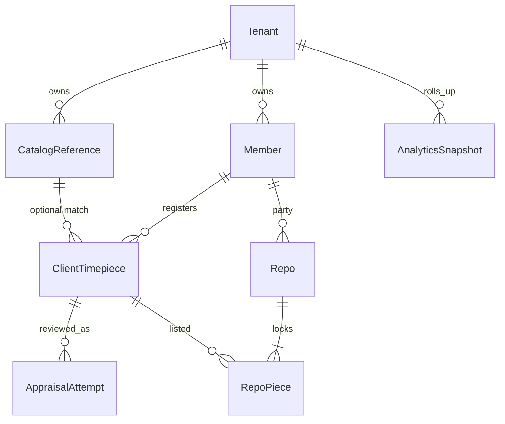

# Desk stores, catalog AI, white-label, analytics - Plan

## Goal Capsule

Rebuild the Desk around **four operational stores** plus an **analytics overlay**. The heart of the Desk is the **repo book**. Catalog, members, and client timepieces exist to feed repos. Super Admin may brand a **tenant** (white-label) without forking the codebase. Appraisers maintain the reusable catalog, including an Exa-backed **suggestion** for the range. Owners get a dense, graph-rich dashboard and exports that help the **real** accountants, without this app becoming QuickBooks.

Authority: `AGENTS.md`, `docs/business-logic.md`, `docs/workflows.md`, `docs/design-system.md`, `docs/decisions/0003-repo-lifecycle-language.md`, `docs/decisions/0004-desk-stores-and-tenant-brand.md`, `docs/plans/2026-09-19-roles-identity-repo-parties-plan.md`, this file.

Stop if any of these would be required: posting a general ledger, inventing accountant account names, linking QuickBooks, enabling Neon Auth/WorkOS, a second MAC palette for the default tenant, treating Exa output as the official appraisal without an appraiser save, or shipping a Patek (or any brand) partnership without a real tenant contract.

Execution: no product code until the owner types **yes** on this plan **and** the roles plan. Then units below, one GitHub PR each, after or interleaved with identity units so appraisal ACL already exists.

---

## Product Contract

### Summary

Desk navigation becomes: **Dashboard** · **Repos** (heart) · **Catalog** · **Members** · **Client timepieces** · Access · Brand (super admin) · existing configure / photos / mail / tutorial.

### Four operational stores

All rows carry `tenant_id`. Default tenant is Mechanical Art Capital (`MAC`).

#### 1. Catalog (generalized timepieces)

Reusable reference for “this model shows up again and again.”

| Field | Rule |
|---|---|
| Brand, model, model reference | Required. No serial number |
| One representative photo | R2 original + preview. Not a customer photo set |
| Typical range (low/high) | Appraiser (or super admin) only. Desk meaning: liquidation band |
| Last edited at, last edited by | Always recorded |
| Financeable flag, notes | As today |

- **Only an appraiser or super admin may add or edit a catalog row.** Admin may read. (Aligns with roles-plan appraisal ACL.)
- **MAC Sparkle** (gold control, appraiser only). Owner rules, 2026-09-19:
  - Sparkle prices **only the range** (low / high). It never writes a chosen appraised price, a financeable flag, or any repo number.
  - It researches **only the timepiece the appraiser is editing right now** — one row, on click. No bulk repricing, no nightly job.
  - Sparkle numbers are **suggestions**: an educated guess of today’s market band with sources and a retrieved-at stamp. The appraiser may accept, edit, or ignore. Nothing changes until the appraiser saves. Ranges stay hand-editable at all times.
  - Sources are pluggable behind one server adapter: **Exa** first (`EXA_API_KEY` in Doppler, never in git); **Radar** as the owner named it (confirm the exact vendor/API before wiring); WatchCharts API v3 and similar watch-price data providers are candidates. The adapter returns one shape (range, currency, sources, retrieved-at) so vendors can be added or swapped without touching the Desk UI.
  - If the source is down, the button fails visibly; the last saved range stays.
  - A **retail** MAC Sparkle (front of the app) is **not now**. Later, if the owner asks.
- Empty catalog is valid (production starts empty).

#### 2. Members (collectors and dealers)

Retail people of this tenant.

- Profile fields used for analysis, registration, and **populating repo agreements** (name, contacts, party kind collector/dealer, addresses already in the app — do not invent extra legal fields counsel has not named).
- Unique **member ID**: `{PREFIX}{#####}-{YY}` e.g. `MAC12345-22` where `22` is the UTC year the account was first created. `PREFIX` is the tenant code (`MAC`, later `PTK`, …). Sequence is per tenant, never reused. Display on profile and on every repo.
- Party kind is live on the member and **snapshotted** on each repo (roles plan).
- Desk people are not members.

#### 3. Client timepieces (named collection)

Watches registered to a member ID. Similar to catalog **plus**:

- Multiple photos (existing five required + optional box/papers/more)
- Optional **video** (R2, presigned PUT, no server file proxy). Cap duration in implementation (start at 60 seconds) unless the owner raises it
- Condition and full descriptive fields as today
- Informational appraisal **range**, one appraiser-entered **appraisal value** (not constrained to the range), **appraised at**
- Flags: in a repo collection (unsigned or signed), **locked in an activated repo** (belongs to MAC **in this app** until the repo is deactivated by whole-collection buyback, liquidated, or renewed)
- Optional link to a catalog reference (brand/model/reference match). Serial lives here, never on the catalog

Retail sees appraisal copy. Desk sees the same appraiser-entered dollars as liquidation value. The range is FYI for both planes: entering a value below or above it produces a warning only and never blocks or changes the value.

##### Appraisal attempts and physical inspection

- Retail submits an unlocked timepiece for appraisal with its current information, current photo references, and **notes to the appraiser** (maximum 256 characters). Submission creates a frozen review snapshot and locks retail edits while review is pending.
- Each timepiece may receive at most **three completed appraisal attempts**. A completed appraiser decision — **Accept** or **Does not meet appraisal criteria** — consumes one attempt. Saving an unfinished review, or returning it for better information, does not. The cap counts **completed decisions, never snapshot rows**: a returned submission still writes its own permanent snapshot, so a piece may legitimately hold more than three snapshots while holding at most three decisions.
- A review has exactly two endings: a **decision** or an appraiser **Return**. There is no retail withdraw or cancel in this unit — adding one would create a third way to close a review and a second actor who can unlock the piece. Both endings close the open review and unlock retail edits.
- A piece has at most **one open review at a time**. Submission is refused while another submission on that piece is pending, and the count of completed decisions is read and incremented in the same transaction that records the decision, so two appraisers cannot both spend the third attempt.
- The appraiser (or super admin) must see the actual submitted photos and all submitted timepiece information. They may save for later, return the submission, accept it, or refuse it.
- **Accept** requires one non-negative appraisal value. The appraiser may enter any value; the advisory range never constrains it. A below-range or above-range value gets a non-blocking warning.
- **Does not meet appraisal criteria** requires no appraisal value. The refused timepiece and its completed attempt remain in the database, tied to the current retail owner. Retail sees that status and a clear refusal icon on collection grids and the full timepiece view.
- A submission snapshot records **immutable object keys plus checksums** for every referenced photo and video, not a live "current photos" pointer. Those objects are retention-pinned for the life of the attempt: replacing a photo writes a new object and never overwrites a referenced key, and any delete of an object still referenced by an attempt is refused at the server. Attempt evidence must render later exactly as the appraiser saw it.
- After a completed decision, retail may again edit any piece that is not in an active repo, add or replace photos, change information or notes, and resubmit while attempts remain. Those edits never rewrite an earlier attempt's snapshot.
- Physical inspection sits only on the purchase path, so **only an Accept is provisional**. Retail copy says **Provisional — physical inspection required**. Within the same attempt the appraiser may revise the value or reverse the decision to a refusal until personally inspecting the actual timepiece.
- Physical-inspection confirmation freezes the attempt's final **Accept** decision and final appraisal value. MAC may not purchase the piece or activate a repo containing it before every included piece has a final inspected acceptance.
- A **refusal is final when recorded**: MAC never takes custody of a refused piece, so it has no inspection step. The refusal consumes its attempt, unlocks retail edits at once, and is that attempt's result.
- One reopen path covers both endings. Changing a recorded refusal or a final inspected acceptance is the same explicit audited **reopen** of that attempt — never a silent edit. A reopen revises the attempt in place and does not create another of the three; a reopened refusal that becomes an Accept is provisional again until inspection.
- **Only the newest attempt may be reopened, and only while no newer submission exists.** A fresh retail submission permanently closes every earlier attempt to reopening. This keeps one unambiguous current appraisal result per piece instead of an old attempt and a new review disagreeing at the same moment.
- Appraisal cards and details show the current state (`not submitted`, `under review`, `returned`, `provisionally accepted`, `does not meet appraisal criteria`, or `final after inspection`) and the number of completed attempts out of three.
- Each attempt is its own record. Do not overwrite the timepiece row as a substitute for appraisal history, and do not event-source every keystroke.
- This lifecycle depends on roles-plan **U-appraise-acl**. No appraisal write or review endpoint ships before that server fence is enforced: `canEditAppraisal` exists in `lib/roles.mjs` today but `timepiece.deskUpdate` still checks only `requireDesk`, so any desk role can currently write valuation fields.
- The activation gate depends on roles-plan **U-mac-sign**. Today `agreement.signCollector` and `agreement.markSigned` both set a live agreement to `signed`, so there is no single MAC-signs-last transaction to hang the inspection check on. The "every piece finally accepted" refusal belongs in that activation transaction, not in draft assembly.
- Locks are enforced at the **mutation boundary of whichever book is live**, never by disabled buttons. While a submission is pending, the piece refuses edits, refuses photo add/replace/delete, and refuses a second submission. In live mode that fence sits in `lib/db/live-book-mutations.ts` and `lib/db/photos.ts`; in browser mode it sits in the `lib/store.tsx` mutation path, because browser mode is still the default book and has no server to protect it. A guard that exists only on the Neon path would leave the default book able to mutate evidence mid-review.
- Express the lock predicate once — one shared "is this piece under review" rule both books call — so the two implementations cannot drift apart.
- Attempts therefore live in `AppState` and the persisted browser store as well as in Neon. An attempt model that exists only in Neon would break the current architecture.
- Money math remains outside this unit. The new appraisal value does not silently replace the current LTV input; connecting it to the cash-offer formula requires the separate owner-approved money-math decision already reserved in `docs/workflows.md`.

#### 4. Repos (heart of the Desk)

Assembled from **free** pieces (not already on an active repo) after appraisal. Draft assembly may begin from a provisionally accepted piece, but MAC cannot purchase or activate the repo until every included piece is physically inspected and finally accepted. At activation the member receives the sale amount. At end of term they buy back the **whole** collection, the desk records liquidation, or admin renews (closes old, opens new).

Each repo stores: member ID + snapshotted party kind, list of timepiece ids, sale amount, frozen Scenario 60 **whole-collection** table and dates, signatures, book label.

Retail-facing status words stay the six book labels. Owner shorthand:

| Owner may say | Book label |
|---|---|
| On course | **open** |
| Behind | **past due** |
| In process (winding down on the street) | **in liquidation** |
| Paid in full / repossessed the collection | **bought back** (never “paid off” on screen — that reads as a loan) |
| Liquidated | **liquidated** |
| Renewed | **renewed** |

### Analytics overlay (not Stage 6)

A **ledger-like** store for **analytics only**: USD and counts over time, member type (collector vs dealer), repo states, catalog vs locked inventory, tenant. Desk owners can **export** CSV/XLSX (and later PDF) so QuickBooks and the third-party inventory book can be checked. This overlay **does not** post journals, name GL accounts, or replace official books. Persistence Stage 6 stays deferred.

Snapshots are derived from the four operational stores (nightly + on repo sign/end). They are append-only facts. Regenerating a dashboard does not rewrite a signed PDF.

### Dashboard (owners / white-label owners)

Replace the current four-stat overview with a dense home:

- Outstanding sale dollars and count of **active** repos: signature **signed** and book **open**, **past due**, or **in liquidation**. Unsigned drafts and demo rows are excluded and shown separately as “drafts”.
- Bought-back vs liquidated vs renewed dollars and counts (trailing 12 months)
- Members: new vs total, collector vs dealer
- Pieces: free / in draft repo / locked
- Mix charts: repo book labels, party kind, vintage year from member ID
- Time series: active USD, new repos per month, buybacks per month
- Tenant name and brand in the chrome
- Export on every widget: current table behind the chart

Palette: MAC navy / gold / champagne on the default tenant; tenant overlay on white-label. Geist stays. No Kit Inter. Graphs must remain readable on the 16:9 dark desk. Prefer a chart library at implementation time (Recharts or the then-current documented choice); do not invent a custom canvas chart engine.

### White-label / tenant brand

- One codebase, many tenants. Super Admin of **that tenant** sets display name, logo (R2), palette (navy/gold/champagne equivalents), member-ID prefix, From-name for mail/SMS/WhatsApp copy.
- Creating a **new** tenant: **master** super admin (`rc@mechartcap.com`) only.
- Default tenant remains Logo-FF and the MAC palette in `design-system.md`. Agents must not “improve” MAC colors. They may apply a stored overlay for a non-MAC tenant.
- Example `PTK` is illustrative. Do not ship Patek marks or copy without an owner-approved tenant and legal right to the marks.
- Retail domain or subdomain per tenant is a later hosting unit; data model is `tenant_id` from day one of this work so we do not retrofit.

### Pricing sources (Exa, Radar, others)

Server-only adapter `lib/pricing/` with one interface: `suggestRange({ brand, model, reference, asOf })` → `{ low, high, currency, sources[], retrievedAt, provider }`. Providers: `exa` (search + highlights, `type: "auto"`, freshness via `maxAgeHours`), `radar` (owner-named; pin the vendor before code), `watchcharts` (v3 `/search/watch` then `/watch/info` or `/watch/appraisal`, credit-based) as candidates. Only the row being edited is sent: brand, model, reference. Never customer names, member IDs, or serials. Log query, provider, retrieved-at, and suggested range in a suggestion table for audit. Never log API keys.

---

## Desk information architecture (proposed nav)

1. **Dashboard** — `/admin` analytics
2. **Repos** — `/admin/agreements` renamed in chrome to Repos; the operational heart
3. **Catalog** — generalized models
4. **Members** — collectors and dealers
5. **Client timepieces** — today’s Client Assets, tied to member ID
6. Access & roles, Configure, Photos, Mail, Tutorial, Brand (super admin)

Remove “Collector app” as the professional desk exit if roles-plan Desk menu exists on the retail chrome; keep a labeled **Front of the app** only for desk users who must preview retail, not as a secret vault.

---

## Delivery units (after owner yes)

1. **U-tenant** — `tenant_id` on catalog, customers, timepieces, agreements; default `MAC`; prefix + member ID allocation
2. **U-catalog-exa** — one photo, no serial, last edited, sparkle suggestion, writes only by appraiser or super admin
3. **U-members** — member ID display, desk members list, agreement populate from profile
4. **U-client-pieces** — piece details, catalog link, locked flag, optional video
5. **U-appraisal-lifecycle** — after roles-plan U-appraise-acl (and U-mac-sign for the activation gate): a first-class attempt record per submission, capped at three **completed decisions**; 256-character retail note; server-enforced review lock over piece edits and photos; Accept or Does not meet appraisal criteria; unrestricted value with range warning; provisional Accept and final-on-record refusal; physical-inspection finalization; grid/detail statuses; audited reopen of the newest attempt only; browser-mode parity
6. **U-repos-heart** — chrome rename, assemble-from-free-pieces rules, and server refusal to purchase/activate until every included piece is finally accepted after physical inspection
7. **U-analytics** — snapshot facts, dashboard graphs, CSV/XLSX export
8. **U-brand** — super-admin brand overlay; master creates tenants

---

## Risks

- Exa is a third-party guess, not a 47th Street ticket. UI must say “suggestion.”
- White-label palettes can violate MAC contrast if unconstrained — store tokens, validate contrast against text on navy/dark.
- Analytics exports will be treated as “the books” if copy is sloppy. Every export header: **Operations analytics — not the official ledger.**
- Video size vs R2 cost; enforce the duration/size cap on the presign.

## Owner confirmation

**Approved 2026-09-19** together with the roles plan. Appraisal lifecycle amendment approved 2026-09-19: the range is FYI only; appraisal value is unrestricted; Accept/Refuse decisions; three completed decisions (not three snapshots); frozen submission evidence on retention-pinned object keys; only an Accept is provisional and a refusal is final on record; one audited reopen path limited to the newest attempt; final inspected acceptance before MAC purchase or repo activation; U-appraise-acl and U-mac-sign are hard prerequisites. Settled: Sparkle is per-row, range-only, suggestion-only, appraiser-only; retail Sparkle later; analytics is exportable operations facts, not QuickBooks; `PTK` stays an example until a tenant exists. Open: which vendor “Radar” is — ask before wiring that provider; which appraisal dollar drives the LTV/cash-offer formula remains a separate owner-approved money-math decision.
