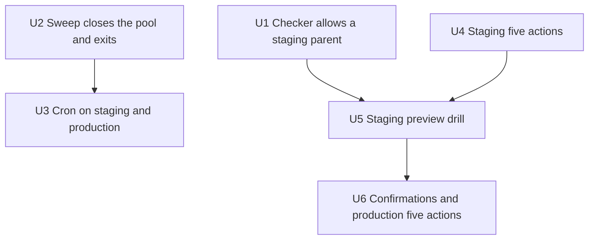

# Finish the live app - Plan

## Goal Capsule

Finish the live Mechanical Art Capital app by closing the remaining go-live checks that do not need DNS. Staging gets one real stored agreement, then a practice restore on a staging preview. The same five live actions then run on `https://mechart.app`. Daily cleanup runs on a schedule in Railway staging and production, and the process exits.

Authority: `AGENTS.md`, `docs/runbooks/go-live.md`, `docs/runbooks/restore-drill.md`, `docs/config-and-env-map.md`, `docs/security.md`, this file. `docs/plans/2026-09-17-003-feat-production-go-live-plan.md` stays as written. This plan does not edit it.

Stop if the work would change the From address, change DNS, seed a fake agreement, point the restore checker at a live database endpoint, schedule cleanup on Development or `ci`, put `DATABASE_URL_UNPOOLED` on the web service, run another production migrate, turn `MAC_LIVE_BOOK` off, or apply an R2 lock or a Neon plan change without a new owner yes.

Execution: one GitHub PR per code change on `KIT-Capital/mac-app`. U1 and U2 each get their own PR. Merge on green after review comments are addressed. Quality gates are `npm run lint`, `npm test`, and `npm run build`. `npm run typecheck` is the same build. Do not run it as a second gate. U3 through U6 are operator steps. The runbook record ships only after the evidence exists.

Tail: U1 and U2 can land in parallel. Staging smoke (U4) produces the stored agreement. The staging drill (U5) waits for U1 and U4. Production smoke waits for that drill. Owner confirmations inside U6 can start at any time. A failed confirmation stops that item and asks the owner.

---

## Product Contract

### Summary

The live book is already on for Railway staging and production. What remains is proof and housekeeping: a staging restore that the checker will accept, the five live actions on staging and then on the public site, four owner confirmations that do not need DNS, and a daily cleanup job that finishes and exits.

### Problem Frame

The public site is up, the first desk password is set, and source maps upload. The staging practice restore cannot pass. Staging has stored photos and no stored agreement PDF, and the checker only accepts a preview whose parent is the development branch. The five live actions have not been walked on staging or on `mechart.app`. Neon history, the photo-bucket lock, production setting names, and the production error mailbox are still unchecked. Daily cleanup exists as a command and is not on a schedule. A run that leaves the database pool open stays active, and the next scheduled run is skipped.

### Requirements

- R1. A restore check may target a Neon preview whose parent is the development branch or the staging branch. It refuses the live development, staging, `ci`, and production endpoints.
- R2. Object keys are checked only when their prefix matches the parent environment. A staging-parent preview checks `staging/` keys. The production-read override is not the staging path.
- R3. The staging drill (practice restore) runs only after staging has at least one stored agreement PDF, one stored photo, and one photo preview. This plan does not insert a stand-in agreement.
- R4. Staging, then `https://mechart.app`, each complete five live actions: staff sign-in, one collector verification, one photo upload, one stored agreement PDF, and one desk analytics export. The rehearsal collector is then suspended. Suspend leaves the stored PDF and the photos in place.
- R5. Daily cleanup runs on a schedule in Railway staging and production only. The process closes its database connections and exits. Development and `ci` are not scheduled.
- R6. The owner confirms the Neon plan tier and history window, the R2 bucket `mac-app` lock and production origin, Doppler `prd` versus Railway production non-secret names, and a Sentry mailbox alert on the production project. A failed confirmation stops that item.
- R7. A checkbox in `docs/runbooks/go-live.md` is marked only after the evidence for that box exists.

### Actors

- A1. Owner. Confirms Neon, R2, production names, and the production error mailbox. Receives the rehearsal verification mail.
- A2. Implementer. Lands U1 and U2, then runs the operator steps with the owner.
- A3. Rehearsal collector. One invited person on staging, then one on production. Suspended after the five actions.

### Key Flows

- F1. Staging smoke. Staff signs in. The desk invites the rehearsal address. That person verifies, adds a piece with a photo, applies, and the scale is frozen so a stored PDF exists. The desk exports analytics. The rehearsal collector is suspended. Counts are pasted into the runbook. Covers the staging half of R4. The production half is the public-site walk.
- F2. Staging drill. After F1 and R1, create a preview from the staging branch, run the checker against that preview, delete the preview, and append the record. Covers R1, R2, R3.
- F3. Daily cleanup. The scheduled service runs the sweep, prints the JSON result, closes the pool, and exits. The next day is not skipped. Covers R5.

### Acceptance Examples

- AE1. A preview whose parent is the staging branch, with one stored agreement, stored photos, and `staging/` keys, finishes with missing, mismatch, and failed all zero. Covers R1, R2, R3.
- AE2. The live staging endpoint is refused before any object read. Covers R1.
- AE3. A thrown sweep still closes the pool and the process exits non-zero. Covers R5.
- AE4. After suspend, the stored agreement PDF and the photo rows from that rehearsal are still present. Covers R4.

### Scope Boundaries

In scope: the checker change, the sweep exit, the Railway schedule, the two five-action walks, the staging drill, and the four confirmations in R6.

#### Deferred to Follow-Up Work

- Company-address mail and the grey-cloud DNS check. The owner cannot reach DNS. Leave the From address as it is.
- The first real collector invitation. Watch Sentry and Resend when it happens. Do not restore the database over those writes.
- Which dollar drives the offer, the Radar vendor, and the remaining ledger names.
- Closing the pool in `scripts/collector-access-sweep.mjs` and `scripts/photo-pending-sweep.mjs`. Only the daily entrypoint is scheduled.
- Moving the existing web service off `railway.json`. Config-as-code keeps working until 2026-12-01. New services cannot use it. This plan does not migrate it.

#### Outside this product's identity

Sale-and-repurchase copy stays. Cash is ABC Bank. Inventory is MAC Vault. Identity stays MAC-owned. Neon Auth and WorkOS stay off. No new Neon project.

### Success Criteria

- The staging drill record in `docs/runbooks/restore-drill.md` shows a deleted staging preview and a passing check.
- Staging and `https://mechart.app` each have pasted counts for the five actions, and each rehearsal collector is suspended.
- R6 items are either checked with evidence or stopped with the owner question named.
- A staging cron run and a production cron run each leave the finished state, and Development has no schedule.

### Dependencies

Staging and production already run the live book. Journal `0000` through `0038` is applied. `SENTRY_AUTH_TOKEN` is the upload token. Desk bootstrap secrets are already removed. The development restore drill already passed and its preview was deleted.

### Outstanding Questions

None of these block implementation.

- Q1. Deferred. Company-address mail and grey-cloud DNS wait until the owner can reach DNS.
- Q2. Deferred. The first real collector invitation is a watch after this plan.

### Sources

- `docs/runbooks/go-live.md` names the open checks.
- `docs/solutions/test-failures/ci-app-env-mutation-breaks-neon-mapping.md` — `APP_ENV` is the Neon selector. `ci` is not a restore target and not a Railway runtime.
- Railway cron and variable reference docs (2026): a second service, the process must exit and close connections, crontab is UTC, shortest interval is 5 minutes, new services cannot use config-as-code.
- Neon serverless driver: await pool end after the work. Use the pooled URL for this script.

---

## Planning Contract

### Key Technical Decisions

- KTD1. Allowed preview parents are the development branch `br-summer-truth-a52brhnv` and the staging branch `br-sweet-poetry-a5j7m69j`. The allowed object prefix follows that parent. The production-read flag stays a production-only override. Rejected alternative: reuse that flag for staging, which skips the preview-identity checks the drill exists to prove. Governs R1, R2.
- KTD2. Staging smoke runs before the staging drill. The current checklist lists the drill first, and that order cannot pass while staging has zero stored agreements. Governs R3, R4.
- KTD3. The fifth action is the desk analytics CSV or XLSX export on the desk overview. Emailing or downloading the stored PDF stays the fourth action, the stored PDF itself. Governs R4.
- KTD4. The rehearsal collector is created with Desk Invite to an owner-controlled mailbox. There is no mail-free invite. Suspend updates status and revokes sessions. It does not delete agreement documents or photo objects. Governs R4.
- KTD5. Daily cleanup is a second Railway service in the same project, not a cron on the web service `mac-app`. Exactly one schedule per environment. Its start command runs the `tsx` binary on `scripts/daily-sweeps.mjs` with the react-server condition, because `lib/db/client.ts` imports `server-only`. The service process is not `npm` or `npx`. `tsx` moves from `devDependencies` to `dependencies` so a production install still has the binary. Schedule `0 11 * * *` UTC (morning US Central) on staging and production only. Variables are references to that same environment's web service: pooled `DATABASE_URL`, matching `APP_ENV`, and the R2 names the photo sweep already requires (`R2_S3_ENDPOINT` or `R2_ACCOUNT_ID`, `R2_BUCKET`, `R2_ACCESS_KEY_ID`, `R2_SECRET_ACCESS_KEY`). No `DATABASE_URL_UNPOOLED`. No new `railway.json`. The script uses `createDb`, not `getDb`. In a finally path it awaits end on the Neon pool at `db.$client`, on success and on failure. It sets `process.exitCode` when a sweep throws, the same way `scripts/photo-pending-sweep.mjs` already does. It does not call `process.exit` to drop the pool, and it does not add a close helper on `getDb`. Governs R5.
- KTD6. The From address stays as it is. `(session-settled: user-directed — chosen over verifying mechartcap.com now: the owner cannot reach DNS)`. Conflict: product docs still name `info@mechartcap.com` as the public From. Live mail keeps the current sender until DNS is reachable. This plan does not change From. Governs the deferred mail item, not R1–R7.
- KTD7. This file is a new plan. `(session-settled: user-directed — chosen over editing the existing go-live plan: the owner asked for a short plan of what is left)`. Do not edit `docs/plans/2026-09-17-003-feat-production-go-live-plan.md`.

### Assumptions

The five-action walks use one rehearsal collector who is then suspended. The owner confirmed the scope and did not pick this over waiting for a real collector. The first real invitation stays Q2.

Staging's agreement count stays zero until F1 stores one. Photos already present do not satisfy R3 by themselves.

`APP_ENV` on the cron service is `staging` or `production` to match that Railway environment. The script does not rewrite `APP_ENV`.

### High-Level Technical Design

The diagram shows order. Unit text below is the work.

U6's four confirmations do not wait on U5. The production five actions do.

### Sequencing

U1 and U2 have no dependency on each other. U3 waits for U2 to be on `main` and deployed. U4 can start before U1 merges. U5 waits for U1 on `main` and for a stored agreement from U4. Production smoke inside U6 waits for a passing U5. R6 confirmations can run beside U1–U5.

### System-Wide Impact

The checker change is the only code path that gains a new legal target. Live endpoints stay refused. `ci` stays isolation-only.

The sweep change must not alter `getDb` for the web server. Only the one-shot script closes the pool on `db.$client`. The cron service also needs the web service's R2 names. Without them the photo half throws and the access half may already have committed.

Production smoke writes real rows: one suspended rehearsal collector, one piece, one photo, one stored PDF. That is the checklist's public-site walk, not a catalog seed. Do not delete those rows to tidy the book.

A cron that stays active skips the next day. A cron pointed at Development or `ci` is a wrong-environment failure. `DATABASE_URL_UNPOOLED` stays migrate-only and off the web service. The cron references the pooled URL.

Desk sign-in rate limits still apply during the walks. A lockout means wait. Do not raise the limits for the rehearsal.

### Risks & Dependencies

- Risk: staging still has no stored agreement, so U5 fails closed. Mitigation: U4 is the producer. Do not insert a row by hand.
- Risk: the preview branch is left behind. Mitigation: U5 deletes it after the check, including after a failed check, and the record says so.
- Risk: R2 is unlocked or the production origin is missing. Mitigation: stop and ask. Do not apply the lock inside the code PR.
- Risk: Neon history is shorter than the owner wants. Mitigation: stop and ask. Do not upgrade the plan in the same step.
- Risk: Doppler `prd` and Railway production disagree on a non-secret name. Mitigation: stop and name the mismatch. Do not copy secrets into the PR or the doc.
- Risk: the production Sentry project has no mailbox rule. The alert the owner already received was the development project. Mitigation: add the production rule only after the owner says yes.
- Risk: Railway config-as-code sunsets 2026-12-01. Mitigation: leave the web `railway.json` in place. Create the cron in the dashboard.
- Risk: two cron services sweep the same database on the same day. Mitigation: U3 stops if staging or production already has a schedule for this command.
- Risk: a cron in one Railway environment references the other environment's web service. Mitigation: `APP_ENV`, the pooled URL, and the R2 names all reference `mac-app` in that same environment. Stop on a cross-wire.
- Risk: a photo left pending overnight can be marked abandoned once the cron exists, and the drill then lacks a photo preview. Mitigation: U4 and U6 are done only when that walk's photo is stored and has a preview. Do not leave the walk unfinished across the 11:00 UTC run.

---

## Implementation Units

### U1. Allow a staging-parent restore check

**Goal:** A preview of the staging branch can pass the object check when its keys use the `staging/` prefix.

**Requirements:** R1, R2, AE1, AE2

**Dependencies:** none

**Files:**
- `scripts/object-manifest-check.mjs`
- `scripts/object-manifest-check.test.mjs`
- `docs/runbooks/restore-drill.md`
- `docs/config-and-env-map.md`

**Approach:** Follow KTD1. Extend the parent allowlist and derive the key prefix from the parent. Keep the live-endpoint refusal. Update the tests that currently require the development parent and reject a `staging/` key with no object read. In the runbook and the env map, state that a staging parent is legal and that the drill still uses a preview. Do not overwrite the existing development drill record. Do not check the go-live box. That waits for U5.

**Execution note:** Add the failing parent and prefix tests first.

**Patterns to follow:** `scripts/object-manifest-check.mjs` access errors `MANIFEST_PARENT_BRANCH_INVALID` and `RESTORE_PREVIEW_REQUIRED`. Tests in `scripts/object-manifest-check.test.mjs`.

**Test scenarios:**
- A preview whose parent is `br-sweet-poetry-a5j7m69j` and whose keys start with `staging/` is eligible for object reads.
- A preview whose parent is `br-summer-truth-a52brhnv` and whose keys start with `development/` stays eligible.
- A parent id that is neither of those two yields `MANIFEST_PARENT_BRANCH_INVALID` and does not read objects.
- The live staging endpoint still yields `RESTORE_PREVIEW_REQUIRED`.
- A `staging/` key on a development-parent preview is a mismatch and does not call object storage.
- The production-read flag is unchanged: it is not required for the staging-parent case.

**Verification:** `scripts/object-manifest-check.test.mjs` passes inside `npm run test:unit`. The runbook describes a staging parent without claiming a staging drill has already passed.

### U2. Daily sweep closes the pool and exits

**Goal:** One run of daily cleanup finishes its work, closes the Neon pool, and lets the Node process exit. Set `process.exitCode` on failure. Do not call `process.exit`.

**Requirements:** R5, AE3

**Dependencies:** none

**Files:**
- `scripts/daily-sweeps.mjs`
- `scripts/daily-sweeps.test.mjs`
- `package.json` (move `tsx` to `dependencies`; add the test on the react-server segment of `test:unit`)

**Approach:** Follow KTD5. Export a runnable function and gate the CLI the way `scripts/object-manifest-check.mjs` does, so the test can import it. Keep `createDb`. Do not change `getDb`. Await end on `db.$client` on the success path and the failure path. Set `process.exitCode` on failure the way `scripts/photo-pending-sweep.mjs` does. Leave `npm run sweeps:daily` as the human command. The Railway start command is U3.

**Execution note:** Test the shutdown helper first, with a stand-in pool, so the test does not open a real database.

**Patterns to follow:** `scripts/object-manifest-check.mjs` for the export and CLI gate. `scripts/photo-pending-sweep.mjs` for `process.exitCode`. `lib/db/collector-sessions.test.ts` and `lib/db/photos.test.ts` cover sweep behavior. This unit does not retest those sweeps. Put `scripts/daily-sweeps.test.mjs` on the `tsx --conditions=react-server --test` segment of `test:unit`, next to `lib/auth.server.test.ts`. The plain `node --test` segment cannot load `server-only`.

**Test scenarios:**
- After a successful sweep, pool end is awaited once and the exit code stays 0.
- When a sweep throws, pool end is still awaited and the exit code is non-zero.
- Pool end is not skipped when the success log throws.
- The helper does not call the long-lived `getDb` singleton.

**Verification:** The new test file is part of `npm run test:unit` and passes. A local run of the script against development returns to the shell. That local run is a smoke of exit, not the staging drill.

### U3. Schedule cleanup on staging and production

**Goal:** Railway staging and production each run daily cleanup once a day, and Development does not.

**Requirements:** R5

**Dependencies:** U2

**Files:**
- `docs/runbooks/go-live.md` (record the service names and the schedule after the first finished run; do not check a box the runbook does not have)

**Approach:** Follow KTD5. Create one cron service per Railway environment that should run it: staging and production. Do not set a cron schedule on Development. Do not add `railway.json` for the new service. Reference pooled `DATABASE_URL` and `APP_ENV` from the web service `mac-app`. Do not add `DATABASE_URL_UNPOOLED` to the web service or the cron service.

**Test expectation:** none — this unit is Railway configuration. U2 holds the behavioral tests.

**Verification:** Staging has exactly one schedule for this command, and production has exactly one. Development has none. Each service's `APP_ENV`, pooled `DATABASE_URL`, and R2 names reference `mac-app` in that same environment. `DATABASE_URL_UNPOOLED` is absent on the cron service and on the web service. One staging run and one production run each finish, and the log is one JSON object with `ok: true` plus both `access` and `photos`. A later schedule is not skipped because the prior run stayed active.

### U4. Walk the five actions on staging

**Goal:** Staging holds one real stored agreement PDF, and the five actions have counts.

**Requirements:** R3, R4, F1, AE4

**Dependencies:** none

**Files:**
- `docs/runbooks/go-live.md` (paste counts only, after the walk)

**Approach:** Follow KTD2, KTD3, and KTD4. Sign in as staff. Invite one rehearsal address the owner controls. Verify that code. Add one piece and one photo. Apply and freeze the scale so the stored PDF path runs. Export desk analytics. Suspend the rehearsal collector. Paste counts. Do not insert an agreement row by SQL.

**Test expectation:** none — this is a live walk. Browser-mode Playwright does not prove staging.

**Verification:** Staging `agreement_documents` rows with status `stored` are at least 1. The walk's photo is stored and has a photo preview before suspend. The rehearsal collector's status is suspended. The stored PDF and that photo are still present after suspend. Counts are in the runbook. Stop if sign-in is rate limited, and wait for the window. Do not leave the photo pending across the 11:00 UTC cleanup.

### U5. Rehearse restore on a staging preview

**Goal:** The staging practice restore passes on a preview, the preview is deleted, and the record is appended.

**Requirements:** R1, R2, R3, R7, F2, AE1

**Dependencies:** U1, U4

**Files:**
- `docs/runbooks/restore-drill.md` (append the staging record; do not rewrite earlier development records)
- `docs/runbooks/go-live.md` (check the staging-restore box only when the outcome is success)

**Approach:** Follow `docs/runbooks/restore-drill.md` with the staging parent from KTD1. Create a preview from the staging branch. Point the checker at that preview only. Pass requires agreement rows, photo rows, and photo rows with a photo preview each above zero, and missing, mismatch, and failed all zero. Delete the preview after the run, including when the check fails. Append the outcome, the time, and that the preview was deleted. Check the staging-restore box in `docs/runbooks/go-live.md` only when the outcome is success.

**Test expectation:** none — U1 covers the checker. This unit is the live staging drill.

**Verification:** The appended record shows success, a staging parent, and a deleted preview. The checker was not pointed at the live staging endpoint. No new production migrate ran.

### U6. Confirm the non-DNS checks and walk production

**Goal:** The four confirmations are answered, and the public site has the same five actions.

**Requirements:** R4, R6, R7, AE4

**Dependencies:** U5 for the production walk. The four confirmations have no unit dependency.

**Files:**
- `docs/runbooks/go-live.md`

**Approach:** Confirm, do not change, unless the owner gives a new yes:
- Neon plan tier and history window for project `withered-lake-05570428`.
- R2 bucket `mac-app` allows `https://mechart.app` and is locked on the production agreements prefix the hosting doc already names.
- Doppler `prd` and Railway production share the same non-secret names, including `APP_ENV=production` and `NEXT_PUBLIC_SITE_URL=https://mechart.app`, and no development or staging URL is present.
- Sentry org `norfolk-ai`, production project `javascript-nextjs-e0`, has a mailbox rule to the owner. The development project is not that proof.

Then repeat F1 on `https://mechart.app` with a second rehearsal collector. Paste counts. Check a box only when its evidence is in the runbook. Leave the mail-domain box and the grey-cloud box unchecked.

**Test expectation:** none — confirmations and a live walk.

**Verification:** Each R6 item is checked with a one-line evidence note, or stopped with the owner question written down. Production counts are pasted. The walk's photo is stored and has a preview before suspend. The production rehearsal collector is suspended. The stored PDF and that photo remain.

---

## Verification Contract

Blocking gates for U1 and U2, before merge: `npm run lint`, `npm test`, and `npm run build`. Do not also run `npm run typecheck`.

U1 is proved by `scripts/object-manifest-check.test.mjs` inside `npm run test:unit`. U2 is proved by `scripts/daily-sweeps.test.mjs` inside the same command. `npm test` also runs Playwright. These units do not change the collector UI. Playwright must stay green.

U3 is proved by a finished Railway deployment in staging and in production, plus no schedule in Development. U4, U5, and U6 are proved by the runbook notes in those units. Do not treat a browser-mode Playwright walk as those proofs.

`npm run db:manifest-check` is the drill command. It stays on a preview URL supplied for that run. Do not point it at Doppler `prd`.

---

## Definition of Done

- U1 and U2 are merged on green, each in its own PR.
- U3 has finished once in staging and once in production. Each log includes `access` and `photos`. Each environment has one schedule. Development has none. The cron services do not hold `DATABASE_URL_UNPOOLED`.
- U4 and U5 are recorded. The staging preview used for U5 is deleted.
- U6 confirmations are checked or explicitly stopped. The production five-action counts are pasted. The production rehearsal collector is suspended.
- `docs/runbooks/go-live.md` still leaves company mail and grey-cloud DNS unchecked.
- `docs/plans/2026-09-17-003-feat-production-go-live-plan.md` is unchanged.
- Abandoned experiments are not left in the diff. No bootstrap secret, no `SENTRY_TOKEN` name, and no unpooled database URL is added to the web service.
