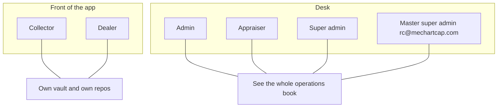
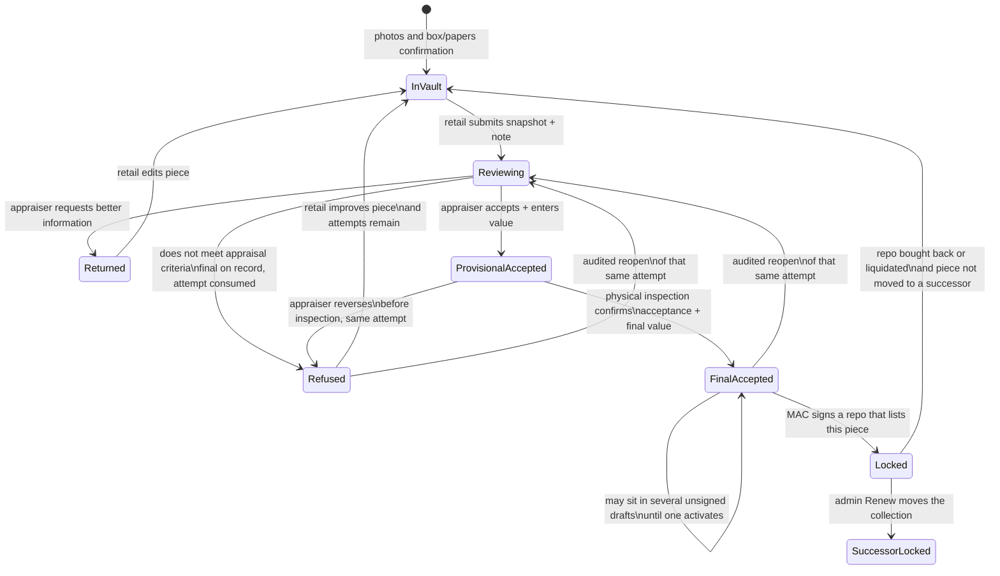
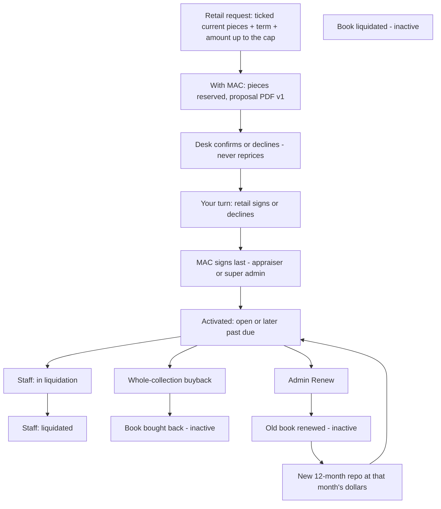
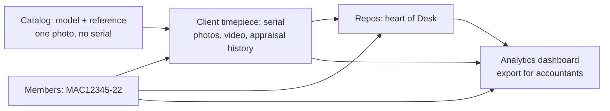

# Users, timepieces, and repos

**Tier: CONTRACT** · Last verified: 2026-09-21

This is the lifecycle map for Mechanical Art Capital. Money math stays in `business-logic.md`. Visual chrome stays in `design-system.md`. Identity implementation that is **not yet in the app** lives in `plans/2026-09-19-roles-identity-repo-parties-plan.md` and is marked **proposed** below. Do not treat proposed boxes as shipped.

Authority: this file, `business-logic.md`, `security.md`, decisions `0003-repo-lifecycle-language.md`, `0004-desk-stores-and-tenant-brand.md`, and `0005-repo-request-lifecycle.md`. Official cash is QuickBooks. Official inventory is the third-party inventory book. This app is the **operations book** only. Desk analytics are derived facts, not Stage 6.

## How to read the words

| Owner / 47th Street talk | What the app stores and shows on both planes | Notes |
|---|---|---|
| Active repo | Book **open**, **past due**, or **in liquidation**, and signature **signed** (activated) | Pieces in it cannot join another active repo |
| Inactive / closed / done | Book **bought back**, **liquidated**, or **renewed** | Pieces are free unless a renewal moved them to the successor |
| Activated | Executed: the repo has an **execution date**, MAC last | The book label and the term clock both start at execution; a request before execution has no book label |
| Repossessed / bought back | Book **bought back** | Retail copy: the person **buys back the whole collection** at that month’s scheduled dollars |
| In liquidation (process) | Book **in liquidation** | Staff-toggled. Modeled dollars never flip this |
| Liquidated (sold off) | Book **liquidated** | Staff-toggled. End of that repo’s life |
| Renewed | Book **renewed** on the old row + a **new** repo | Old repo is done. New repo is a new life |
| Appraisal range (retail) | Informational low/high band | Shown to the collector/dealer and appraiser; never constrains the appraiser |
| Appraisal value (retail) | Appraiser-entered dollar value | May sit outside the range with a warning only |
| Liquidation value (desk) | The same appraiser-entered dollar value | 47th Street wholesale if the retail party does not buy back |
| Free piece | Not on any active repo | May join a new application |
| Request (retail) | **With MAC**, **Your turn**, **Active**, **Closed** | The only four words a collector or dealer reads for a request; internal states never appear |
| Current appraisal | An Accept decided within the last seven days | Only current pieces can be placed on a new request; older ones read "Appraisal expired — send again" |
| Desk answer | Confirm or decline | The Desk never changes the amount before inspection; the app exists to avoid negotiation |

Forbidden on retail copy: loan, lender, interest, debt, vesting, paid off.

Environment-mapping words (`APP_ENV`, fixture environment, Neon ci, live-book flag) live in `CONCEPTS.md`. Visual chrome stays in `design-system.md`.

## Users

Two planes. One email cannot be both.

**Shipped today:** `collector`, `dealer`, `admin`, `appraiser`, `super_admin`. Collectors and dealers self-identify on signup and may change on profile; that tag is **frozen on each repo** at apply and at renew. Collectors sign in with a one-time email or SMS code (no password). Desk uses a password, and when live identity is on, a one-time email code as well. First-login for seeded desk people is a set-password link. There is no hidden “MAC desk staff” control on login. Retail WhatsApp notices and the Desk inbox ship with this unit (opt-in on profile; no WhatsApp login).

**Approved, not yet shipped** (`2026-09-19` roles plan leftover desk-stores units): Desk users are created only inside the Desk. Bottom-menu **Desk** for desk emails. Master super admin is Ricardo Cidale. Seeded desk people: Dov Tuzman (appraiser), Rosario David (admin) (`@mechartcap.com`). Appraiser (and super admin) own appraisal numbers and MAC sign. Admin cannot change those numbers or appraiser/super-admin rows.

Retail users **see** agreements, pieces, appraised values, and an “in an activated repo” flag. They do **not** edit a signed repo and they do **not** record a book end.

## Timepiece life

A piece belongs to one retail person. It never belongs to two **active** repos.

Rules:

- Five required photos (front, back, left, right, clasp). Box and papers photos optional.
- The retail submission includes **notes to the appraiser**, maximum 256 characters.
- Submission freezes one review snapshot of the piece information, submitted photo references, and note. Retail edits are locked while that snapshot is under review.
- The appraiser or super admin may save an unfinished review without consuming an appraisal opportunity, or return it for better information without consuming an opportunity.
- A completed **Accept** or **Does not meet appraisal criteria** decision consumes one of at most **three** appraisal opportunities for that timepiece. The cap counts completed decisions, not submissions: a **returned** submission keeps its own permanent snapshot without spending an opportunity. Refused pieces remain in the database, remain tied to their current retail owner, and may be improved and resubmitted while opportunities remain.
- A review ends exactly two ways: a **decision** (Accept or refuse) or a **Return** by the appraiser. There is no retail cancel or withdraw — once submitted, the piece waits for the appraiser. Both endings close the open review and unlock retail edits, so "is this piece free to resubmit?" always has one answer.
- A piece carries at most **one open review at a time**, and the third opportunity is claimed in the same transaction that records its decision.
- Accept requires an appraiser-entered appraisal value. The appraiser may enter any non-negative dollar value. The catalog range is informational only; an out-of-range value receives a non-blocking warning and remains saveable.
- Physical inspection sits only on the purchase path, so **only an Accept is provisional**. A remote Accept reads **Provisional — physical inspection required**; inside that same attempt the appraiser may revise the value or reverse the decision to a refusal until personally inspecting the piece.
- Physical-inspection confirmation freezes that attempt's final **Accept** decision and final appraisal value. MAC may not purchase the piece or activate a repo containing it before that confirmation.
- A **refusal is final the moment it is recorded**. MAC never takes custody of a refused piece, so there is nothing to inspect: the refusal consumes its attempt, immediately unlocks retail edits, and stands as that attempt's result.
- One reopen path covers both endings. Changing a recorded refusal **or** a final inspected acceptance takes the same explicit, audited **reopen** of that attempt. A reopen revises that attempt in place and never consumes another of the three; a reopened refusal that becomes an Accept is provisional again until inspection.
- Only the **newest** attempt may be reopened, and only while no newer submission exists. A fresh retail submission permanently closes earlier attempts to reopening, so a piece never shows two competing current results.
- Grid cards and the full timepiece view show the current appraisal state and remaining opportunities. A refusal uses the retail phrase **Does not meet appraisal criteria** and a clear refusal icon; do not imply that the timepiece ceased to exist.
- After a completed decision, the underlying piece becomes editable again unless it is bound to an active repo. Later edits do not rewrite the completed submission snapshot; a new review requires a new submission.
- Catalog typical range, candidate models, and photo provenance may be suggested by Sparkle. Collector copy = appraisal range. Desk meaning = indicative liquidation band. Sparkle never writes the official numbers.
- LTV / purchase cap math is prototype UI until an owner money-math plan. The appraiser-entered value does not silently change that formula in this documentation unit.
- After activation, the repo snapshot is frozen. Do not edit those dollars on that repo. Free pieces not on an activated repo may still be appraised.
- **No partial buyback.** To get optionality, the person opens **several smaller repos**, not one repo they pick apart.

## Repo life

A repo is the center of the product: one retail party (collector or dealer) + MAC + a named collection + a frozen whole-collection repurchase table (Scenario 60).

### Signature axis (separate from the book)

`draft` → `pending_signature` → `signed`

Signing does not write a book end. A book end does not change the signature flag.

**Shipped:** collector HTML Sign or desk Mark signed on legacy and executed rows. A repo appears in the book only once it has an execution date, and its term clock runs from that date; rows written before the request model were mapped once to executed on the day they were created, so Hale still reads **past due**.

**Shipped 2026-09-20 (U10):** Apply creates a **request**, not a repo. The collector ticks accepted pieces whose Accept is current (seven days), keeps the Desk's typical term, and sends an amount at or below the maximum for those pieces; the pieces are reserved and a proposal PDF is recorded. The Desk **confirms or declines**; the collector may decline or withdraw. Confirm returns the request at the same amount ("Your turn"). Every proposal states that MAC accepts only after physical inspection and other checks, will re-appraise each timepiece, and reserves the right not to execute.

**Shipped 2026-09-20 (U6):** The collector picker shows a live offer card (maximum and buyback schedule). Agreements group under Your turn / With MAC / Active / Closed. A confirmed request's only primary action is Sign; an inspection return uses "Accept the inspected amount and sign". Closed requests offer Start again. An Accept older than seven days reads "Appraisal expired — send again" and stays off the picker.

**Shipped 2026-09-20 (U11):** MAC signs last; desk checklist first; only an appraiser or super admin signs for MAC; admin cannot. Software sign is not counsel approval. E-sign vendor still deferred.

### Book axis

| Label | How it is set | Active for exclusive pieces? |
|---|---|---|
| open | Derived: executed, term not ended, no staff end | Yes, if executed |
| past due | Derived: executed, day after term date, no staff end | Yes, if executed |
| in liquidation | Staff end | Yes |
| bought back | Staff end (paid whole-collection close) | No |
| liquidated | Staff end | No |
| renewed | Admin Renew only | No (successor is the live repo) |

Staff may overwrite or clear the current end. There is no end history in this app. Clearing returns open or past due.

**Open** last day of term is still open. **Past due** starts the next calendar day. Unexecuted requests are not on this axis. Term clock is calendar months from `executedOn`.

Renew: close old at that month’s whole-collection dollars, open new 12-month repo with those pieces, optional extra **free** pieces to meet LTV, snapshot the party tag **at renewal**. Does not post cash.

### Many repos, one person

There is **no cap** on how many active repos one collector or dealer may have. Each repo has its own life. A dealer may lock on the order of 100 pieces in one repo. A timepiece still cannot sit in two active repos.

## Activation and custody (operations, not the official inventory)

When MAC has signed:

- Those pieces are **locked**.
- This app **assumes** they are in MAC’s possession and in a MAC-controlled vault.
- Official inventory remains the third-party book. This app does not write that book or QuickBooks.

## Channels

Email, SMS login codes (Twilio Verify), and WhatsApp for **retail** notices plus a Desk inbox. Desk staff are not WhatsApp users. Neon Auth stays off. WorkOS is not the core login (decision `0002` must not be read as permission to enable it).

## Desk stores

Decision `0004`. Plan `plans/2026-09-19-desk-stores-whitelabel-analytics-plan.md`. Catalog brands, models, retail checkmarks, and Sparkle shipped 2026-09-21 (U13). Tenant stamp `tenant_id` plus MAC member-ID allocation shipped as U-tenant. Members list/display, analytics, and per-tenant brand rows besides the two presets remain later units of that plan.

- **Catalog** — reusable brands and models. Only an appraiser or super admin adds or edits rows; admins read. **MAC Sparkle** asks a pricing source (Exa, then Firecrawl, then Apify) for a **guess** on the one brand or model being edited: candidate models, a market range with sources, and photo provenance. The appraiser saves or ignores. Last edited recorded. No retail Sparkle. Collector `/brands` shows only retail-checked rows that have a photo.
- **Members** — collectors and dealers. Member ID `{PREFIX}{#####}-{YY}`. Feeds analysis and agreement forms.
- **Client timepieces** — named to a member. Informational range + appraiser-entered value + up to three attempt snapshots + physical-inspection finalization. Locked when the repo is activated (operations custody). Free again after bought back, liquidated, or if not moved on renew.
- **Repos** — assembled from **free** pieces. MAC purchase and activation require final inspected acceptance for every included piece. Whole-collection table. Heart of the Desk.
- **Analytics** — graphs and exports. Not the official ledger. Never label a close **paid off**.

White-label: same four stores scoped by tenant. Super Admin sets that tenant’s palette, logo, and prefix. MAC default chrome stays Logo-FF.

## What the code must not do

- Auto-toggle **in liquidation** from a liquidation-value field.
- Let a locked piece join another live repo.
- Let retail buy back two watches from a ten-watch repo.
- Let a desk email own a retail vault.
- Describe the product as a loan.
- Put a serial number on a catalog row.
- Treat Exa (or any model) as the official range without an appraiser save.
- Post QuickBooks journals from the dashboard.
